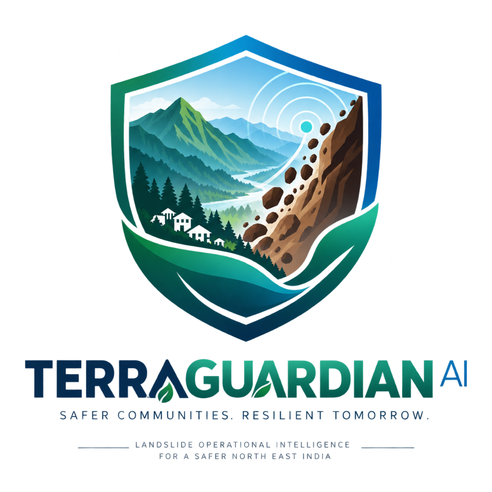
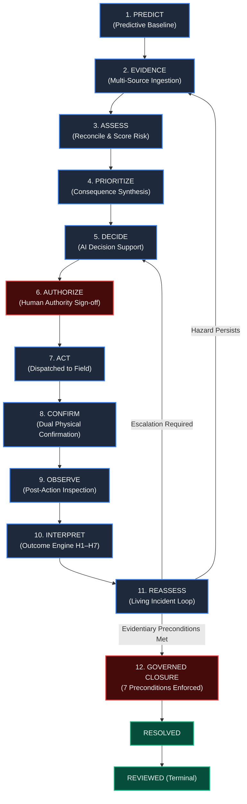
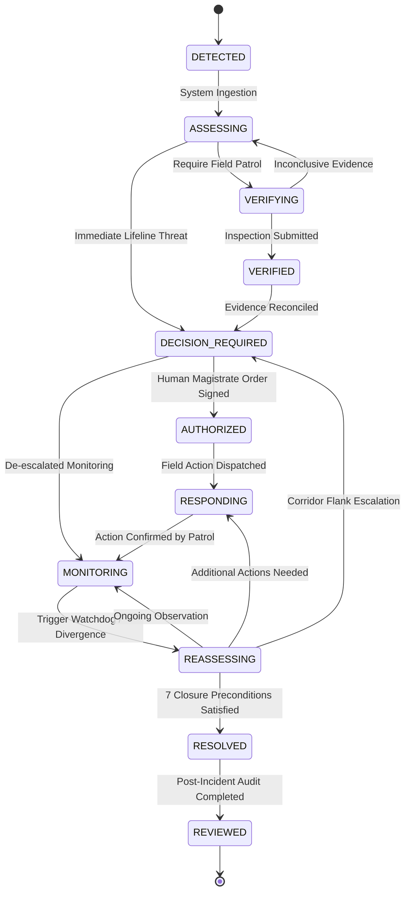
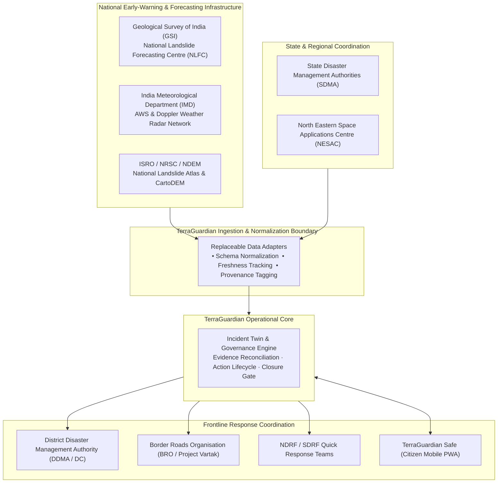

<div align="center">



# TERRAGUARDIAN AI
### Landslide Operational Intelligence System
**From Warning to Verified Response**

[-emerald?style=for-the-badge&logo=pytest)](https://github.com/KeerthanaaSaravanan/TerraGuardian)
[-blue?style=for-the-badge&logo=vite)](https://terraguardian.vercel.app/)
[](https://github.com/KeerthanaaSaravanan/TerraGuardian)
[](https://github.com/KeerthanaaSaravanan/TerraGuardian)

---

### 🔗 **Live Operations Centre**: [terraguardian.vercel.app](https://terraguardian.vercel.app/) &nbsp;|&nbsp; 🎥 **Technical Demonstration**: [Watch on YouTube](https://youtube)

*Smart India Hackathon 2026 · Problem Statement: SIH26001 / PS26001 · Ministry of Development of North Eastern Region (MDoNER) · Disaster Management · Software Track*

---

<br>


*TerraGuardian Operations Centre: Evolving Incident Twin, GIS Corridor Analysis, Evidence Reconciliation, Risk vs. Confidence Metrics, Action Dispatch Tracking, Outcome Intelligence & Living Reassessment.*

</div>

---

## TABLE OF CONTENTS

1. [Executive Summary & Product Identity](#1-executive-summary--product-identity)
2. [The Operational Problem](#2-the-operational-problem)
3. [Non-Negotiable Semantic Safeguards](#3-non-negotiable-semantic-safeguards)
4. [The Closed-Loop Operational Lifecycle](#4-the-closed-loop-operational-lifecycle)
5. [System Architecture](#5-system-architecture)
6. [Server-Enforced 11-State Finite State Machine](#6-server-enforced-11-state-finite-state-machine)
7. [Intervention-Conditioned Outcome Intelligence (H1–H7)](#7-intervention-conditioned-outcome-intelligence-h1h7)
8. [Qualitative Next-Best-Information (NBI)](#8-qualitative-next-best-information-nbi)
9. [Predictive Foundation & Risk-Confidence Separation](#9-predictive-foundation--risk-confidence-separation)
10. [Data Provenance & Source Classification](#10-data-provenance--source-classification)
11. [Governed Action Lifecycle & Physical Confirmation](#11-governed-action-lifecycle--physical-confirmation)
12. [Evidentiary Closure Governance](#12-evidentiary-closure-governance)
13. [Geospatial Corridor Logic & Spatial Divergence](#13-geospatial-corridor-logic--spatial-divergence)
14. [Golden Incident Runtime Trace (TG-2048)](#14-golden-incident-runtime-trace-tg-2048)
15. [Indian Disaster-Management Ecosystem Alignment](#15-indian-disaster-management-ecosystem-alignment)
16. [SIH Requirements Traceability Matrix](#16-sih-requirements-traceability-matrix)
17. [Research Contribution & Prior-Art Boundary](#17-research-contribution--prior-art-boundary)
18. [Security, Authority Boundaries & Audit Integrity](#18-security-authority-boundaries--audit-integrity)
19. [Implementation Maturity Ledger](#19-implementation-maturity-ledger)
20. [Verification Evidence](#20-verification-evidence)
21. [Repository Topology](#21-repository-topology)
22. [Local Setup, Execution & Testing Guide](#22-local-setup-execution--testing-guide)
23. [Demonstration Credentials](#23-demonstration-credentials)
24. [Transparent Limitations & Engineering Boundaries](#24-transparent-limitations--engineering-boundaries)
25. [Official References & Scientific Literature](#25-official-references--scientific-literature)

---

## 1. EXECUTIVE SUMMARY & PRODUCT IDENTITY

### Canonical Product Definition
> **TerraGuardian is a landslide operational intelligence system that maintains an evolving, evidence-backed incident state across hazard, confidence, consequence, decision, action, and outcome, and continuously reassesses that state as reality changes.**

### Core Operating Tagline
$$\textbf{FROM WARNING TO VERIFIED RESPONSE}$$

### Positioning in the Indian Disaster Management Ecosystem
> **Connect. Don't Replace.**
> 
> TerraGuardian does **not** replace India's authoritative hazard-warning and disaster-management systems (such as the Geological Survey of India's National Landslide Forecasting Centre, NRSC/NDEM, IMD AWS networks, or NDMA/SDRF emergency frameworks). It operates as an **operational intelligence layer** that ingests incoming hazard warnings and multi-source field evidence, connects them to accountable, human-authorized response actions, tracks physical confirmations, interprets post-intervention outcomes, and drives continuous operational reassessment.

### Foundational Governance Principle
$$\textbf{ONE INCIDENT. ONE OPERATIONAL TRUTH. ONE CLOSED LOOP.}$$

* **AI assists reasoning**: Predictive models, computer vision heuristics, and diagnostic engines propose options, evaluate features, and estimate uncertainties. AI never exercises statutory command authority.
* **Rules govern critical transitions**: State progressions, evidentiary preconditions, and closure criteria are strictly enforced by deterministic server-side state machines.
* **Humans authorize critical actions**: Safety-critical orders (evacuations, highway closures, physical deployment) require authenticated human sign-off with official disaster order codes.

---

## 2. THE OPERATIONAL PROBLEM

Existing regional early-warning systems answer an increasingly sophisticated question: **"What may happen?"** They generate spatial susceptibility heatmaps, precipitation threshold alerts, and failure-time forecasts.

However, in safety-critical disaster management across complex montane corridors like India's North Eastern Region (NER), the far more challenging operational problem begins **after the warning is issued**:

| Operational Question | Why Traditional Dashboards Break Down | TerraGuardian Solution |
|:---|:---|:---|
| **What is actually happening?** | Alert triggers are often treated as confirmed ground reality. | Decouples forecast from observational evidence with strict provenance tracking. |
| **How certain is the data?** | High hazard likelihood is frequently conflated with high certainty. | Enforces mathematical decoupling: $\text{Hazard Risk} \neq \text{Evidential Confidence}$. |
| **What matters most right now?** | Massive landslides in uninhabited gorges trigger higher alarms than smaller slides blocking vital lifelines. | Separates physical hazard severity from operational consequence and exposure priority. |
| **Did the dispatched action happen?** | Dispatching an order is often mistaken for field execution. | Establishes a 7-stage action lifecycle requiring independent physical confirmation. |
| **What can we conclude afterward?** | Absence of a slide is prematurely labeled a "false alarm" or attributed to successful intervention. | Implements **Intervention-Conditioned Outcome Intelligence** with 7 competing hypotheses. |

### The Critical Ambiguity: "The Hard Case"

```text
       HAZARD FORECAST ISSUED (e.g., Critical slope failure predicted at KM-42)
                                ↓
       INTERVENTION DISPATCHED (e.g., Culvert cleared, commercial traffic stopped)
                                ↓
                     NO OBSERVED FAILURE EVENT
```

When an expected landslide does not manifest after an intervention, naive operational systems make one of two catastrophic errors:
1. **The False-Alarm Assumption**: Declaring the initial warning was a false alarm, eroding operational credibility and breeding warning fatigue.
2. **The Post-Hoc Fallacy**: Claiming the intervention successfully prevented the landslide without causal proof.

In reality, the absence of an observed failure may be caused by:
* Hydrologic lag and delayed pore-pressure infiltration ($H_3$).
* Spatial divergence to an adjacent slope flank within the transit corridor ($H_4$).
* Heavy monsoon cloud cover blinding optical satellites, or unpatrolled slopes ($H_5$).
* Baseline over-prediction ($H_1$).
* Residual instability that remains perched above the carriageway ($H_6$).

**TerraGuardian does not guess. It reassesses.**

---

## 3. NON-NEGOTIABLE SEMANTIC SAFEGUARDS

The integrity of TerraGuardian rests on 15 non-negotiable semantic invariants enforced across the backend schemas, services, API boundaries, and UI components:

$$\begin{aligned}
\text{Risk} &\neq \text{Confidence} \\
\text{Hazard} &\neq \text{Priority} \\
\text{Recommendation} &\neq \text{Authorization} \\
\text{Authorization} &\neq \text{Execution} \\
\text{Execution} &\neq \text{Physical Confirmation} \\
\text{Observation} &\neq \text{Interpretation} \\
\text{Non-Event} &\neq \text{False Alarm} \\
\text{Intervention} + \text{Non-Event} &\neq \text{Proven Prevention} \\
\text{Missing Evidence} &\neq \text{Hazard Resolution} \\
\text{Stale Assessment} &\neq \text{Current Reality} \\
\text{Model Output} &\neq \text{Ground Truth} \\
\text{Prediction} &\neq \text{Operational Order} \\
\text{External Source Availability} &\neq \text{Successful Ingestion} \\
\text{Model Complexity} &\neq \text{Validation Quality} \\
\text{Operational Incident Closure} &\neq \text{Geotechnical Hazard Extinction}
\end{aligned}$$

---

## 4. THE CLOSED-LOOP OPERATIONAL LIFECYCLE



---

## 5. SYSTEM ARCHITECTURE

TerraGuardian is structured into three clean, decoupled architectural planes, ensuring that non-authoritative machine learning predictions cannot mutate operational truth without verification and governance:

```text
┌────────────────────────────────────────────────────────────────────────────────────────────────────────┐
│                                       PLANE 1: HAZARD INTELLIGENCE                                     │
│  External Geotechnical & Weather Feeds  │  Predictive Baseline (ml/baseline.py)  │ Feature Pipeline    │
│  • IMD AWS Rainfall Grids (Simulated)   │  • Physics-Informed Logistic Baseline │ • 7d Surcharge      │
│  • InSAR / Optical Telemetry (Demo)    │  • Sigmoid Hazard Probability         │ • Slope Angle & Sat │
└───────────────────────────────────────────────────┬────────────────────────────────────────────────────┘
                                                    │ Standardized Event Stream
┌───────────────────────────────────────────────────▼────────────────────────────────────────────────────┐
│                                     PLANE 2: OPERATIONAL INTELLIGENCE                                   │
│  Persistent Incident Core  │ Consequence & Priority Service │ Action & Outcome Engine (H1–H7)          │
│  • Living Incident Twin   │ • NH-13 Lifeline Exposure     │ • Hypothesis Separation                  │
│  • Multi-Source Evidence   │ • 5-Factor Priority Formula   │ • Qualitative NBI Recommender            │
└───────────────────────────────────────────────────┬────────────────────────────────────────────────────┘
                                                    │ Enforced Transaction Boundary
┌───────────────────────────────────────────────────▼────────────────────────────────────────────────────┐
│                                   PLANE 3: GOVERNANCE & PROVENANCE                                     │
│  Server-Enforced 11-State FSM  │  Statutory Authority Boundary  │  Append-Only Relational Audit Trail  │
│  • Precondition Verification   │  • Human Decision Maker Gate   │  • Actor Identity Binding            │
│  • 21,600s Closure Gate        │  • Order Code Validation       │  • Chronological Event History       │
└────────────────────────────────────────────────────────────────────────────────────────────────────────┘
```

---

## 6. SERVER-ENFORCED 11-STATE FINITE STATE MACHINE

Incident coordination follows an authoritative, server-side 11-state state machine ([`services/api/app/domain/incident.py`](file:///c:/Users/ksaravanan/TerraGuardian/services/api/app/domain/incident.py)). Arbitrary transitions or skipping stages is blocked at the database transaction layer.



### Exact Allowed Transition Matrix

| Source State | Permitted Destination States | Enforcing Service / Guard |
|---|---|---|
| `DETECTED` | `ASSESSING` | Initial assessment pipeline trigger |
| `ASSESSING` | `VERIFYING`, `DECISION_REQUIRED` | Initial triage; direct decision if exposure is critical |
| `VERIFYING` | `VERIFIED`, `ASSESSING` | Field evidence reconciliation requirement |
| `VERIFIED` | `DECISION_REQUIRED` | Verification complete; action options generated |
| `DECISION_REQUIRED` | `AUTHORIZED`, `MONITORING` | **Requires Human Authorization**; or downgrade to watch |
| `AUTHORIZED` | `RESPONDING` | Task dispatch to field response agencies |
| `RESPONDING` | `MONITORING` | Transition enabled upon action dispatch & acknowledgment |
| `MONITORING` | `REASSESSING` | Mandatory operational reassessment trigger |
| `REASSESSING` | `MONITORING`, `RESPONDING`, `DECISION_REQUIRED`, **`RESOLVED`** | Multi-path reassessment; **`RESOLVED` is heavily guarded** |
| `RESOLVED` | `REVIEWED` | Post-incident operational debrief sign-off |
| `REVIEWED` | *None* | Terminal state; read-only archival record |

> [!CAUTION]
> **REASSESSING → RESOLVED IS A GUARDED CLOSURE TRANSITION.**
> An incident cannot be closed merely because it reached the `REASSESSING` state. The server enforces 7 strict evidentiary preconditions before accepting transition to `RESOLVED`. Direct closure from `MONITORING` or any operational state is strictly rejected with `HTTP 400 Bad Request`.

---

## 7. INTERVENTION-CONDITIONED OUTCOME INTELLIGENCE (H1–H7)

The core research contribution implemented in TerraGuardian is **Intervention-Conditioned Hazard Outcome Intelligence** ([`services/api/app/domain/outcome.py`](file:///c:/Users/ksaravanan/TerraGuardian/services/api/app/domain/outcome.py)). When an expected hazard outcome is altered following a dispatched intervention, the Outcome Engine maintains seven competing operational hypotheses:

| Hypothesis Code | Authoritative Title | Operational Semantic Meaning | Evaluation Statuses |
|---|---|---|---|
| **`H1_FALSE_ALARM`** | *False Alarm (Ungrounded Forecast)* | Initial hazard prediction was an over-prediction or false positive; slope was never in imminent failure conditions. | `ACTIVE`, `SUPPORTED`, `CONTRADICTED`, `DISFAVORED`, `VIABLE` |
| **`H2_INTERVENTION_CONDITIONED_NON_EVENT`** | *Intervention-Conditioned Non-Event* | Expected slope failure was not observed following deployment of mitigating actions. **Causal prevention remains unestablished.** | `ACTIVE`, `SUPPORTED`, `CONTRADICTED`, `DISFAVORED`, `VIABLE` |
| **`H3_DELAYED_FAILURE`** | *Delayed Failure (Hydrologic Lag)* | Failure has not occurred yet due to hydrologic lag, deep percolation, or slow sub-surface shear strain accumulation. | `ACTIVE`, `SUPPORTED`, `CONTRADICTED`, `DISFAVORED`, `VIABLE` |
| **`H4_SHIFTED_HAZARD`** | *Shifted Hazard (Spatial Divergence)* | Slope displacement or tension cracking manifested on an adjacent corridor flank within the $5.0\text{ km}$ corridor envelope. | `ACTIVE`, `SUPPORTED`, `CONTRADICTED`, `DISFAVORED`, `VIABLE` |
| **`H5_OBSERVATION_GAP`** | *Observation Gap (Obscuration / Blind)* | Observational coverage is degraded or incomplete (cloud cover $\ge 70\%$, unpatrolled slope, unelapsed window). | `ACTIVE`, `SUPPORTED`, `CONTRADICTED`, `DISFAVORED`, `VIABLE` |
| **`H6_RESIDUAL_HAZARD`** | *Residual Hazard (Persisting Instability)* | Acute rupture window passed without total collapse, but perched colluvium, tension cracks, or saturation sustain risk. | `ACTIVE`, `SUPPORTED`, `CONTRADICTED`, `DISFAVORED`, `VIABLE` |
| **`H7_CONFLICTED`** | *Conflicted Evidence (Discordant Channels)* | Distinct sensor or human observational sources report mutually incompatible ground states. | `ACTIVE`, `SUPPORTED`, `CONTRADICTED`, `DISFAVORED`, `VIABLE` |

> [!IMPORTANT]
> **H1–H7 ARE COMPETING OPERATIONAL HYPOTHESES, NOT A GEOTECHNICAL TAXONOMY.**
> They do not represent physical landslide mechanism classifications (e.g. *debris flow, rockfall, rotational slide*). They represent competing epistemic explanations for an observed outcome following a prediction and intervention.

### Canonical OutcomeTypes
* `EVENT_OBSERVED`: Ground failure, detachment, or debris transit verified.
* `NON_EVENT_OBSERVED`: Adequate observation confirmed slope intact without intervention.
* `INTERVENTION_CONDITIONED_NON_EVENT`: Mitigating intervention deployed; no failure observed; `causal_claim_established` remains `False`.
* `OBSERVATION_GAP`: Sensor blackout, cloud cover, or unpatrolled terrain prevents negative inference.
* `RESIDUAL_HAZARD`: Primary window elapsed, but secondary indicators sustain threat.
* `CONFLICTED`: Contradictory reports among reporting sources.
* `UNRESOLVED`: Insufficient evidence to establish an outcome.

---

## 8. QUALITATIVE NEXT-BEST-INFORMATION (NBI)

Rather than recommending generic monitoring, TerraGuardian's **Next-Best-Information Engine** ([`services/api/app/domain/decision.py`](file:///c:/Users/ksaravanan/TerraGuardian/services/api/app/domain/decision.py)) generates targeted, hypothesis-separating information gathering orders:

```text
AMBIGUOUS OUTCOME: [H1_FALSE_ALARM vs. H5_OBSERVATION_GAP]
                      ↓
DIAGNOSTIC QUESTION: "Was the slope unthreatened, or could the drone not see through monsoon cloud cover?"
                      ↓
NBI DIRECTIVE: "Deploy ground foot-patrol with geo-tagged photo inspection at KM-42 culvert toe."
                      ↓
DISCRIMINATION: Separates H1 from H5 with HIGH qualitative power.
```

* **Non-Authorizing**: NBI recommendations are advisory; they suggest the most informative diagnostic task.
* **Qualitative Ratings**: Uses bounded qualitative discrimination ratings (`HIGH`, `MEDIUM`, `LOW`).
* **No Manufactured Probabilities**: The system does **not** generate fabricated Bayesian posteriors, quantitative information-gain percentages, or pseudo-scientific confidence deltas.

---

## 9. PREDICTIVE FOUNDATION & RISK-CONFIDENCE SEPARATION

### Mathematical Formulation
The predictive baseline ([`ml/baseline.py`](file:///c:/Users/ksaravanan/TerraGuardian/ml/baseline.py)) implements an interpretable, physics-informed logistic baseline trained on representative slope stability relationships ($F_s \propto \frac{\tan\phi}{\tan\theta}$):

$$\text{Logit}(z) = \beta_0 + w_{\text{rain}} \cdot z_{\text{rain}} + w_{\text{slope}} \cdot z_{\text{slope}} + w_{\text{geo}} \cdot z_{\text{geo}} + w_{\text{sat}} \cdot z_{\text{sat}}$$

$$\text{Hazard Risk Score} = \frac{100.0}{1.0 + e^{-\text{clamp}(z, -8.0, 8.0)}}$$

Where:
* $w_{\text{rain}} = 0.35$ (7-day cumulative precipitation surcharge normalized around $120\text{ mm}$)
* $w_{\text{slope}} = 0.30$ (Slope gradient in degrees normalized around $32^\circ$)
* $w_{\text{geo}} = 0.20$ (Geological formation susceptibility rating)
* $w_{\text{sat}} = 0.15$ (Antecedent soil saturation index)

### Independent Evidential Confidence Calculation
Crucially, **Confidence is computed completely independently of Risk**:

$$\text{Confidence Score} = \text{clamp}\Big(\text{Base Completeness} \cdot 75.0 - P_{\text{obscuration}} - P_{\text{conflict}} - P_{\text{stale}} + B_{\text{field}}, \quad 5.0, \quad 98.0\Big)$$

* $P_{\text{obscuration}} = (\text{Cloud Obscuration } \% / 100) \times 16.0$
* $P_{\text{conflict}} = N_{\text{conflicts}} \times 6.0$
* $P_{\text{stale}} = N_{\text{stale}} \times 4.0$
* $B_{\text{field}} = +35.0$ bonus upon verified human ground-patrol report.

```text
DEMONSTRATION RUNTIME VERIFICATION (Incident TG-2048):
• Hazard Risk Score:       86.0 / 100.0  (RiskLevel.HIGH)
• Evidential Confidence:   54.0 / 100.0  (ConfidenceLevel.MODERATE)
• Consequence Priority:    74.0 / 100.0  (PriorityLevel.P2_HIGH)
```

---

## 10. DATA PROVENANCE & SOURCE CLASSIFICATION

TerraGuardian enforces a strict provenance ledger for every data point ingested into the Incident Twin:

| Data Category | Prototype Classification | Representation in System | Production Boundary Disclosure |
|---|---|---|---|
| **Highway Coordinates** | `AUTHENTIC GEOGRAPHIC REFERENCE` | NH-13 Trans-Arunachal Highway ($27.0842^\circ\text{N}, 92.5681^\circ\text{E}$) | Authentic geographic location in West Kameng District. |
| **Terrain Elevation** | `STATIC REFERENCE` | DEM 30m contour gradients & GSI lithology ratings | Static reference parameters; not real-time InSAR. |
| **Precipitation** | `SIMULATED NUMERICAL` | 7-day cumulative rainfall surcharge ($168.4\text{ mm}$) | Synthetic feature vectors representing monsoon conditions. |
| **Drone / Satellite** | `SIMULATED OBSERVATION` | Optical obscuration percentage ($88\%$ cloud cover) | Synthetic sensor readings for evaluation. |
| **Incident TG-2048** | `SEEDED DEMONSTRATION FIXTURE` | Bhalukpong-Tenga Corridor Slope Debris Flow | Controlled demonstration fixture exercising lifecycle. |
| **Field Actors** | `SEEDED DEMONSTRATION FIXTURE` | `ACT-001` (Magistrate), `ACT-002` (Patrol Lead) | Synthetic test actors for RBAC and audit logging. |
| **Radio Channels** | `API DISPATCH METADATA` | `TETRA_RADIO`, `ERSS_112`, `MOBILE` | Structured metadata enum; no physical RF stack. |

---

## 11. GOVERNED ACTION LIFECYCLE & PHYSICAL CONFIRMATION

Issuing a disaster directive does not mean the road is blocked or the village is evacuated. TerraGuardian enforces a strict 7-state operational action machine ([`services/api/app/domain/action.py`](file:///c:/Users/ksaravanan/TerraGuardian/services/api/app/domain/action.py)):

```text
PROPOSED ──▶ APPROVED ──▶ DISPATCHED ──▶ ACKNOWLEDGED ──▶ IN_PROGRESS ──▶ COMPLETED
                                                                              │
                                                                   confirm_action()
                                                                              ▼
                                                                     PHYSICALLY_CONFIRMED
```

### Core Invariants
1. **$\text{APPROVED} \neq \text{COMPLETED}$**: Issuing an order is not proof of execution.
2. **$\text{COMPLETED} \neq \text{PHYSICALLY\_CONFIRMED}$**: A field team reporting "task completed" over radio must have accepted verification evidence (geo-tagged photo, officer ID, callsign) processed through the dedicated `confirm_action` endpoint.
3. **Bypass Protection**: Generic incident transition endpoints cannot mutate action status to `PHYSICALLY_CONFIRMED`.

---

## 12. EVIDENTIARY CLOSURE GOVERNANCE

Operational incident closure is a safety-critical governance decision. In TerraGuardian, transition from `REASSESSING` to `RESOLVED` requires satisfying all **7 server-enforced closure preconditions** simultaneously:

```text
CLOSURE PRECONDITION AUDIT (Executed atomically in a single DB transaction):
[1] Precursor State:     Current state MUST be REASSESSING (No direct closure from MONITORING).
[2] Authority Role:      Actor MUST have role AUTHORIZED_DECISION_MAKER (Magistrate / Incident Commander).
[3] Order Reference:     Non-empty statutory resolution order code required (e.g., ORD-CLOSURE-2026-0884).
[4] Action Confirmation: 100% of dispatched operational actions must be PHYSICALLY_CONFIRMED.
[5] Evidence Discord:    Zero unresolved CONFLICTED evidence items allowed.
[6] Field Verification:  Fresh FIELD evidence with VERIFIED status required (Age <= 21,600s / 6.0 hours).
[7] Outcome Engine:      Authoritative OutcomeAssessment must exist with closure_permitted = True,
                         and no new evidence received since the outcome evaluation.
```

> [!NOTE]
> **Operational Closure $\neq$ Geotechnical Hazard Extinction.**
> Resolving an operational incident means response actions are verified, immediate lifeline threats are mitigated, and stabilizing conditions are confirmed. It does not imply the geological slope will never fail again.

---

## 13. GEOSPATIAL CORRIDOR LOGIC & SPATIAL DIVERGENCE

TerraGuardian monitors montane transit alignments using configurable corridor envelopes ([`services/api/app/domain/outcome.py`](file:///c:/Users/ksaravanan/TerraGuardian/services/api/app/domain/outcome.py)):

* **$5.0\text{ km}$ Corridor Envelope**: Ground distress detected within $5\text{ km}$ of the predicted centroid along the highway alignment is tracked within the **SAME LIVING INCIDENT**, triggering divergence reassessment rather than fragmenting into duplicate incident tickets.
* **$500\text{ m}$ Spatial Divergence Threshold**: If observed deformation occurs between $500\text{ m}$ and $5000\text{ m}$ from the prediction centroid, the Outcome Engine flags **`H4_SHIFTED_HAZARD`** (Corridor Flank Shift), preventing false-alarm closure and redirecting drone reconnaissance to the active flank.
* **Configured Policies**: All distance envelopes are explicit, configurable operational policies (Class C), not universal natural laws.

---

## 14. GOLDEN INCIDENT RUNTIME TRACE (TG-2048)

The complete end-to-end lifecycle has been verified against the live ASGI FastAPI backend using SQLite in-memory transactions across 15 chronological steps:

```text
[T0]  System Health Check                              ──▶ HTTP 200 OK (Healthy)
[T1]  Seed Demo Users & Authentication                 ──▶ HTTP 200 OK (Tokens issued for Operator & Magistrate)
[T2]  Seed Incident TG-2048 (NH-13 KM-42 Corridor)     ──▶ HTTP 201 Created (DETECTED)
[T3]  Predictive Risk Assessment Inferred              ──▶ HTTP 200 OK (Risk=86.0, Conf=54.0, Priority=74.0)
[T4]  State Transition: DETECTED → ASSESSING           ──▶ HTTP 200 OK (Triage initiated)
[T5]  State Transition: ASSESSING → VERIFYING          ──▶ HTTP 200 OK (Ground patrol dispatched)
[T6]  State Transition: VERIFYING → VERIFIED           ──▶ HTTP 200 OK (Field evidence verified)
[T7]  State Transition: VERIFIED → DECISION_REQUIRED   ──▶ HTTP 200 OK (Decision options synthesized)
[T8]  ADVERSARIAL ATTACK: AI Attempts Direct Order     ──▶ HTTP 403 Forbidden (AI_AGENT_CANNOT_AUTHORIZE)
[T9]  Statutory Authorization Signed by Magistrate     ──▶ HTTP 200 OK (Order: DDMA-WK-2026/884-A)
[T10] Action Dispatch: Evacuation & Traffic Stoppage   ──▶ HTTP 200 OK (State: RESPONDING)
[T11] Physical Confirmation: Patrol Radio Inspection   ──▶ HTTP 200 OK (State: MONITORING)
[T12] Watchdog Divergence: Tension Cracks at Flank     ──▶ HTTP 200 OK (State: REASSESSING, Shift=650m)
[T13] ADVERSARIAL ATTACK: Premature Closure Attempt    ──▶ HTTP 422 Unprocessable (Blocked by Gate)
[T14] Outcome Engine Evaluation: Slope Stabilized      ──▶ HTTP 200 OK (closure_permitted=True)
[T15] Final Magistrate Closure Signed                  ──▶ HTTP 200 OK (State: RESOLVED)
```

---

## 15. INDIAN DISASTER-MANAGEMENT ECOSYSTEM ALIGNMENT

TerraGuardian is architected to operate within India's multi-agency institutional matrix:



---

## 16. SIH REQUIREMENTS TRACEABILITY MATRIX

Mapping against Problem Statement **SIH26001 / PS26001** (MDoNER / Disaster Management):

| Problem Statement Requirement | TerraGuardian Architectural Component | Implementation Maturity | Authoritative Code Reference |
|:---|:---|:---|:---|
| **Multi-Source Hazard Data Integration** | Data Fabric Adapters (`EvidenceService`) | `RUNTIME VERIFIED` | [`services/api/app/services/evidence_service.py`](file:///c:/Users/ksaravanan/TerraGuardian/services/api/app/services/evidence_service.py) |
| **AI/ML Landslide Risk Prediction** | Physics-Informed Logistic Baseline | `RUNTIME VERIFIED` (Demo Calibrated) | [`ml/baseline.py`](file:///c:/Users/ksaravanan/TerraGuardian/ml/baseline.py) |
| **GIS Risk Mapping & Corridor Scope** | Geospatial Envelope Service & MapLibre UI | `DEMONSTRATION-READY` | [`apps/operations-centre/src/components/views/CommandCentreView.tsx`](file:///c:/Users/ksaravanan/TerraGuardian/apps/operations-centre/src/components/views/CommandCentreView.tsx) |
| **Critical Infrastructure Exposure** | Impact & Lifeline Prioritization Engine | `RUNTIME VERIFIED` | [`services/api/app/services/impact_service.py`](file:///c:/Users/ksaravanan/TerraGuardian/services/api/app/services/impact_service.py) |
| **Citizen Hazard Reporting** | Safe Citizen PWA Mobile Companion | `DEMONSTRATION-READY` | [`apps/terra-guardian-safe/src/`](file:///c:/Users/ksaravanan/TerraGuardian/apps/terra-guardian-safe/src/) |
| **Offline-Oriented Field Reporting** | Service Worker Shell Caching & Local Forms | `IMPLEMENTED` | [`apps/terra-guardian-safe/src/sw.ts`](file:///c:/Users/ksaravanan/TerraGuardian/apps/terra-guardian-safe/src/sw.ts) |
| **Human Authority Sign-Off** | Statutory Role RBAC & Order Reference Gate | `RUNTIME VERIFIED` | [`services/api/app/domain/rbac.py`](file:///c:/Users/ksaravanan/TerraGuardian/services/api/app/domain/rbac.py) |
| **Action Tracking & Confirmation** | 7-State Action Lifecycle & Dual Verification | `RUNTIME VERIFIED` | [`services/api/app/services/action_service.py`](file:///c:/Users/ksaravanan/TerraGuardian/services/api/app/services/action_service.py) |
| **Living Incident Reassessment** | Continuous State Reassessment Engine | `RUNTIME VERIFIED` | [`services/api/app/services/state_transition_service.py`](file:///c:/Users/ksaravanan/TerraGuardian/services/api/app/services/state_transition_service.py) |
| **Post-Action Outcome Intelligence** | Competing Hypotheses Engine (H1–H7) | `RUNTIME VERIFIED` | [`services/api/app/services/outcome_service.py`](file:///c:/Users/ksaravanan/TerraGuardian/services/api/app/services/outcome_service.py) |

---

## 17. RESEARCH CONTRIBUTION & PRIOR-ART BOUNDARY

### Research Question
> *When a predicted landslide hazard is followed by an operational intervention and an observed non-event or altered manifestation, how should an operational system distinguish model error, successful intervention, delayed/shifted hazard, observation obscuration, and residual risk—without making an unsupported causal claim?*

### Documented Prior Art vs. TerraGuardian Synthesis

| Domain | Documented Prior Art | TerraGuardian Candidate Operational Synthesis |
|---|---|---|
| **Landslide Warning** | Regional LEWS thresholds (e.g., GSI NLFC, SafeLand). | Ingests warnings as initial inputs; does not claim novel sensor physics. |
| **Evidence Fusion** | Multisource Dempster-Shafer & Bayesian data fusion. | Implements traceable evidence bindings with explicit conflict detection. |
| **Intervention Reasoning** | Counterfactual reasoning in early warning (Amazon Science, 2024). | Applies intervention context states to operational disaster lifecycle. |
| **Active Sensing / VOI** | Value-of-Information in sensor networks. | **Hypothesis-Separating NBI**: Diagnostic action selection targeting H1–H7. |
| **Digital Twins** | Industrial asset digital twins (IoT streams). | **Living Incident Twin**: Persistent operational lifecycle across 11 states. |

### Explicit Research Non-Claims
* We do **not** claim to have invented landslide prediction, satellite radar interferometry, or digital twin technology.
* We do **not** claim "world-first" or "India-first" predictive accuracy.
* We do **not** claim autonomous causal proof that an intervention prevented a disaster.
* **Our contribution is the disciplined operational composition**: uniting predictive triggers, human governance, verified physical response, competing outcome hypotheses, and closed-loop reassessment into one transparent software architecture.

---

## 18. SECURITY, AUTHORITY BOUNDARIES & AUDIT INTEGRITY

### Prototype RBAC vs. Real Government Infrastructure
* **Implemented Prototype RBAC**: Role-based access control enforced at the FastAPI router and domain service layers. Validates authenticated JWT tokens for designated software roles (`PUBLIC_CITIZEN`, `OPERATOR`, `FIELD_VERIFIER`, `AUTHORIZED_DECISION_MAKER`).
* **Boundary Disclosure**: Does **not** interface with government identity platforms (e-Pramaan / Jan Parichay) or police emergency CAD systems.

### Audit Trail Integrity
* **Application-Level Append-Only Audit Log**: Every state change, risk recalculation, authorization order, and physical confirmation is persisted to an append-only relational database table (`AuditEventModel`).
* **Boundary Disclosure**: The audit trail is **not** cryptographically immutable, does not employ Merkle tree notary proofs, and does not use blockchain or WORM storage.

---

## 19. IMPLEMENTATION MATURITY LEDGER

Every capability claimed in this repository is strictly audited:

```text
CODE EXISTS ──▶ TESTED ──▶ RUNTIME VERIFIED ──▶ DEMONSTRATION-READY ──▶ PRODUCTION
```

| Subsystem / Feature | Audit Status | Evidence File / Proof |
|---|---|---|
| **11-State Incident FSM** | `RUNTIME VERIFIED` | `tests/unit/test_domain_incident.py`, `test_state_machine.py` |
| **Risk $\neq$ Confidence Decoupling** | `RUNTIME VERIFIED` | `tests/unit/test_predictive_intelligence.py` |
| **Governed Action Lifecycle** | `RUNTIME VERIFIED` | `tests/unit/test_governed_action_workflow.py` |
| **Adversarial AI RBAC Rejection** | `RUNTIME VERIFIED` | `test_authorization_boundary_and_guards` (HTTP 403) |
| **Outcome Engine (H1–H7)** | `RUNTIME VERIFIED` | `tests/unit/test_outcome_engine.py` (26 tests passing) |
| **Closure Evidentiary Gate** | `RUNTIME VERIFIED` | `tests/unit/test_closure_evidentiary_gate.py` (14 tests passing) |
| **Operations Centre UI** | `DEMONSTRATION-READY` | Vite v6 production release build verified ($491\text{ kB}$ bundle) |
| **Safe Citizen PWA Interface** | `DEMONSTRATION-READY` | Vitest 3/3 smoke tests passing, service worker verified |
| **PostgreSQL / PostGIS Engine** | `ARCHITECTURE` | Migrations defined; unit execution verified on SQLite (`aiosqlite`) |
| **Live Government Ingestion** | `NOT CLAIMED` | Simulated and seeded demo fixtures only |
| **Cryptographic Ledger** | `NOT CLAIMED` | Relational database append-only log only |

---

## 20. VERIFICATION EVIDENCE

### 1. Full Backend Test Suite
```powershell
pytest tests/ -q
# Result: 149 passed, 10 warnings in 49.75s (100% Passing)
```

The 16 verified test suites:
* `tests/unit/test_action_confirmation_security.py` — Dual verification & bypass closure
* `tests/unit/test_adversarial_intelligence.py` — Adversarial safety invariants & boundary guards
* `tests/unit/test_api_health.py` — Telemetry & ASGI application health endpoints
* `tests/unit/test_api_incidents.py` — REST routes & authorized state transitions
* `tests/unit/test_auth_security.py` — JWT security & role-based authority boundaries
* `tests/unit/test_closure_evidentiary_gate.py` — 7 server-enforced closure preconditions
* `tests/unit/test_domain_incident.py` — Domain schemas, enums & state validation
* `tests/unit/test_evidence_reconciliation.py` — Cross-source conflict & discordance
* `tests/unit/test_governed_action_workflow.py` — 7-state action lifecycle & confirmation
* `tests/unit/test_hazard_evolution.py` — Hazard state evolution & spatial divergence
* `tests/unit/test_impact_priority.py` — Consequence synthesis & lifeline exposure
* `tests/unit/test_intelligence_contracts.py` — Pydantic schema validation & contracts
* `tests/unit/test_outcome_engine.py` — Intervention-conditioned H1–H7 & qualitative NBI
* `tests/unit/test_persistence.py` — Relational persistence, sessions & cascades
* `tests/unit/test_predictive_intelligence.py` — Interpretable ML baseline pipeline
* `tests/unit/test_state_machine.py` — Canonical 11-state transition matrix & guards

### 2. Frontend Production-Mode Release Builds
* **Operations Centre**: Vite v6 release build clean in $2.27\text{s}$ (`dist/assets/index-fypOpAJW.js`: $491.24\text{ kB}$).
* **Safe Citizen**: `tsc -b && vite build` clean in $1.51\text{s}$ (`dist/assets/index-x4ihVgEv.js`: $196.55\text{ kB}$).
* **Safe Citizen Unit Tests**: `vitest run --run` $\to$ **3 passed in 3.72s**.

### 3. Golden Incident Live Runtime Execution
Executed via `scratch/golden_incident_runtime_execution.py` against the ASGI application:
* All 15 sequential steps ($T_0 \to T_{15}$) completed with expected status codes.
* Adversarial AI authorization attempt rejected with `HTTP 403 Forbidden`.
* Adversarial unconfirmed closure attempt rejected with `HTTP 422 Unprocessable Content`.
* Legitimate magistrate closure accepted with `HTTP 200 OK`.

---

## 21. REPOSITORY TOPOLOGY

```text
TerraGuardian/
│
├── apps/
│   ├── operations-centre/               # Command-and-control operations UI (React, Vite, Tailwind)
│   │   ├── src/components/views/        # Incident, Evidence, Decision, Action, Outcome & Golden Demo views
│   │   └── dist/                        # Production release build assets
│   └── terra-guardian-safe/             # Citizen companion PWA (React, Vite, Service Worker)
│       └── src/sw.ts                    # Offline shell caching service worker
│
├── services/
│   └── api/                             # Authoritative FastAPI backend service
│       └── app/
│           ├── db/                      # SQLAlchemy models & database engine configuration
│           ├── domain/                  # Pure domain logic: incident, evidence, action, outcome, enums
│           ├── routers/                 # REST endpoints: incidents, actions, evidence, auth, health
│           └── services/                # Domain engines: state transition, outcome, predictive, audit
│
├── ml/                                  # Interpretable geotechnical baseline model & physics weights
│   └── baseline.py                      # LandslidePredictiveBaseline (Logistic slope stability)
│
├── tests/
│   └── unit/                            # 16 authoritative test suites (149 passing automated tests)
│
├── docs/                                # Technical specifications, research dossiers & architecture contracts
├── vercel.json                          # Vercel deployment build & rewrite configuration
└── README.md                            # Authoritative public documentation
```

---

## 22. LOCAL SETUP, EXECUTION & TESTING GUIDE

### Prerequisites
* Python 3.11+
* Node.js v20+ / v24+ & npm
* Git

### Step 1: Clone Repository
```bash
git clone https://github.com/KeerthanaaSaravanan/TerraGuardian.git
cd TerraGuardian
```

### Step 2: Backend Setup & Automated Test Execution
```bash
# Create and activate virtual environment
python -m venv .venv
# Windows:
.\.venv\Scripts\Activate.ps1
# Linux/macOS:
source .venv/bin/activate

# Install dependencies
pip install -r services/api/requirements.txt
pip install pytest pytest-asyncio httpx

# Run the complete 149-test verification suite
pytest tests/ -v
```

### Step 3: Run the FastAPI ASGI Backend
```bash
cd services/api
uvicorn app.main:app --host 127.0.0.1 --port 8000 --reload
```
* Interactive API Documentation (Swagger UI): `http://127.0.0.1:8000/docs`

### Step 4: Run Operations Centre UI
```bash
cd apps/operations-centre
npm install
npm run dev
```
* Accessible at: `http://localhost:5173/`

### Step 5: Run TerraGuardian Safe Citizen App
```bash
cd apps/terra-guardian-safe
npm install
npm test -- --run     # Executes Vitest smoke suite (3/3 passing)
npm run dev
```
* Accessible at: `http://localhost:5174/`

---

## 23. DEMONSTRATION CREDENTIALS

> [!NOTE]
> **DEMO / LOCAL USE ONLY**: These accounts are seeded specifically for evaluating role-based workflows and prototype governance gates locally or on demonstration instances. They do not represent production credentials.

| Role | Username | Password | Purpose & Capabilities |
|---|---|---|---|
| **Operator** | `operator` | `Terra#Op2026` | Incident triage, multi-source evidence reconciliation, action drafting. |
| **Magistrate** | `magistrate` | `Terra#Admin2026` | **Authorized Decision Maker**: Signs disaster orders and closure certificates. |
| **Field Verifier** | `patrol` | `Patrol#2026` | Submits verified ground inspection reports and action confirmations. |
| **Public Citizen** | `citizen` | `Citizen#2026` | Submits geo-tagged hazard observations via Safe Citizen PWA. |

---

## 24. TRANSPARENT LIMITATIONS & ENGINEERING BOUNDARIES

To ensure scientific integrity and prevent claim inflation, TerraGuardian explicitly publishes its current technical limitations:

1. **Synthetic Demonstration Calibration**: The predictive baseline is calibrated on theoretical slope stability equations ($F_s \propto \tan\phi / \tan\theta$); it has **not** been backtested or empirically validated on historical geotechnical landslide inventories from the Geological Survey of India.
2. **Simulated Sensor & Satellite Feeds**: InSAR radar coherence anomalies, piezometric pore-pressures, and optical satellite cloud obscurations are simulated demonstration inputs. No live IoT telemetry or satellite ground stations are connected.
3. **No Live Government API Integrations**: The system does not interface with live, production endpoints of GSI Bhusanket, IMD Radar, NDMA Sachet, or national emergency dispatch CADs.
4. **Prototype Software Authority**: Role-based access control enforces prototype safety policies; it does not connect to government single sign-on (e-Pramaan / Jan Parichay) or convey statutory legal authority.
5. **No Direct RF Trunk**: Communication channel tags (`TETRA_RADIO`, `VHF_RADIO`) are stored as API dispatch audit metadata; no physical VHF/TETRA transceiver hardware is connected.
6. **Relational Append-Only Audit**: Audit logs are preserved via append-only database tables, not cryptographic blockchain ledgers or WORM media.
7. **Offline-Oriented PWA**: The Safe Citizen app caches application shell assets via service worker and saves draft forms locally, but requires an active HTTP/REST connection to submit observations to the Incident Twin.

---

## 25. OFFICIAL REFERENCES & SCIENTIFIC LITERATURE

### Institutional Early-Warning Frameworks
* **Geological Survey of India (GSI)**: *National Landslide Forecasting Centre (NLFC) & Bhusanket Regional Warning Bulletin System*, [bhusanket.gsi.gov.in](https://bhusanket.gsi.gov.in/).
* **ISRO / National Remote Sensing Centre (NRSC)**: *Landslide Atlas of India: Mapped Historical Inventories & Exposure Ranking (1998–2022)*, [nrsc.gov.in](https://www.nrsc.gov.in/).
* **National Disaster Management Authority (NDMA)**: *National Landslide Risk Management Strategy & Guidelines*, Government of India.
* **UNDRR / WMO**: *Global Status of Multi-Hazard Early Warning Systems (MHEWS)*, United Nations Office for Disaster Risk Reduction, 2025.
* **UNDRR**: *Leveraging Artificial Intelligence to Enhance Multi-Hazard Early Warning Systems*, United Nations, 2026.

### Peer-Reviewed Geotechnical & Causal Literature
* **Amazon Science**: *Intervention-Aware Interpretable Early Warning Systems*, International Conference on Learning Representations / Peer-Reviewed Series, 2024.
* **Springer Landslides**: *Post-Failure Residual Hazard and Progressive Slow Slope Deformations*, Journal of the International Consortium on Landslides, [doi.org/10.1007/s10346-024-02353-2](https://doi.org/10.1007/s10346-024-02353-2).
* **Copernicus NHESS**: *Warning Cancellation, False Alarms, and Operational Flip-Flop Prevention in Hydrometeorological Emergencies*, Natural Hazards and Earth System Sciences, 2025.
* **Nature npj Natural Hazards**: *Competing Process Attribution and Epistemic Uncertainty in Debris-Flow Disaster Management*, [doi.org/10.1038/s44304-026-00271-y](https://doi.org/10.1038/s44304-026-00271-y), 2026.

---

<div align="center">


### TERRAGUARDIAN AI
$$\textbf{From Warning to Verified Response}$$

`PREDICT` → `EVIDENCE` → `ASSESS` → `PRIORITIZE` → `DECIDE` → `AUTHORIZE` → `ACT` → `CONFIRM` → `OBSERVE` → `INTERPRET` → `REASSESS`

*Built for Smart India Hackathon 2026 · MDoNER · Disaster Management · Software Track*

</div>
