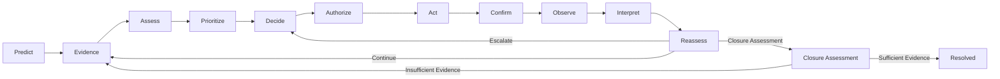

<div align="center">

# TERRAGUARDIAN AI
### FROM WARNING TO VERIFIED RESPONSE
> **"Landslide Operational Intelligence for the North Eastern Region of India"**
---
### 🔗 Website: [TerraGuardian](https://terraguardian.vercel.app/)<br/>
### 🎥 Demo Video: [Watch on YouTube](https://youtu.be/nhXzRiLlDXI)
---

<br>

> ## A warning starts an incident. It does not end one.

<br>

**SIH26001** · **MDoNER** · **Disaster Management** · **Software**

<br><br>

</div>

---

<div align="center">

### TERRAGUARDIAN OPERATIONS CENTRE

<br>


<br>

*Incident · Map · Evidence · Risk · Confidence · Priority · Action · Timeline*

</div>

---

# THE IDEA

<table>
<tr>
<td width="50%" align="center">

### EXISTING HAZARD SYSTEMS

> **What may happen?**

</td>
<td width="50%" align="center">

### TERRAGUARDIAN

> **What should happen next — and what can we legitimately conclude afterward?**

</td>
</tr>
</table>

<br>

It maintains **one evolving, evidence-backed incident state** across:

<div align="center">

**HAZARD → EVIDENCE → CONSEQUENCE → DECISION → ACTION → CONFIRMATION → OUTCOME → REASSESSMENT**

</div>

<br>

### GOVERNANCE

> **AI assists reasoning. Rules govern critical state transitions. Humans authorize critical actions.**

---

# THE OPERATIONAL GAP

## A WARNING IS NOT THE END OF AN INCIDENT

| **Signal** | **Operational question** |
|:---|:---|
| **Forecast** | What is actually happening? |
| **Alert** | How certain are we? |
| **Hazard map** | Who and what is exposed? |
| **Risk** | What matters most now? |
| **Recommendation** | What should happen next? |
| **Authorization** | Was the action approved? |
| **Execution** | Did it actually happen? |
| **Confirmation** | Was execution verified? |
| **Observation** | What actually happened afterward? |
| **Outcome** | What can we legitimately conclude? |

<br>

### THE HARD CASE

<div align="center">

```text
WARNING
   ↓
INTERVENTION
   ↓
NO OBSERVED EVENT
```

<br>

A non-event does not automatically mean:

### FALSE ALARM

And it does not prove:

### INTERVENTION PREVENTED THE EVENT

<br>

The system must distinguish among:

**Delayed / shifted hazard · Incomplete observation · Successful intervention · Model error · Residual hazard · Unresolved evidence**

<br>

### TERRAGUARDIAN

> ## DON'T GUESS. REASSESS.

</div>

---

# THE OPERATIONAL LOOP



<div align="center">

### ONE INCIDENT. ONE OPERATIONAL TRUTH.

The incident remains under reassessment as evidence and reality evolve.

</div>

---

## WHAT THE SYSTEM MAINTAINS

| State | Preserved operational truth |
|:---|:---|
| **INCIDENT** | Lifecycle · location · current state |
| **EVIDENCE** | Source · time · provenance · freshness · reliability · conflict |
| **RISK** | Hazard likelihood / severity |
| **CONFIDENCE** | Confidence in the assessment |
| **CONSEQUENCE** | Exposure · criticality · response difficulty |
| **PRIORITY** | Operational importance |
| **DECISION** | Recommended next step · rationale |
| **AUTHORIZATION** | Human approval for critical action |
| **ACTION** | Proposed → authorized → executed |
| **CONFIRMATION** | Whether execution was actually confirmed |
| **OUTCOME** | What was observed |
| **REASSESSMENT** | What should happen next |
| **AUDIT** | Structured incident history |

---

# SAFETY SEMANTICS

TerraGuardian deliberately keeps operational concepts separate.

| Invariant | Operational meaning |
|:---|:---|
| **Risk ≠ Confidence** | High risk does not mean high certainty |
| **Hazard ≠ Priority** | Hazard severity alone does not determine operational priority |
| **Recommendation ≠ Authorization** | AI recommendation does not authorize critical action |
| **Approval ≠ Execution** | Approval does not prove action occurred |
| **Execution ≠ Confirmation** | Reported execution does not equal verified execution |
| **Observation ≠ Interpretation** | Observation is not automatically a causal conclusion |
| **Non-event ≠ False Alarm** | No observed event does not prove forecast error |
| **Intervention + Non-event ≠ Proven Prevention** | Temporal sequence alone does not establish causality |
| **Missing Evidence ≠ Hazard Resolution** | Lack of evidence is not evidence of safety |
| **Stale Assessment ≠ Current State** | Old intelligence must not silently represent current reality |

---

# ARCHITECTURE

### System Architecture
*Figure 1 — Master Operational Architecture: How TerraGuardian connects existing hazard intelligence to evidence, decision, action, outcome and continuous reassessment.*


### Technical Deployment & Integration Architecture
*Figure 2 — Technical Deployment & Integration Architecture: How the platform is structured internally, isolated at AI/data/security boundaries, connected through adapters/APIs, and progressively deployed from prototype to validated operational integration.*


### ARCHITECTURE PRINCIPLE

<div align="center">
*TerraGuardian is designed to complement existing government systems through controlled interfaces, not replace their authoritative roles. Current prototype capabilities, integration-ready components, and future deployment capabilities remain explicitly distinguished.*

> **Replaceable inputs. Persistent incident state. Bounded intelligence. Human-governed critical transitions.**

</div>

---

# DECISION INTELLIGENCE

TerraGuardian does not stop at:

<div align="center">

### “What is the risk?”

</div>

It asks:

<div align="center">

### “What information or operational step is most valuable next?”

<br>

```text
RISK
+
CONFIDENCE
+
CONSEQUENCE
+
TIME
+
EVIDENCE
        ↓
MOST INFORMATIVE NEXT STEP
        ↓
VERIFY · MONITOR · OBSERVE · PREPARE · ACT
```

<br>

AI reasoning feeds a policy and rule boundary before critical state transitions.

</div>

---

# RESEARCH

### FROM RESEARCH → OPERATIONAL GAP → CONTRIBUTION

```text
LANDSLIDE WARNING & DECISION RESEARCH
                 ↓
FORECAST VERIFICATION
                 ↓
EVIDENCE / UNCERTAINTY
                 ↓
ACTIVE SENSING / INFORMATION VALUE
                 ↓
INTERVENTION-AWARE REASONING
                 ↓
RESIDUAL HAZARD / POST-EVENT ASSESSMENT
                 ↓
INDIAN DISASTER-MANAGEMENT ECOSYSTEM
                 ↓
          OPERATIONAL GAP
                 ↓

┌───────────────────────────────────────────┐
│ WHAT SHOULD AN OPERATIONAL SYSTEM        │
│ CONCLUDE AFTER AN INTERVENTION AND       │
│ AN OBSERVED OUTCOME?                     │
└───────────────────────────────────────────┘

                 ↓

INTERVENTION-CONDITIONED
HAZARD OUTCOME INTERPRETATION
                 ↓
OPERATIONAL IMPLEMENTATION
```

---

### WHAT THE RESEARCH CHANGED

| Research area | Engineering consequence |
|:---|:---|
| **Forecast verification** | Living hazard state + divergence reassessment |
| **Evidence / uncertainty** | Evidence-aware state instead of single-source truth |
| **Active sensing / information value** | Select the most informative next operational step |
| **Incident / digital-twin research** | One evolving incident state |
| **Intervention-aware / counterfactual research** | Intervention context + bounded outcome interpretation |
| **Residual-hazard research** | Continued reassessment instead of premature closure |
| **Indian warning ecosystem** | Connect to — not replace — authoritative systems |

---

### THE RESEARCH QUESTION

<div align="center">

> When a predicted hazard is followed by an intervention and an observed non-event or altered outcome, how should an operational system distinguish model error, successful intervention, delayed/shifted hazard, incomplete observation and unresolved residual risk — without making an unsupported causal claim?

</div>

This question drives the outcome semantics, reassessment workflow and governance boundaries.

---

# THE CONTRIBUTION

### INTERVENTION-CONDITIONED HAZARD OUTCOME INTERPRETATION

TerraGuardian separates:

```text
WHAT WAS PREDICTED
        ↓
WHAT INTERVENTION OCCURRED
        ↓
WHAT WAS ACTUALLY OBSERVED
        ↓
WHAT EVIDENCE SUPPORTS
        ↓
WHAT REMAINS UNCERTAIN
        ↓
WHAT SHOULD HAPPEN NEXT
```

### CORE RULE

<div align="center">

> **Observed outcome ≠ automatic causal explanation.**
>
> The system preserves uncertainty when available evidence cannot justify a stronger conclusion.

</div>

---

### RESEARCH BOUNDARY

TerraGuardian does not claim to invent:

<div align="center">

Landslide prediction · Evidence fusion · Active sensing · Value-of-information · Digital twins · Forecast verification · Intervention-aware warning · Residual-hazard assessment · Closed-loop disaster response · GIS / satellite landslide intelligence

</div>

### DEFENSIBLE CONTRIBUTION

> An intervention-conditioned operational synthesis connecting evidence, action, observed outcome and reassessment within one persistent incident lifecycle — while preserving uncertainty instead of forcing premature conclusions.

---

# INDIA / NER POSITIONING

TerraGuardian is an operational intelligence layer, not a replacement for authoritative warning infrastructure.

```text
GSI / NLFC
NDEM / NRSC
NDMA / SACHET
NESAC
STATE / DISTRICT SYSTEMS
        │
        ▼
┌────────────────────────────┐
│       ADAPTER / API        │
│ Validate · Normalize       │
│ Provenance · Freshness     │
└──────────────┬─────────────┘
               ▼
        TERRAGUARDIAN
               │
               ▼
    Evidence → Decision
               │
               ▼
       Action → Confirmation
               │
               ▼
        Observation
               │
               ▼
         Reassessment
```

<div align="center">

### CONNECT. DON'T REPLACE.

Progressive integration is supported through replaceable data adapters.

No live government integration is claimed unless explicitly implemented and verified.

</div>

---

# ENGINEERING TRUTH

TerraGuardian follows a strict maturity model:

```text
DESIGNED
   ↓
IMPLEMENTED
   ↓
EXECUTABLE
   ↓
VERIFIED
   ↓
DEMONSTRATION-READY
```

Claims are not upgraded without evidence.

| Capability | Current status |
|---|---|
| Persistent Incident Twin | IMPLEMENTED |
| Server-enforced incident lifecycle | IMPLEMENTED |
| Evidence reconciliation | IMPLEMENTED |
| Citizen-evidence safety boundary | IMPLEMENTED |
| Risk + confidence baseline | IMPLEMENTED |
| Impact / priority | IMPLEMENTED |
| Human authorization | IMPLEMENTED |
| Reassessment | IMPLEMENTED |
| Deterministic / interpretable intelligence baseline | IMPLEMENTED |
| Intervention context | IMPLEMENTED |
| Observed-outcome integration | IMPLEMENTED |
| Evidentiary closure gate | IMPLEMENTED |
| Full action-confirmation enforcement | IMPLEMENTED |
| Live government integrations | NOT CLAIMED |
| Production ML accuracy | NOT CLAIMED |
| Production RBAC / IAM | NOT CLAIMED |
| Cryptographically immutable audit | NOT CLAIMED |
| Full offline-first operation | NOT CLAIMED |

<br>

<div align="center">

> ### Sparse-but-true beats impressive-but-false.

</div>

---

# VERIFICATION

### BACKEND TEST SUITE

<div align="center">

### 94 Automated Tests Across 7 Test Suites

</div>

Verified test modules:

- `test_security_p0.py` (Authentication, Server-Side RBAC, Action Confirmation, Evidentiary Closure Gate)
- `test_outcome_engine.py` (Intervention-Conditioned Outcome Engine & Spatial Corridor Envelope)
- `test_adversarial_intelligence.py` (12 Adversarial Safety Invariants, NBI, Risk ≠ Confidence)
- `test_reassessment_flow.py` (Living Incident Bounded Reassessment & State Transitions)
- `test_priority_scoring.py` (Consequence & Multi-Factor Operational Priority)
- `test_domain_models.py` (Domain Schemas, Enums & Invariants)
- `test_api_endpoints.py` (FastAPI REST Routes & Serialization)

Execution command:

```bash
python3 -m pytest tests/ -v
```

*Note: In headless or constrained host environments where the Python/Node runtimes are not pre-installed in PATH, execution status is reported truthfully as `IMPLEMENTED / VERIFICATION PENDING` rather than fabricating runtime passes.*

### VERIFICATION BOUNDARY

The following are not represented as production-verified unless separately demonstrated:

- PostgreSQL/PostGIS runtime
- Docker Compose runtime
- Frontend E2E execution
- Production authentication / IAM
- Live government integrations
- Regional ML accuracy
- Offline-first operation
- Cryptographically immutable audit

---

# DEMONSTRATION

## THE GOLDEN SCENARIO

### 01 · PREDICT

A hazard signal creates an incident.

```text
Risk       → assessed
Confidence → assessed separately
Location   → mapped
```

### 02 · EVIDENCE

Additional evidence arrives.

```text
Source · Timestamp · Location
Freshness · Reliability · Conflict
```

### 03 · PRIORITIZE

```text
Hazard
+
Exposure
+
Criticality
+
Response Difficulty
```

### 04 · DECIDE

```text
AI reasoning
      ↓
Policy / Rule validation
      ↓
Human authorization
```

### 05 · ACT

```text
PROPOSED
   ↓
AUTHORIZED
   ↓
EXECUTED
   ↓
CONFIRMED
```

### 06 · REALITY DIVERGES

Field observation:

<div align="center">

### NO LANDSLIDE OBSERVED

</div>

TerraGuardian does not automatically declare:

### FALSE ALARM

and does not claim:

### PREVENTION PROVEN

### 07 · INTERPRET

<div align="center">

### INTERVENTION-CONDITIONED NON-EVENT

</div>

The incident retains:

Intervention context · Observation · Evidence · Uncertainty · Residual questions

### 08 · REASSESS

```text
OBSERVE
   ↓
INTERPRET
   ↓
REASSESS
   ↓
CONTINUE
   /
ESCALATE
   /
CLOSURE ASSESSMENT
```

---

# OUTCOME SEMANTICS

| Scenario | Operational interpretation |
|:---|:---|
| **Event observed** | `EVENT_OBSERVED` |
| **No event + intervention** | `INTERVENTION_CONDITIONED_NON_EVENT` |
| **No event + adequate observation** | `POTENTIAL_FALSE_ALARM_ASSESSMENT` |
| **No event + insufficient evidence** | `OBSERVATION_GAP` |
| **Event + remaining hazard** | `RESIDUAL_HAZARD` |
| **Conflicting evidence** | `CONFLICTED` |
| **Evidence insufficient for closure** | `UNRESOLVED` |

<br>

### CLOSURE IS NOT A SHORTCUT

```text
MONITORING
    ↓
OUTCOME ASSESSMENT
    ↓
REASSESSMENT
    ↓
CONTINUE / ESCALATE / CLOSURE ASSESSMENT
    ↓
AUTHORIZED CLOSURE
    ↓
RESOLVED
    ↓
REVIEWED
```

---

# IMPACT

### FROM MORE ALERTS TO BETTER OPERATIONAL DECISIONS

| Capability | Operational value |
|:---|:---|
| **Faster coordination** | Warning → verification → decision → action |
| **Better prioritization** | Consequence-aware operational focus |
| **Evidence-aware state** | Freshness, provenance and conflict remain visible |
| **Verified response** | Authorization → execution → confirmation |
| **Safer interpretation** | Observation separated from causal conclusion |
| **Continuous reassessment** | Reality divergence produces the next decision |
| **Structured history** | Incident state remains reviewable |

<br>

### OPERATIONAL METRICS

```text
WARNING → DECISION TIME

DECISION → ACTION TIME

ACTION CONFIRMATION LATENCY

EVIDENCE CONFLICT RATE

REASSESSMENT COMPLETION

CLOSURE EVIDENCE COMPLETENESS
```

These are proposed operational metrics, not claimed performance results.

---

# WHY THE NORTH EAST

The architecture is designed for a regional operational environment where hazard intelligence, field evidence, exposure, response coordination and changing ground conditions must coexist across multiple administrative and technical systems.

<div align="center">

```text
REUSABLE CORE
      +
REPLACEABLE DATA ADAPTERS
      +
PROGRESSIVE VALIDATION
      +
DISTRICT → STATE → NER SCALE
```

<br>

### DEPLOYMENT PRINCIPLE

> **Validate first. Delegate authority progressively.**

</div>

---

# TECHNOLOGY

| Layer | Technology |
|:---|:---|
| **Frontend** | React · TypeScript |
| **API** | FastAPI |
| **Database** | PostgreSQL / PostGIS target architecture |
| **Intelligence** | Python |
| **ML baseline** | Deterministic / interpretable prototype |
| **Geospatial UI** | MapLibre |
| **Validation** | Typed APIs · Domain rules |
| **Testing** | Pytest |
| **Migrations** | Alembic |
| **Architecture** | Modular domain services |

---

# REPOSITORY

```text
TerraGuardian/
│
├── apps/
│   ├── operations-centre/
│   └── terra-guardian-safe/
│
├── services/
│   └── api/
│       ├── models/
│       ├── services/
│       ├── routers/
│       └── migrations/
│
├── intelligence/
│   ├── agents/
│   ├── evidence/
│   ├── impact/
│   ├── priority/
│   ├── risk/
│   └── vision/
│
├── ml/
├── gis/
├── tests/
├── docs/
└── README.md
```

Repository structure reflects the current prototype architecture. Placeholder modules are not represented as completed intelligence capabilities.

---

# ENGINEERING METHOD

<div align="center">

```text
REQUIREMENT
     ↓
ARCHITECTURAL DECISION
     ↓
DOMAIN CONTRACT
     ↓
SMALL IMPLEMENTATION
     ↓
AUTOMATED TEST
     ↓
RUNTIME VERIFICATION
     ↓
INTEGRATION
     ↓
DEMO VERIFICATION
     ↓
DOCUMENTATION
```

</div>

### ENGINEERING RULES

- Evidence before conclusion
- Explicit state over implicit assumptions
- Human authorization for critical actions
- Deterministic rules for critical transitions
- AI assists; governance controls
- Replaceable source adapters
- Persistent incident history
- No unsupported causal claims
- No automatic closure from absence alone
- Documentation follows verification

---

# RUN

### Backend verification

```bash
cd services/api

python3 -m pytest tests/ -v
```

For the complete development environment, follow the repository's verified setup and dependency instructions.

Runtime and deployment commands must remain synchronized with the actual repository configuration.

## Demo Access Credentials

> TerraGuardian includes seeded demonstration accounts for evaluating role-based workflows locally. These credentials are DEMO / LOCAL ONLY and are not production credentials.

| Role | Username | Password | Purpose |
|---|---|---|---|
| Operator | `operator` | `Terra#Op2026` | Operations command workflow |
| Magistrate | `magistrate` | `Terra#Admin2026` | Authorization / decision-maker workflow |
| Field Verifier | `patrol` | `Patrol#2026` | Field verification workflow |
| Citizen | `citizen` | `Citizen#2026` | Public / citizen workflow |

> **DEMO / LOCAL ONLY:** These credentials are intentionally seeded for prototype evaluation and must not be used, reused, or treated as production credentials. Production deployment requires integration with the appropriate secure identity and access-management infrastructure.

Start the application locally, open the Authority Operations Gateway, and use the appropriate demo account above to inspect its role-specific workflow.

---

# RESEARCH & SUPPORTING MATERIAL

The README is intentionally the product and engineering front door.

Detailed material belongs in supporting documentation:

```text
docs/
├── research/
│   ├── research-matrix
│   ├── prior-art
│   └── source-register
│
├── architecture/
│   ├── domain-model
│   ├── state-machines
│   └── decisions
│
├── verification/
│   ├── test-evidence
│   └── audit
│
└── demo/
    ├── golden-scenario
    └── walkthrough
```

---

<div align="center">

### TERRAGUARDIAN AI

### FROM WARNING TO VERIFIED RESPONSE

<br>

PREDICT → EVIDENCE → ASSESS → PRIORITIZE → DECIDE → AUTHORIZE → ACT → CONFIRM → OBSERVE → INTERPRET → REASSESS

<br><br>

> Making uncertainty an operational decision variable.

<br>

SIH26001 · MDoNER · Disaster Management · Software

</div>
