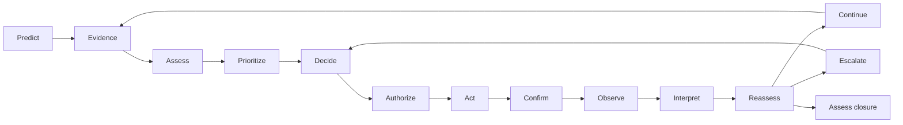
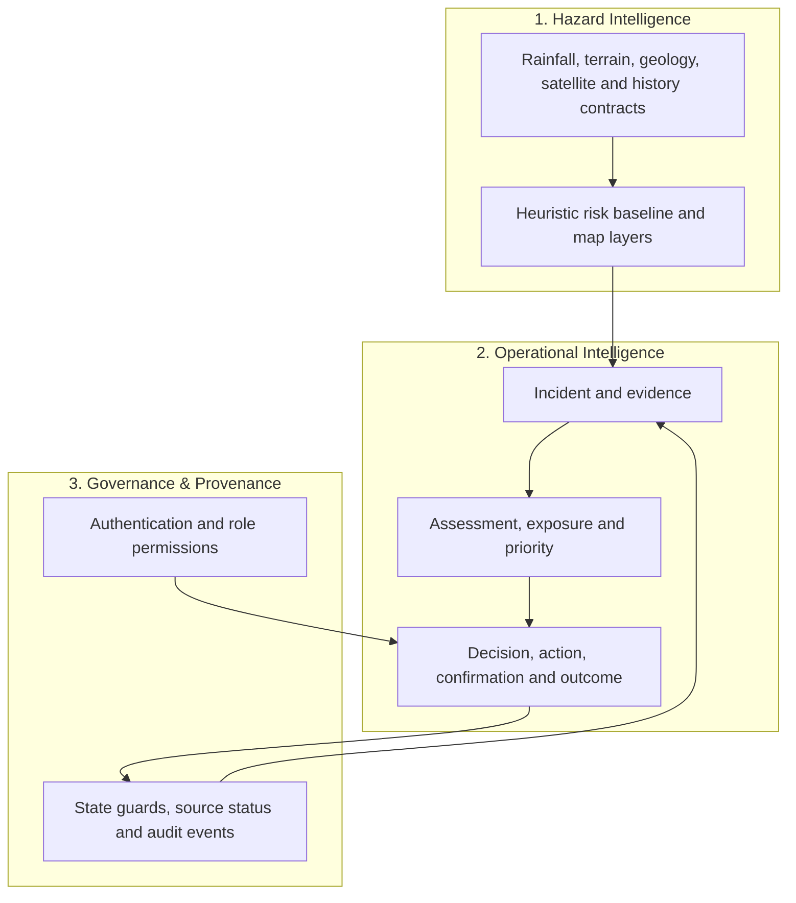

# TERRAGUARDIAN AI
## Landslide Early-Warning & Operational Intelligence System

**FROM WARNING TO VERIFIED RESPONSE**

TerraGuardian is a landslide operational intelligence system that maintains an evolving, evidence-backed incident state across hazard, confidence, consequence, decision, action and outcome, and continuously reassesses that state as reality changes.

> **ONE INCIDENT. ONE OPERATIONAL TRUTH. ONE CLOSED LOOP.**
>
> AI assists reasoning. Rules govern critical state transitions. Humans authorize critical actions.

## At a Glance

| Item | Current scope |
|---|---|
| Hackathon problem | SIH26001 / PS26001: AI-based early warning and landslide risk monitoring in the North Eastern Region |
| Ministry / theme / category | Ministry of Development of North Eastern Region (MDoNER) / Disaster Management / Software |
| Geographic scope | NER is the product scope; the deep controlled scenario is West Kameng, Arunachal Pradesh, around NH-13 |
| Applications | Operations Centre and TerraGuardian Safe citizen PWA |
| Public Production alias | [terraguardian.vercel.app](https://terraguardian.vercel.app/) served the frontend and `/api/v1/health` returned HTTP 200 on 2026-10-04. This observation does not establish durable storage, source equivalence, or production readiness. |
| Protected Preview | [latest verified Preview](https://terraguardian-rk42dg471-tsakeerthanasaravanan-1927s-projects.vercel.app/) reported `staging` and database `ok` on 2026-10-04. It uses demo configuration and ephemeral SQLite; Vercel access protection applies. |

Deployment observations are time-bound. Neither endpoint is evidence of live government feeds. The repository’s current Production settings require PostgreSQL and S3-compatible storage; the project’s Vercel environment inventory showed Preview variables only during this audit. See [deployment boundaries](#limitations).

## The SIH26001 Problem

SIH26001 asks for an AI-based landslide early-warning and risk-monitoring system for the North Eastern Region. Its required foundation spans rainfall and soil moisture, satellite imagery, terrain and historical landslides, risk identification, GIS exposure, alerts, citizen/field evidence, emergency prioritisation, multilingual communication, low-connectivity use and integration architecture.

TerraGuardian follows that problem statement as its primary product spine. The repository represents these data modalities and workflows through a mix of implemented software, controlled fixtures, adapter contracts and future integrations. That distinction matters: a schema for an IMD observation is not an IMD connection, a map layer is not regional live coverage, and a deterministic score is not a regionally validated predictive model.

## What TerraGuardian Builds

The SIH foundation feeds an operational lifecycle rather than ending at a warning card. The Operations Centre presents an incident workspace, map, evidence reconciliation, assessments, prioritisation, decision support, action tracking, confirmation, outcome and review views. TerraGuardian Safe provides a citizen-facing safety and reporting application. FastAPI routes connect these interfaces to incident, evidence, action, notification, GIS and replay services.

The intended hierarchy is:

1. **SIH26001 foundation:** represent hazard indicators, exposure, maps, warnings and citizen/field evidence.
2. **Operational core:** carry a persistent incident through assessment, authority, response, confirmation and reassessment.
3. **Bounded research contribution:** interpret ambiguous outcomes after interventions and identify information that may separate competing explanations.

The research layer is depth on top of the SIH solution, not a replacement for it.

## The Operational Gap

**A warning is not the end of the operational problem.** Teams still need to determine what the evidence supports, which people and lifelines are exposed, who may authorize an action, whether it was executed and physically confirmed, and what can responsibly be concluded afterward.

TerraGuardian keeps these concepts distinct:

- Risk ≠ Confidence
- Hazard ≠ Priority
- Prediction ≠ Ground Truth
- Recommendation ≠ Authorization
- Authorization ≠ Execution
- Execution ≠ Confirmation
- Observation ≠ Interpretation
- Non-event ≠ False Alarm
- Intervention + Non-event ≠ Proven Prevention
- Missing Evidence ≠ Hazard Resolution
- Stale Evidence ≠ Current Reality
- Citizen Evidence ≠ Verified Ground Truth
- Operational Closure ≠ Geotechnical Hazard Extinction

These are product semantics expressed in domain services, API contracts and interface labels; they are not a claim that every external evidence source is available.

## From Warning to Verified Response


```mermaid
flowchart LR
    PREDICT[Predict] --> EVIDENCE[Evidence]
    EVIDENCE --> ASSESS[Assess]
    ASSESS --> PRIORITIZE[Prioritize]
    PRIORITIZE --> DECIDE[Decide]
    DECIDE --> AUTHORIZE[Authorize]
    AUTHORIZE --> ACT[Act]
    ACT --> CONFIRM[Confirm]
    CONFIRM --> OBSERVE[Observe]
    OBSERVE --> INTERPRET[Interpret]
    INTERPRET --> REASSESS[Reassess]
    REASSESS --> CONTINUE[Continue]
    REASSESS --> ESCALATE[Escalate]
    REASSESS --> CLOSURE[Assess closure]
    CONTINUE --> EVIDENCE
    ESCALATE --> DECIDE
```

The API contains an incident state machine, a governed action workflow, and closure checks. Tests exercise these boundaries. A complete field operation is not implied by a state transition: the demonstrated case is controlled, and statutory decisions remain human-authorized in the software model.

## Three-Plane Architecture


```mermaid
flowchart TB
    subgraph H[1. Hazard Intelligence]
      H1[Rainfall, terrain, geology, satellite and history contracts]
      H2[Heuristic risk baseline and map layers]
      H1 --> H2
    end
    subgraph O[2. Operational Intelligence]
      O1[Incident and evidence]
      O2[Assessment, exposure and priority]
      O3[Decision, action, confirmation and outcome]
      O1 --> O2 --> O3
    end
    subgraph G[3. Governance & Provenance]
      G1[Authentication and role permissions]
      G2[State guards, source status and audit events]
    end
    H2 --> O1
    O3 --> G2
    G1 --> O3
    G2 --> O1
```

The backend is a FastAPI/SQLAlchemy application exposed through Vercel’s Python function routing. The Operations Centre and Safe are React/Vite applications. The API is the state-changing authority; the client’s role display is not an authority boundary. Detailed package-specific notes are in [database](database/README.md), [GIS](gis/README.md), [intelligence](intelligence/README.md), [brand assets](assets/brand/README.md) and [visual references](assets/references/README.md).

## AI/ML and GIS

The risk baseline in [`ml/baseline.py`](ml/baseline.py) normalizes rainfall, slope, geological susceptibility and a saturation estimate with expert-set coefficients and a logistic transform. It computes risk separately from evidential confidence and emits feature explanations. The coefficients are not learned from a regional training set; the repository does not establish regional calibration, predictive accuracy or production-grade AI validation. Synthetic benchmark code is not evidence of real-world model performance.

GIS functionality includes a Leaflet-based map, API layer contracts, GeoJSON serialization, regional catalogue display and Python geodesic/corridor calculations. The repository contains one Copernicus GLO-30 tile and terrain derivative code for that local asset. This is not continuous DEM ingestion or a complete, authoritative NER GIS. Seeded roads, settlements and infrastructure are demonstration fixtures. GIS code and spatial contracts are described in [gis/README.md](gis/README.md).

## Evidence and Ground Reality

The evidence model records source, observation, time, location, interpretation and provenance fields. Citizen reports are accepted as citizen-originated observations and remain unverified until reviewed. Field and citizen submissions are not interchangeable with an authoritative landslide inventory. Freshness, conflicts and missing evidence can affect assessment; absence of an observation is not evidence that a slope is safe.

The NER inventory file contains 18 records: 6 classified `REAL_HISTORICAL` and 12 `CONTROLLED_DEMO`; it reports zero live events and `NOT_CONNECTED` live adapters. Historical rows include named source references, while some coordinate or time values are explicitly approximate and none is represented as field-verified by TerraGuardian. See the [record-level provenance audit](docs/ner-event-provenance-audit.json). The file is a static catalogue, not a live GSI/NRSC event feed.

## Governed Response

The operational model separates four steps:

1. **Recommendation:** software services can calculate and present options.
2. **Authorization:** a permitted human role approves a governed decision where required.
3. **Execution:** an action is dispatched, acknowledged and progressed by its assigned actor.
4. **Confirmation:** accepted field confirmation is recorded separately from completion claims.

The action service and incident transition guards are covered by unit tests. Relational audit events support traceability, but the repository does not implement cryptographic immutability, an external government identity provider, radio dispatch hardware or a connected emergency CAD system. Software role names do not grant legal authority outside the demonstration.

## Outcome Intelligence

After a warning, intervention and non-event, multiple explanations may remain possible: forecast error, intervention-conditioned non-event, delayed or shifted hazard, observation gap, residual hazard or conflicting evidence. The outcome service represents seven such competing operational hypotheses (H1–H7). It is a structured interpretation mechanism, not causal inference. A non-event does not prove prevention, and a `closure_permitted` result is a software precondition evaluation, not geotechnical certification.

## Bounded Research Contribution

The candidate contribution is **intervention-conditioned hazard outcome interpretation**: preserving intervention context while assessing an observed event, non-event, observation gap or shifted manifestation. The associated mechanism under evaluation is **hypothesis-separating Next-Best-Information (NBI)**: suggesting which observation could discriminate among remaining hypotheses.

This is a bounded operational composition candidate. The repository does not establish that it is first, unique or novel relative to prior research. NBI means Next-Best-Information here; it is qualitative advisory reasoning, not net-benefit economics, a calibrated value-of-information estimate or an autonomous instruction. No causal claim follows solely from `WARNING → INTERVENTION → NO EVENT`.

## SIH26001 Traceability

| SIH26001 requirement | TerraGuardian capability | Current maturity | Evidence / boundary |
|---|---|---|---|
| Rainfall | Canonical rainfall schema, validation adapter, feature pipeline and seeded scenario values | IMPLEMENTED / VERIFICATION PENDING; scenario is SIMULATED | No live IMD connection; adapter accepts payloads, it does not fetch them. |
| Soil moisture | Canonical schema and adapter; scenario saturation estimate | IMPLEMENTED / VERIFICATION PENDING; SIMULATED | No connected sensor or SMAP/SMOS feed; saturation can be heuristic. |
| Satellite imagery | Optical/InSAR data contracts and adapter validation | SIMULATED / IMPLEMENTED | No connected Sentinel imagery or processing pipeline is verified. |
| Terrain and slope | One local DEM asset, terrain derivative code and display contracts | IMPLEMENTED / VERIFICATION PENDING | Limited tile coverage; seeded incident slope values may be fixture inputs. |
| Historical landslides | Static 18-record NER catalogue | IMPLEMENTED | Six rows are classified REAL_HISTORICAL with source references; coordinate/time precision varies; twelve are controlled fixtures. |
| AI/ML risk identification | Deterministic interpretable baseline and synthetic benchmark code | EXPERIMENTAL | Expert-set coefficients; no regionally trained or calibrated predictive model is established. |
| High-risk identification | Risk score/level and separate confidence assessment | IMPLEMENTED / VERIFICATION PENDING | Reproducible software assessment; not a validated probability or operational warning authority. |
| Near-real-time alert architecture | Alert lifecycle, in-app/API channel models and source status | IMPLEMENTED / VERIFICATION PENDING | Scenario delivery can be simulated; external carrier/provider connection is not verified. |
| GIS | Interactive Leaflet map, GIS endpoints and spatial calculations | IMPLEMENTED / VERIFICATION PENDING | Regional views include fixtures; no full authoritative regional GIS ingestion is established. |
| Roads | Corridor and road map layers | SIMULATED | Seed geometry is a demonstration representation, not a complete road network. |
| Villages | Settlement and exposure display | SIMULATED | Limited seeded points; not a complete NER village inventory. |
| Infrastructure | Critical asset exposure and priority inputs | SIMULATED | Demonstration asset records; authoritative completeness is not established. |
| Field/citizen evidence | Geo-tagged report API, review status and evidence association | IMPLEMENTED; Preview flow VERIFIED | A citizen report remains `UNVERIFIED` / pending review until an authorized review. |
| Emergency prioritisation | Hazard, exposure, criticality, connectivity and response-difficulty scoring | IMPLEMENTED / VERIFICATION PENDING | Deterministic ranking for operational support, not an externally calibrated score. |
| Multilingual support | Operations and Safe language catalogs | IMPLEMENTED / VERIFICATION PENDING | Coverage is partial; regional machine-assisted translations require native review. |
| Low-network/offline capability | Safe app-shell cache and local report queue with later sync attempt | IMPLEMENTED / VERIFICATION PENDING | Local queue is not guaranteed background delivery; API submission needs connectivity. |
| SMS/app warning | SMS/provider adapter, in-app channel and alert state models | IMPLEMENTED / VERIFICATION PENDING | SMS is `CHANNEL_NOT_CONFIGURED` without provider credentials; no government broadcast integration. |
| Cloud/scalable architecture | Vercel frontend and Python function deployment configuration | VERIFIED for observed HTTP serving only | Preview uses ephemeral SQLite/local storage; availability, durability and load scalability are not proven. |

“Implemented” means code exists and is wired in the stated boundary; it does not mean a live source is connected. “Verified” is reserved for the narrow behavior and environment named in the evidence.

## Product Surfaces

- **Operations Centre** (`apps/operations-centre`): command overview, priority queue, map, incident/evidence workspace, action/decision views, replay and audit-oriented views.
- **TerraGuardian Safe** (`apps/terra-guardian-safe`): citizen-facing safety status, multilingual UI, location-aware views, report wizard and local queue/sync behavior.
- **FastAPI service** (`services/api`): authentication, incidents, GIS, citizen reports, evidence, actions, alerts, replay and health routes.

The separate Safe app is a working interface with limited offline behavior, not a complete emergency communications network.

## Data and Provenance Model

The repository uses several provenance labels. They describe data origin or maturity, not quality by themselves:

| Label | Meaning in this repository |
|---|---|
| `LIVE` | A connected real-time source. No live government weather, satellite or sensor feed was verified in this audit. |
| `REAL_HISTORICAL` | Static, source-attributed historical records in the NER catalogue; some coordinates/times are approximate and TerraGuardian field verification is false. |
| `REPLAY` | Deterministic event or payload progression for demonstration/testing. |
| `SYNTHETIC` | Constructed scenario values or benchmark data, not observed conditions. |
| `DEMO` / `CONTROLLED_DEMO` | Explicitly seeded demonstration state; not a real incident report. |
| `EXPERIMENTAL` | A model or analysis not validated for operational predictive accuracy. |
| `NO_LIVE_FEED` | The relevant live upstream feed is disconnected or absent. |
| `UNVERIFIED` | An observation, particularly a citizen report, has not been independently reviewed. |

Do not infer `LIVE` from an adapter class, `REAL_HISTORICAL` from a coordinate, or `VERIFIED` from a successful HTTP response. See [data contracts](docs/08-data-contracts.md) as schema intent and the [provenance audit](docs/ner-event-provenance-audit.json) for the current catalogue. Some broad design documents are aspirational; executable code and observed behavior take precedence.

## Implementation Maturity

| Capability | Maturity | Boundary |
|---|---|---|
| Incident and action state services | IMPLEMENTED; unit-tested | Tests run against local in-memory SQLite, not a production database. |
| Evidence, decision, outcome and reassessment services | IMPLEMENTED; unit-tested | Domain flow is demonstrable with controlled data; it is not a live operational service. |
| Rainfall/soil/satellite adapters | IMPLEMENTED / VERIFICATION PENDING | Input validation and replay; no live provider integration. |
| Risk baseline | EXPERIMENTAL | Rule/weight-based score; no regional fitting, calibration or accuracy claim. |
| NER map/catalogue | IMPLEMENTED | Static historical and controlled records; live feed reports disconnected. |
| Citizen observation submission | VERIFIED in protected Preview on 2026-10-04 | API returned 201 and the operations queue returned the report pending review/unverified. This is not a Production persistence guarantee. |
| Preview API health | VERIFIED in protected Preview on 2026-10-04 | `environment=staging`, SQLite health `ok`; storage is ephemeral. |
| Production URL response | VERIFIED by read-only probe on 2026-10-04 | Frontend and health responded; deployment commit provenance and durable dependencies were not verified. |
| Production infrastructure safeguards | IMPLEMENTED in current source | Current config requires PostgreSQL, strong secret and S3-compatible values when environment is production; actual Production variable inventory did not show those values. |

## Verification

The repository contains Python unit tests, Safe-app Vitest tests and frontend build scripts. The end-to-end Playwright configuration exists, but `tests/e2e` contains no test suite beyond its placeholder; do not infer full E2E coverage from the config. Final command results for this documentation revision are recorded below after running them:

| Check | Command | Result |
|---|---|---|
| Backend unit tests | `python -m pytest tests/unit -q` | 361 passed in 289.31s on 2026-10-04 |
| Operations build and root dist sync | `npm run build` | Passed on 2026-10-04; Vite build and `scripts/sync-dist.cjs` completed. Vite emitted the existing large-chunk advisory. |
| Safe build | `npm run build:safe` | Passed on 2026-10-04 (`tsc -b` and Vite build). |
| Safe tests | `npm run test:safe` | 3 passed in 54.01s on 2026-10-04. |

## Demonstration Scenario

The canonical demonstration uses incident `TG-2048`, a controlled West Kameng/NH-13 scenario. Its rainfall, slope, weather/satellite states, field observations, actions and outcomes are scenario values unless individually sourced otherwise. The deterministic replay API is under `/api/v1/replay`. Replay completion demonstrates software transitions; it does not establish a real July 2024 incident, government action or successful intervention in the field.

Demo role access is documented separately in [docs/DEMO_ACCESS.md](docs/DEMO_ACCESS.md). Never use these demo identities as real accounts.

## Repository and Local Development

```text
 apps/operations-centre/   React/Vite command interface
 apps/terra-guardian-safe/ React/Vite citizen PWA
 services/api/             FastAPI, SQLAlchemy, domain services and API routes
 ml/                       Interpretable deterministic baseline and synthetic benchmark
 gis/                      Spatial contracts; active calculation code is in services/api
 intelligence/             Intelligence contracts and re-exports
 data/                     Static inputs and controlled fixtures
 tests/unit/               Backend domain and API tests
 docs/                     Product, security, data and lifecycle specifications
 api/index.py              Vercel Python function entrypoint
 vercel.json               Frontend/API routing and build configuration
```

Prerequisites: Python 3.11+ and Node.js 20+. From the repository root:

```powershell
npm install
python -m pip install -r services/api/requirements.txt
python -m uvicorn app.main:app --app-dir services/api --host 127.0.0.1 --port 8000 --reload
```

In another terminal, run `npm run dev:ops` for Operations Centre or `npm run dev:safe` for Safe. Default local database is SQLite. Use `.env.example` as a variable-name guide; never copy placeholder values into Production. For managed PostgreSQL configuration and current database boundaries, see [database/README.md](database/README.md).

## Limitations

- No live IMD, GSI, ISRO/NRSC, satellite, soil sensor, IoT or emergency-system feed was verified as connected.
- No live government identity system, SMS carrier, SACHET broadcast or physical radio/CAD system is connected.
- Risk scores are deterministic expert-weighted estimates. They are not regionally trained/calibrated probabilities, and no accuracy result should be inferred from synthetic benchmarks.
- The regional map combines a static event catalogue and demonstration geometry. It is not an authoritative, complete road/village/infrastructure GIS for all eight states.
- Preview uses Vercel temporary SQLite and local `/tmp` storage. Function instances may not share that state and it is not durable storage.
- The current Production URL returned a successful health response, but the Vercel project’s environment inventory showed only Preview variables during this audit, and CLI inspection did not expose source commit metadata for the Production deployment. Production readiness and durable persistence are therefore **not verified**.
- The audit table is relational application data, not tamper-proof cryptographic storage.
- Offline Safe mode can queue reports locally and retry synchronization; it does not provide live server operations while disconnected.
- Language catalogs are incomplete and require native-speaker review before public emergency use.

## Research Boundary

TerraGuardian does not claim to invent landslide prediction, GIS, data fusion, digital twins, active sensing or causal inference. It does not claim world-first or India-first status, a validated regional model, autonomous authorization, or proof that an intervention prevented a failure. The defensible candidate contribution is the composition of SIH-aligned warning/risk monitoring with a governed incident lifecycle and explicit post-intervention outcome hypotheses. That contribution remains bounded and requires independent research evaluation.

The repository does not contain a complete literature review or a complete bibliographic record for every source named in its data catalogue. The public README therefore makes no priority or novelty claim based on incomplete citations. Historical source attributions are available in the record-level audit; coordinates, timestamps and field verification must be read per record.

## Roadmap

Future work is limited to actual gaps: provision and verify durable managed PostgreSQL and object storage before claiming production persistence; integrate authorized external data sources behind the existing adapter boundary; expand authoritative NER GIS and historical inventories; evaluate risk methods on documented, independently sourced data with appropriate spatial/temporal validation; complete Safe/offline synchronization and translation review; and add deployed browser E2E coverage for role-governed workflows. These are future tasks, not completed capabilities.

## References

The following source pointers appear in the repository’s historical-event records; their presence documents record attribution and does not mean a live connector is active:

- ISRO National Remote Sensing Centre, *Landslide Atlas of India*: [nrsc.gov.in/Landslide_Atlas_of_India](https://www.nrsc.gov.in/Landslide_Atlas_of_India).
- Government of Mizoram, Disaster Management & Rehabilitation Department: [dmr.mizoram.gov.in](https://dmr.mizoram.gov.in).
- Nagaland State Disaster Management Authority: [nsdma.nagaland.gov.in](https://nsdma.nagaland.gov.in).
- Ningthoujam et al., *Current Science*, 123(5), 2022, cited by the Tupul historical inventory record. The repository record does not include the article title or a persistent article identifier; consult the original publication before using it as scientific support.
- Record-level sources, coordinate/time verification modes and limitations: [docs/ner-event-provenance-audit.json](docs/ner-event-provenance-audit.json).
- Frozen product ordering and semantic invariants: [docs/00-product-north-star.md](docs/00-product-north-star.md).
- Current implementation boundaries: source modules and tests linked in this README; repository specifications are not runtime proof.

---

**SIH26001 remains the spine. Operational intelligence is the differentiation. The research contribution is the depth. Evidence determines maturity.**
