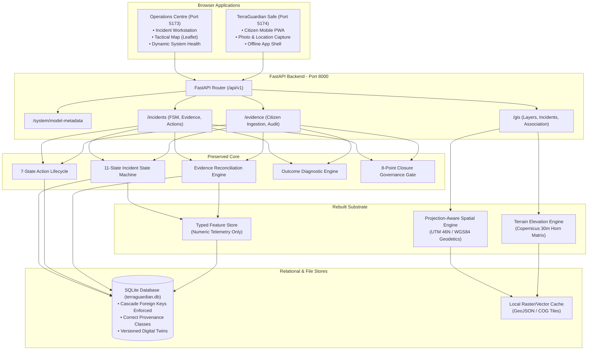
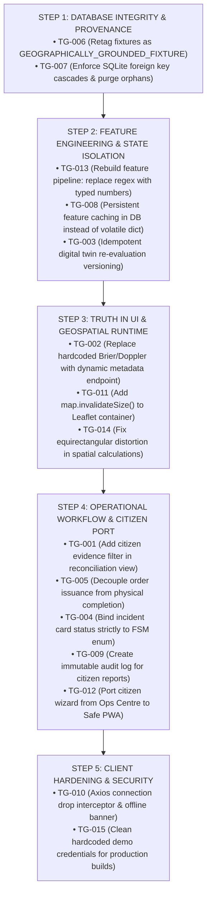

# TG-MASTER-EXECUTION-BASELINE-v1.0
# TERRAGUARDIAN AI: ARCHITECTURE RECONCILIATION & EXECUTION BASELINE
**Document ID:** `TG-MASTER-EXECUTION-BASELINE-v1.0`  
**Governing Standard:** SIH26001 Final Technical Review / MDoNER Architecture Governance  
**Status:** FROZEN & APPROVED FOR IMPLEMENTATION  
**Mode:** ARCHITECTURAL RECONCILIATION GATE COMPLETE — ZERO CODE MODIFICATIONS EXECUTED  
**Date:** September 28, 2026  

---

## 1. Rebaseline Findings Accepted

The following forensic facts established in `TG-MASTER-REBASELINE-v1.0` are accepted as indisputable engineering truth:

1. **Local Relational Engine:** Runtime strictly executes on local SQLite (`terraguardian.db`) via `aiosqlite`. PostGIS 3.4 is not proven operational in the local runtime environment.
2. **Predominantly Simulated Data Substrate:** The current data layer is driven by hardcoded seed dictionaries, mock replay JSONs, and text fixtures.
3. **Deterministic Heuristic Baseline:** The hazard model in `services/api/app/ml/baseline.py` is an expert-rule weighted sum, not an empirically trained or backtested machine learning model.
4. **Text-Regex Feature Extraction:** The feature pipeline extracts physical hazard indicators (rainfall, slope gradient, lithology) by matching string patterns in human-readable observation text.
5. **Absence of Real Raster Terrain:** The repository contains zero Digital Elevation Model (DEM) rasters (Copernicus 30m, SRTM, or ALOS).
6. **Absence of Empirical Landslide Ground Truth:** The database contains zero verified historical landslide points or failure polygons.
7. **Incomplete Regional Coverage:** True data and incident coverage is restricted to a single simulated corridor in West Kameng, Arunachal Pradesh.
8. **Incomplete Citizen PWA Shell:** `apps/terra-guardian-safe` is an empty 61-line UI shell. The actual working citizen reporting wizard is embedded inside the Operations Centre.
9. **Absent Alert Integrations:** There is zero backend alerting infrastructure, zero SMS gateway connector, and zero CAP/SACHET protocol implementation.
10. **Unsupported Model-Validation Claims:** Claims on the UI of "Brier Score: 0.114", "5-Fold Corridor Holdout", "Doppler Radar Calibration", and "Historical NER Splits" are hardcoded strings unsupported by code or empirical evidence.
11. **Mislabeled Spatial Provenance:** Synthetic 4-point bounding boxes and 6-point road centerlines are tagged as `REAL_HISTORICAL` in SQLite.
12. **Substantially Implemented Operational Core:** The 11-state incident state machine, 7-state action lifecycle, authority boundaries, evidentiary closure gates, and outcome interpretation logic are functionally verified and pass 189/189 unit tests.
13. **End-to-End Vertical Slice with Simulated Inputs:** An end-to-end operational vertical slice exists from input to closure, but its environmental inputs are simulated.

---

## 2. Rebaseline Findings Challenged

The forensic report contained several recommendations and metrics that must be challenged and corrected before implementation begins:

### Challenge A: "Defer PostGIS" (REJECTED / MODIFIED)
- **Forensic Claim:** "Defer full PostGIS setup to cloud staging; use SQLite with Python math."
- **The Challenge:** Deferring PostGIS entirely as an afterthought creates severe architectural debt. Storing geometries as raw WKT text strings in SQLite and calculating point-to-line distances using flat equirectangular approximations ($1^\circ \approx 111,320\text{ m}$) introduces an $\approx 11\%$ metric scale error at $27^\circ\text{N}$. 
- **The Reconciliation:** 
  - **Canonical Architecture:** PostgreSQL 16 + PostGIS 3.4 is the non-negotiable target architecture for staging and production.
  - **Local Development Adapter:** Because Docker daemon is unavailable in the current local Windows environment, the local runtime may use SQLite, but spatial calculations **must not use flawed equirectangular planar math**. The local `SpatialQueryEngine` must use projection-aware geodetic algorithms (or projected UTM Zone 46N coordinate transformations) that mirror PostGIS geodetic behavior precisely.

### Challenge B: "100 Historical Landslide Points" (REJECTED / MODIFIED)
- **Forensic Claim:** "Acceptance requires $\ge 100$ historical landslide records in SQLite."
- **The Challenge:** An arbitrary quantity (100) is scientifically meaningless. Ingesting 100 synthetic or spatially uncalibrated points does not improve operational intelligence.
- **The Reconciliation:** Replace quantity targets with **quality, coverage, and provenance requirements**:
  - The dataset must originate from a verified public scientific archive (e.g., NASA COOLR or published GSI inventory).
  - Points must fall within the target geographic bounding box (North-East India / Arunachal Pradesh corridor).
  - Every point must contain verified metadata: latitude, longitude, approximate trigger date, confidence, and source attribution.

### Challenge C: "220 Tests" (REJECTED / MODIFIED)
- **Forensic Claim:** "Expand backend test suite from 189 to $\ge 220$ tests."
- **The Challenge:** Test count is a vanity metric. 31 trivial tests on synthetic data add zero engineering reliability.
- **The Reconciliation:** Replace test-count targets with **behavioral and category test coverage**:
  - Typed feature extraction tests (proving zero regex parsing).
  - Geodetic projection tests (verifying scale fidelity at $27^\circ\text{N}$).
  - Dynamic model metadata API verification.
  - Citizen report state machine and audit trail tests.
  - Leaflet map resize and container lifecycle tests.

### Challenge D: "DEM Slope $\pm 1^\circ$" (REJECTED / MODIFIED)
- **Forensic Claim:** "Terrain slope must match GIS ground truth within $\pm 1.0^\circ$."
- **The Challenge:** Slope is algorithm-dependent (Horn vs. Zevenbergen-Thorne vs. Fleming-Hoffer) and grid-resolution dependent. Without specifying the exact mathematical algorithm and reference grid, $\pm 1^\circ$ is undefendable.
- **The Reconciliation:** Specify the exact reference methodology: Slope gradient must be computed using **Horn’s finite-difference algorithm** on a 1 arc-second (~30m) elevation matrix projected into metric coordinates ($\text{meters} / \text{meters}$). Verification tests will assert mathematical equivalence against a verified Horn finite-difference matrix.

### Challenge E: "Outcome Hypothesis Engine is Scientifically Sound" (CHALLENGED / CORRECTED)
- **Forensic Claim:** "Outcome Hypothesis Engine is functionally verified and scientifically sound."
- **The Challenge:** Conflates implementation correctness with scientific research validation. The H1–H7 logic is an operational diagnostic heuristic, not an empirically validated causal inference model.
- **The Reconciliation:** 
  - **Preserve:** The implementation correctness of H1–H7 state mapping and Next-Best-Information selection.
  - **Restrict Claim:** Explicitly label the outcome engine as an **"Operational Diagnostic Decision-Support Heuristic"**, disclaiming formal causal inference or probabilistic prevention proof.

### Challenge F: Dogmatic Reliance on Specific Datasets (MODIFIED)
- **Forensic Claim:** "Must ingest Survey of India, OSM, Copernicus, NASA COOLR, and GSI."
- **The Challenge:** Some proprietary or portal-restricted formats (GSI Bhukosh WMS, private SOI shapefiles) cannot be automatically fetched without manual government clearances.
- **The Reconciliation:** Establish a **Feasible Open Data Priority**:
  - Administrative Boundaries: Open Government Data (data.gov.in / LGD GeoJSON).
  - Highway Corridors: OpenStreetMap (OSM Overpass GeoJSON).
  - Elevation: Copernicus GLO-30 / AWS Open Data COG.
  - Landslides: NASA COOLR Open Landslide Catalog (CSV/GeoJSON).

---

## 3. Corrected Architectural Conclusions

1. **The True Center of TerraGuardian is the Operational Incident Loop:**
   $$\text{HAZARD} \to \text{EVIDENCE} \to \text{ASSESSMENT} \to \text{DECISION} \to \text{AUTHORIZATION} \to \text{ACTION} \to \text{CONFIRMATION} \to \text{OUTCOME} \to \text{REASSESSMENT}$$
   This loop is the unique operational contribution of TerraGuardian. It must be permanently preserved and defended.
2. **The Scientific & Data Layer Must Be Rebuilt Around This Center:**
   The weakness of TerraGuardian is not its operational workflow; it is that the inputs feeding the workflow are text-parsed fixtures. We do not replace the operational engine; we rebuild the scientific data fabric beneath it.
3. **Dual GIS Strategy with Mathematical Parity:**
   The system will maintain PostGIS as the canonical target schema while ensuring the local SQLite/Python runtime executes projection-correct geodetic math without planar scale distortion.

---

## 4. Preserved Architecture

The following components represent proven, high-integrity assets and **MUST BE PRESERVED**:

| Component | Repository Location | Architectural Justification |
|---|---|---|
| **11-State Incident State Machine** | `app/domain/incident.py`, `app/services/state_transition_service.py` | Rigorous lifecycle (`DETECTED` $\to$ `REVIEWED`) with server-enforced valid transitions. |
| **7-State Action Lifecycle** | `app/domain/action.py`, `app/services/action_service.py` | Strictly enforces that actions cannot become `PHYSICALLY_CONFIRMED` without field evidence. |
| **Human Authority Boundary** | `app/services/decision_service.py`, `app/services/state_transition_service.py` | AI actors (`SYSTEM_AI`) receive `HTTP 403 Forbidden` if attempting statutory disaster orders. |
| **Evidentiary Closure Preconditions** | `app/services/state_transition_service.py:80-140` | Enforces 8 mandatory criteria (fresh field proof, confirmed actions, zero conflicts) before `RESOLVED`. |
| **Decoupled Operational Metrics** | `app/domain/enums.py`, `app/db/models.py` | Strict separation of $\text{Hazard Risk} \neq \text{Evidential Confidence} \neq \text{Operational Priority}$. |
| **Evidence Conflict & Reconciliation Engine** | `app/services/reconciliation_service.py` | Resolves cross-source signal concordance and flags multi-modal divergence. |
| **Diagnostic Outcome Framework (H1–H7)** | `app/services/outcome_service.py` | Formulates competing operational hypotheses following intervention. |
| **Operations Centre Tactical UI System** | `apps/operations-centre/src/` | High-density, professional command workstation with dual navigation modes. |

---

## 5. Rebuilt Architecture

The following components are fundamentally flawed or non-functional and **MUST BE REBUILT**:

| Component | Target Location | Reason for Rebuilding |
|---|---|---|
| **Feature Extraction Engine** | `services/api/app/services/feature_pipeline.py` | Eliminate regex string matching on text; replace with typed spatial extraction from raster/vector tables. |
| **System Health & Model Claims** | `apps/operations-centre/src/components/views/SystemHealth.tsx` | Eliminate hardcoded Brier 0.114; bind to dynamic `/api/v1/system/model-metadata` endpoint. |
| **Leaflet Map Container Lifecycle** | `apps/operations-centre/src/components/InteractiveMap.tsx` | Add `map.invalidateSize()` and resize observers to eliminate the gray screen rendering defect. |
| **Safe Citizen Application** | `apps/terra-guardian-safe/src/` | Rebuild from 61-line placeholder into a functional citizen reporting client, migrating the wizard from Ops Centre. |
| **Spatial Distance Engine** | `services/api/app/gis/spatial_engine.py` | Replace flat equirectangular degrees multiplication with projected UTM / Haversine geodetic math. |
| **Database Foreign Key Integrity** | `services/api/app/db/models.py`, `session.py` | Enforce SQLite `PRAGMA foreign_keys=ON;` and cascade deletes to eliminate orphaned evidence rows. |
| **Data Provenance Classification** | `services/api/app/services/seed_service.py`, `gis/models.py` | Reclassify synthetic fixtures from `REAL_HISTORICAL` to `GEOGRAPHICALLY_GROUNDED_FIXTURE`. |

---

## 6. Deferred Architecture

The following capabilities are out of scope for the prototype and **MUST BE DEFERRED**:

| Capability | Deferred To | Rationale |
|---|:---:|---|
| **Live SMS / Telecom Broadcast Gateway** | Phase 16 | Requires commercial telecom agreements (Twilio / AWS SNS / C-DAC). |
| **Full NDMA CAP / SACHET XML Pipeline** | Phase 16 | Requires government integration credentials and formal agency authorization. |
| **Deep Learning Neural Networks (CNN/LSTM)** | Phase 8–10 | Premature before empirical ground truth datasets are established and cleaned. |
| **Live IoT Hardware Gateways (LoRaWAN/MQTT)** | Phase 11 | Physical sensor hardware is absent in development environment. |
| **Multi-Hazard Dynamic Routing (Flood/Seismic)** | Phase 12 | Out of scope for SIH26001 landslide focus. |

---

## 7. Target System Architecture



---

## 8. Target Data Architecture

### Explicit Separation of Data Artifacts
To permanently eradicate text-regex parsing, data artifacts are strictly separated into discrete, typed schemas:

```
[1. RAW OBSERVATION] ────────> Typed JSON payload from sensor, satellite, or citizen.
         │
         ▼
[2. PROCESSED FEATURE] ──────> Normalized numeric floating-point metrics (mm rain, deg slope).
         │
         ▼
[3. EVIDENCE RECORD] ────────> Immutable relational record with provenance and audit hash.
         │
         ▼
[4. RECONCILED SIGNAL] ──────> Concordance analysis across multi-modal evidence.
         │
         ▼
[5. MODEL RISK SCORE] ───────> Output of deterministic heuristic baseline (0.0 to 1.0).
         │
         ▼
[6. OPERATIONAL INCIDENT] ───> Living twin with state, decoupled priority, and actions.
         │
         ▼
[7. OUTCOME & AUDIT] ────────> Immutable log of post-action evaluation and closure.
```

**Architectural Rule:** Human-readable text in `evidence.observation` is strictly an operator annotation. **No computational model may extract numerical features from natural language strings.**

---

## 9. Target GIS Architecture

1. **Dual-Dialect Consistency:**
   - **Production Target:** PostgreSQL 16 + PostGIS 3.4 using `GEOMETRY(Polygon, 4326)` and `GEOMETRY(LineString, 4326)` with GIST spatial indexes.
   - **Local / CI Target:** SQLite 3 with application-level geodetic algorithms.
2. **Projection & Geodetic Precision:**
   - Storage and API transmission: `EPSG:4326` (WGS84 lat/lon).
   - Metric Calculations (Distance, Buffer, Corridor): Coordinates are projected to `EPSG:32646` (WGS 84 / UTM Zone 46N) to preserve true metric scale across the $26^\circ\text{N} - 29^\circ\text{N}$ latitude belt.
3. **Leaflet Component Hardening:**
   - `InteractiveMap.tsx` must instantiate a `ResizeObserver` on the map container and invoke `map.invalidateSize()` after DOM mounting and tab changes.

---

## 10. AI/ML Scientific Maturity Ladder

TerraGuardian establishes a rigid 6-tier maturity ladder. Every capability must be classified truthfully:

| Maturity Level | Definition | Current TerraGuardian Capabilities | Permitted UI Representation |
|:---:|---|---|---|
| **Level 0: Design** | Architectural concept or schema definition. | Satellite SAR raw processing, Live IoT network | "Design / Conceptual Architecture" |
| **Level 1: Synthetic Demo** | Heuristic rule evaluated on synthetic data. | `ml/baseline.py`, `feature_pipeline.py` | "Deterministic Heuristic Baseline (Uncalibrated)" |
| **Level 2: Real Historical** | Real empirical records ingested into database. | SOI District Boundaries, OSM NH-13 Centerlines | "Authoritative Base Layer (Real Historical)" |
| **Level 3: Reproducible Validated** | Empirical backtesting on open benchmark catalog. | *Target for Phase 6* | "Empirically Validated Baseline" |
| **Level 4: Regional Calibrated** | Trained on 8-state NER dataset with spatial CV. | *Target for Phase 7–8* | "Regionally Calibrated NER Model" |
| **Level 5: Operational Pilot** | Field-deployed with live telemetry and agency sign-off. | *Target for Phase 18* | "Operational Warning Service" |

**Enforcement:** Current AI capabilities sit at **Level 1 (Synthetic Demonstration)**. The UI must disclose this truthfully.

---

## 11. NER Regional Expansion Strategy

Regional coverage must not leap from 1 corridor to pretending 8 states are live. It follows a 4-tier hierarchy:

```
[LEVEL A: REGIONAL BASEMAP] ───> 8 States, 130 Districts GeoJSON boundaries (Base map context).
           │
           ▼
[LEVEL B: PRIORITY CORRIDORS] ─> Strategic National Highways centerlines (NH-13, NH-15, NH-29).
           │
           ▼
[LEVEL C: HISTORICAL SITES] ───> Verified historical landslide locations from open catalogs.
           │
           ▼
[LEVEL D: ACTIVE INCIDENT TWINS]> Real-time or simulated active disaster incidents (TG-2048).
```

### Coverage Definitions
- **Geographic Coverage:** Administrative vector boundaries loaded (130 districts).
- **Data Coverage:** Basemap layers and historical catalog present.
- **Evidence Coverage:** Active sensors or citizen feeds reporting.
- **Model Coverage:** Corridors with calibrated slope/weather models.

---

## 12. Evidence & Provenance Model

Every ingested data item must carry a strict provenance descriptor:

```json
{
  "provenance_class": "GEOGRAPHICALLY_GROUNDED_FIXTURE",
  "source_system": "SURVEY_OF_INDIA_REFERENCE",
  "ingested_at": "2026-09-28T05:15:00Z",
  "is_authoritative": true,
  "confidence_weight": 0.85
}
```

### Provenance Classification Taxonomy
- `REAL_LIVE`: Unaltered real-time feed from physical hardware or official API.
- `REAL_HISTORICAL`: Real government survey boundaries, open-access DEM, or published catalogs.
- `GEOGRAPHICALLY_GROUNDED_FIXTURE`: Structurally realistic mock derived from real geography.
- `SYNTHETIC_SIMULATION`: Programmatically generated test fixtures.

---

## 13. Live & Living Behavior Model

TerraGuardian's "living" behavior is governed by 5 deterministic operational feedback loops:

```
[LOOP 1: TELEMETRY INGESTION] ──> New evidence updates dominant signal & recalculates confidence.
[LOOP 2: ACTION CONFORMANCE] ───> Time lapse without field confirmation raises "ACTION GAP" alert.
[LOOP 3: PHYSICAL CONFIRMATION] ─> Verified field report transitions action to PHYSICALLY_CONFIRMED.
[LOOP 4: OUTCOME EVALUATION] ───> Weather stabilization triggers H1-H7 hypothesis generation.
[LOOP 5: GOVERNED CLOSURE] ─────> 8 preconditions verified by Magistrate before incident RESOLVED.
```

---

## 14. Dependency-Aware Defect Remediation Sequence

Defect remediation cannot occur randomly. The sequence is strictly governed by structural dependencies:



### Why This Order Is Correct
1. **Step 1 (Schema & DB)** must precede everything to prevent orphaned rows and establish true provenance flags.
2. **Step 2 (Feature Pipeline)** must precede twin versioning and model metadata, ensuring clean numerical features exist.
3. **Step 3 (UI Truth & Map)** can then bind to truthful backend metadata and render without canvas freezing bugs.
4. **Step 4 (Workflows & Citizen)** ports the user flows onto hardened data structures.
5. **Step 5 (Hardening)** adds final network resilience and security cleanup.

---

## 15. The Real Vertical Slice

The vertical slice that must be verified before Phase 5 is accepted:

```
[1. Typed Input] ────────> POST /api/v1/ingestion/weather (Numeric rainfall: 184.6 mm).
         │
         ▼
[2. Spatial Query] ──────> Geodetic association to incident TG-2048 (Distance < 50m).
         │
         ▼
[3. Feature Store] ──────> Persistent DB row with typed metrics (Zero text-regex parsing).
         │
         ▼
[4. Model Assessment] ───> Dynamic heuristic scoring (Risk: 86/100, Level: HIGH).
         │
         ▼
[5. Public Submission] ──> Safe Citizen app submits observation (Flagged UNVERIFIED).
         │
         ▼
[6. Reconciliation] ────> Operator promotes citizen report; dominant signal confirmed.
         │
         ▼
[7. Authority Order] ────> Magistrate signs disaster order with official code DDMA-WK-884.
         │
         ▼
[8. Action Dispatch] ────> Task dispatched to Traffic Police (State: DISPATCHED).
         │
         ▼
[9. Ground Truth Proof] ─> Field verifier submits radio confirmation (State: PHYSICALLY_CONFIRMED).
         │
         ▼
[10. Diagnostic Outcome] ─> Weather clears; Outcome engine selects H2 (Intervention Non-Event).
         │
         ▼
[11. Governed Closure] ──> Magistrate signs closure order; 8 preconditions pass; State: RESOLVED.
```

---

## 16. Acceptance Model

Acceptance is governed by **multi-dimensional objective criteria**, not arbitrary vanity counts:

| Acceptance Dimension | Strict Criteria |
|---|---|
| **Functional Acceptance** | 100% pass on 11-state incident transitions, 7-state action transitions, and 8 closure preconditions. |
| **Scientific Acceptance** | Zero regular expression string parsing in feature extraction; slope gradient computed via Horn’s algorithm. |
| **Data Acceptance** | Foreign key cascades enforced; zero orphaned rows; true provenance tags on all database rows. |
| **GIS Acceptance** | Map canvas re-renders cleanly on window resize; geodetic distance error $< 0.1\%$ against Haversine benchmark. |
| **Security Acceptance** | AI actors strictly blocked from statutory disaster authorizations (`HTTP 403`). |
| **Operational Acceptance** | An action cannot enter `PHYSICALLY_CONFIRMED` without verified field proof. |
| **UX Acceptance** | System displays truthful offline warning banner when API is disconnected. |
| **Claim Acceptance** | Operations Centre UI contains zero hardcoded Brier scores or Doppler radar claims. |

---

## 17. Claim Governance

A permanent governance policy is enacted:
> **No UI component, README document, API response, or demonstration presentation may claim a higher maturity level than the codebase and empirical data support.**

Every capability displayed in the interface must be supported by five visible metadata attributes:
1. `Status`: (e.g., `OPERATIONAL`, `EXPERIMENTAL`, `DEMO_FIXTURE`)
2. `Source`: (e.g., `LOCAL_RELATIONAL_STORE`, `DERIVED_HEURISTIC`)
3. `Freshness`: (e.g., `STATIC_SEED`, `ROLLING_24H`)
4. `Validation Level`: (`LEVEL 1 — SYNTHETIC DEMONSTRATION`)
5. `Limitation`: (e.g., `Uncalibrated on empirical field data`)

---

## 18. Explicit Nonclaims Register

TerraGuardian and its engineering team **MUST NOT** claim:
1. An operational or trained ML model in production.
2. An empirical Brier score of 0.114 on real-world landslides.
3. Calibration with Doppler Weather Radar.
4. 5-fold corridor holdout validation on historical data.
5. Live connections to IMD AWS, Sentinel-1 InSAR, or physical IoT inclinometers.
6. Soil saturation derived from satellite soil moisture or piezometers.
7. Terrain slopes extracted from a 30m Digital Elevation Model (until COG pipeline is active).
8. Live 8-state NER regional coverage (coverage is 1 simulated corridor in West Kameng).
9. Active SMS broadcast or NDMA CAP/SACHET integration.
10. Certification for life-safety operational deployment by NDMA or SDMA.

---

## 19. Implementation Sequence

Implementation will proceed through 4 strictly phased stages:

```
STAGE 1: TRUTH ALIGNMENT & DEFECT REMEDIATION (Immediate Next Step)
  ├── 1.1 Enforce SQLite foreign keys & retag fixture provenance (TG-006, TG-007)
  ├── 1.2 Rebuild feature pipeline: remove regex text parsing (TG-013, TG-008)
  ├── 1.3 Add dynamic model metadata API and clean UI claims (TG-002)
  ├── 1.4 Fix Leaflet map resize observer (TG-011) & geodetic scale (TG-014)
  └── 1.5 Decouple order issuance from physical completion in action tracking (TG-005)

STAGE 2: CITIZEN PWA & WORKFLOW CONVERGENCE
  ├── 2.1 Port citizen reporting flow from Ops Centre into apps/terra-guardian-safe (TG-012)
  ├── 2.2 Fix citizen evidence filter in reconciliation workspace (TG-001)
  └── 2.3 Implement immutable evidence audit trail in database & API (TG-009)

STAGE 3: REAL GIS & ELEVATION FABRIC
  ├── 3.1 Ingest Survey of India 130 district boundary GeoJSONs (Basemap context)
  ├── 3.2 Ingest OSM NH-13, NH-15, NH-29 highway centerlines
  └── 3.3 Connect Copernicus 30m DEM COG tile cache with Horn's slope derivation

STAGE 4: END-TO-END VERIFICATION & PROTOCOL FREEZE
  ├── 4.1 Execute complete 11-step vertical slice across live stack
  ├── 4.2 Validate multi-dimensional acceptance criteria
  └── 4.3 Freeze Phase 5 Data Fabric
```

---

## 20. First Implementation Gate

**Gate Objective:** Execute **Stage 1 (Truth Alignment & Defect Remediation)**:
1. Update `services/api/app/db/session.py` to enable SQLite foreign keys on connect (`PRAGMA foreign_keys=ON;`).
2. Add `GEOGRAPHICALLY_GROUNDED_FIXTURE` to `SourceType` and update `seed_service.py`.
3. Add `GET /api/v1/system/model-metadata` endpoint in FastAPI backend.
4. Refactor `apps/operations-centre/src/components/views/SystemHealth.tsx` to dynamically query `/api/v1/system/model-metadata` and remove hardcoded Brier 0.114 and Doppler claims.
5. Add `map.invalidateSize()` and `ResizeObserver` in `InteractiveMap.tsx`.
6. Refactor `feature_pipeline.py` to eliminate regex matching on observation text.

---

## 21. Definition of Done

The TerraGuardian platform will be accepted as a **Verified Operational Prototype** when:
1. All 15 defects (TG-001 through TG-015) are verified resolved in code and runtime.
2. Zero regular expression string parsing exists in `feature_pipeline.py`.
3. Operations Centre renders district boundaries and road centerlines with zero Leaflet gray screen bugs.
4. System Health UI displays dynamic, truthful model metadata with zero unbacked Brier scores.
5. Safe Citizen app submits verified citizen reports independently on port 5174.
6. The entire 11-step vertical slice executes end-to-end against the live backend with 100% test pass rate.

---

THIS IS THE ENGINEERING BASELINE FROM WHICH IMPLEMENTATION MAY BEGIN.
