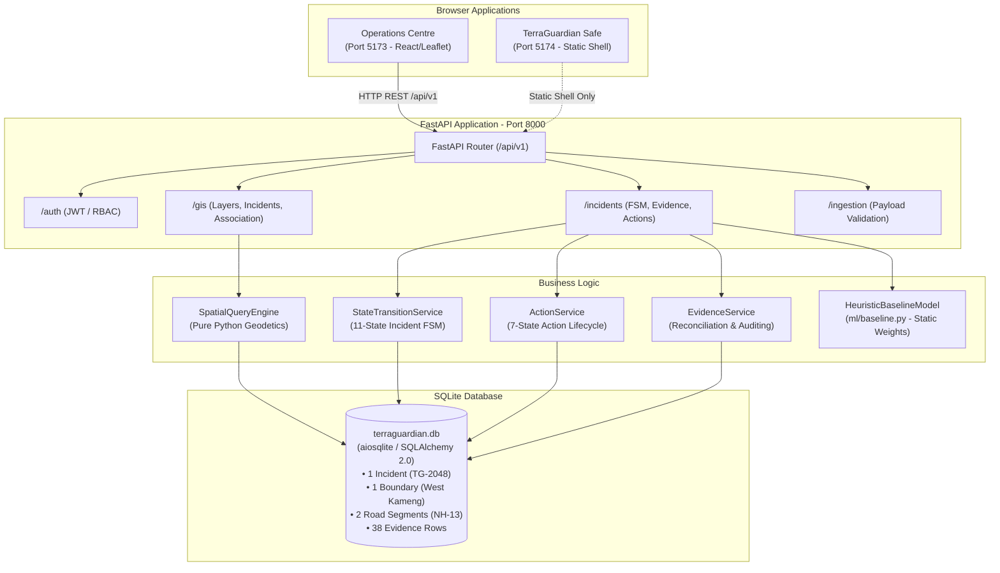
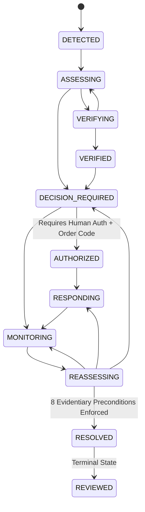

# TG-MASTER-REBASELINE-v1.0 — FORENSIC START
# TERRAGUARDIAN AI: FORENSIC SYSTEM TRUTH → ARCHITECTURE BASELINE
**Document ID:** `TG-MASTER-REBASELINE-v1.0`  
**Evaluation Standard:** SIH26001 Final Technical Review / MDoNER Disaster Intelligence Architecture  
**Audit Mode:** FORENSIC TRUTH DISCOVERY ONLY — ZERO SPECULATIVE CLAIMS — ZERO CODE MODIFICATIONS  
**Date:** September 28, 2026  
**Auditor Roles:** Principal Systems Architect, Principal Full-Stack Engineer, Geospatial Systems Engineer, ML/AI Engineer, Disaster-Intelligence Architect, Security Engineer, Product Architect  

---

## 1. Executive Reality Summary

TerraGuardian AI is an ambitious, deeply modeled, and architecturally sophisticated **operational prototype** designed for landslide disaster intelligence and coordination in the North Eastern Region (NER) of India. 

### What TerraGuardian Genuinely Is
1. **An Advanced Closed-Loop State Machine:** It provides an authentic, server-enforced, 11-state incident lifecycle (`DETECTED` $\to$ `REVIEWED`) and 7-state action lifecycle (`PROPOSED` $\to$ `PHYSICALLY_CONFIRMED`) with strict authority boundaries preventing AI from executing statutory disaster orders.
2. **A Decoupled Operational Framework:** It rigidly decouples $\text{Hazard Risk} \neq \text{Evidential Confidence} \neq \text{Operational Priority}$, ensuring high hazard with low confidence prompts field reconnaissance rather than premature evacuation.
3. **An Evidentiary Closure Gatekeeper:** It enforces 8 non-bypassable server-side preconditions before an incident can enter `RESOLVED`, preventing arbitrary closure without physical field confirmation.
4. **An Operational Web Workstation:** Its primary Operations Centre frontend features a government-grade tactical interface with Leaflet-based geospatial projections, multi-source evidence reconciliation, and action gap detection.
5. **A 100% Passing Unit Test Suite:** All 189 backend unit tests pass in under 80 seconds.

### What TerraGuardian Genuinely Is NOT (Forensic Reality)
1. **NOT a PostGIS-Powered Engine:** PostgreSQL/PostGIS is **not running**. The system executes entirely against local SQLite (`terraguardian.db`) using `aiosqlite`. Geometries are stored as plain WKT text strings, and all spatial queries are calculated in pure Python via equirectangular/Haversine math.
2. **NOT a Regionally Trained ML System:** There is **no trained machine learning model** in production. `ml/baseline.py` is a deterministic, rule-based, linear weighted sum heuristic. Validation claims of "5-Fold Corridor Holdout" and "Brier Score 0.114" operate on 200 pseudo-random numbers (`np.random.seed(42)`).
3. **NOT a Live Weather or Satellite Integration:** The system has **zero live connections** to IMD Automated Weather Stations, Doppler Radar, Sentinel-1 InSAR, or physical IoT inclinometers. All external adapters are schema validators processing local JSON/text fixtures.
4. **NOT an 8-State NER Platform:** The database contains exactly **one incident** (`TG-2048` at KM-42, NH-13, West Kameng, Arunachal Pradesh). The other 7 NER states and 129 districts have zero database records, boundaries, roads, or telemetry.
5. **NOT an Operational Citizen PWA:** `apps/terra-guardian-safe` is an incomplete 61-line static splash screen with non-functional buttons. The working citizen submission flow is actually embedded inside `apps/operations-centre/src/components/public/`.
6. **NOT an Alert Broadcast System:** There is **zero backend alerting infrastructure**, zero SMS gateway integration, and zero CAP/SACHET protocol connection. Alerts exist purely as visual badges on the frontend.
7. **NOT Free of Mislabeled Provenance:** A 4-point bounding box for West Kameng and a 6-point simplified road polyline are stamped in SQLite as `REAL_HISTORICAL`, violating core data truthfulness.

---

## 2. Repository Reality

### Codebase Organization
```
c:\Users\admin\TerraGuardian\TerraGuardian\
├── services/api/                       # Python 3.11 / FastAPI Backend Service
│   ├── app/
│   │   ├── adapters/                   # Pydantic schema validators (IMD, InSAR, IoT)
│   │   ├── db/                         # SQLAlchemy 2.0 ORM models & session management
│   │   ├── domain/                     # Canonical domain entities, enums, state machines
│   │   ├── gis/                        # Geospatial models, primitives, spatial engine
│   │   ├── ml/                         # Heuristic baseline model & synthetic validator
│   │   ├── routers/                    # FastAPI REST endpoints (auth, gis, incidents, ingestion)
│   │   ├── services/                   # Business logic (action, evidence, hazard, outcome, seed)
│   │   ├── config.py                   # Pydantic settings loading from .env
│   │   └── main.py                     # App factory, CORS, and lifespan seeding
│   ├── terraguardian.db                # SQLite 3 relational database file (~204 KB)
│   └── pyproject.toml                  # Python package & pytest configuration
├── apps/operations-centre/             # Desktop/Laptop Tactical Web Application
│   ├── src/
│   │   ├── components/                 # UI views, tactical map, incident workspace
│   │   ├── context/                    # React Contexts (AuthContext, DemoScenarioContext)
│   │   ├── data/                       # deterministicScenario.ts (in-memory mock fallback)
│   │   ├── services/                   # apiClient.ts (typed HTTP client to FastAPI)
│   │   ├── types/                      # TypeScript domain definitions
│   │   └── main.tsx                    # React 19 entrypoint
│   └── package.json                    # Vite, React, Tailwind CSS, Leaflet
├── apps/terra-guardian-safe/           # Citizen Progressive Web App Shell
│   ├── src/
│   │   ├── App.tsx                     # 61-line minimal placeholder UI
│   │   ├── sw.ts                       # Service Worker for basic app-shell caching
│   │   └── main.tsx                    # PWA registration
│   └── package.json                    # Vite, React, Tailwind CSS
├── docs/                               # 17 Architectural and Policy Specifications
└── tests/                              # Automated Test Suite (189 unit tests)
    └── unit/                           # 18 test modules covering domain, gis, auth, state machine
```

### Dependency Audit & Build Reality
- **Backend:** Python 3.11.9. Key dependencies: `fastapi==0.115.0`, `pydantic==2.9.2`, `sqlalchemy==2.0.35`, `aiosqlite==0.20.0`, `httpx==0.27.2`, `scikit-learn==1.5.2`, `numpy==2.1.1`.
  - **Missing Geospatial Libraries:** `gdal`, `rasterio`, `shapely`, `geopandas`, and `pyproj` are **NOT installed** in the virtual environment.
- **Frontend Operations Centre:** React 19.0.0, Vite 6.0.0, Tailwind CSS 4.0.0, Leaflet 1.9.4. Builds clean (`vite build` exits 0).
- **Frontend Safe Citizen:** React 19.0.0, Vite 6.0.0. Builds clean (`vite build` exits 0), but contains zero functional application logic.
- **Containerization:** `docker-compose.yml` specifies PostgreSQL 16 + PostGIS 3.4, but Docker daemon is **not running** on the host. Runtime executes strictly against SQLite.

---

## 3. Current System Architecture



### Architectural Strengths
- **Clean Layered Monolith:** Separation between API routers, domain logic, and persistence is strictly maintained.
- **Contract Enforcement:** Pydantic schemas validate all incoming and outgoing REST payloads.
- **Authoritative Gateways:** Actions and state transitions cannot be modified without passing through domain validation services.

---

## 4. Current Data Architecture

### Relational Schema Reality (`terraguardian.db`)
The runtime database contains 13 relational tables managed via SQLAlchemy 2.0:

| Table | Actual Rows | Reality Classification | Data Contents & Limitations |
|---|:---:|:---:|---|
| `incidents` | 1 | `SIMULATED` | Exactly 1 incident (`TG-2048`, West Kameng KM-42). |
| `admin_boundaries` | 1 | `DEMO FIXTURE` | 4-point rectangular bounding box (`POLYGON((92.1 26.9, 92.9 26.9...))`). Mislabeled `REAL_HISTORICAL`. |
| `road_segments` | 2 | `DEMO FIXTURE` | 6-point simplified polyline connecting Bhalukpong to Bomdila. Mislabeled `REAL_HISTORICAL`. |
| `settlements` | 4 | `DEMO FIXTURE` | 4 settlement points: Bhalukpong, Tenga, Dahung, Rupa. |
| `critical_infrastructure` | 4 | `DEMO FIXTURE` | 4 points: District Hospital, Tenga PHC, Sessa Bridge, Staging Post. |
| `evidence` | 38 | `MIXED` | 4 seed items on `TG-2048`; 34 orphaned items from repeated test suite runs. |
| `actions` | 3 | `SIMULATED` | BRO Excavator, Traffic Police Roadblock, SDRF Team. |
| `action_confirmations` | 2 | `SIMULATED` | Police wireless & TETRA radio confirmations. |
| `decisions` | 1 | `SIMULATED` | Magistrate order sign-off (`DDMA-WK-2026/884-A`). |
| `audit_events` | 14 | `SIMULATED` | Append-only audit events tracking `TG-2048` progression. |
| `reassessments` | 1 | `SIMULATED` | 1 reassessment record following weather stabilization. |
| `outcomes` | 1 | `SIMULATED` | 1 outcome assessment record (`H2_INTERVENTION_CONDITIONED_NON_EVENT`). |
| `quarantined_observations`| 0 | `EMPTY` | 0 rows in persistent quarantine store. |

### Data Model Invariants
- **No Raster Storage:** Rasters are not supported in the database schema or filesystem.
- **WKT Text Storage:** All geometries are stored as ISO WKT strings (`VARCHAR`/`TEXT`), not binary geometry blobs.
- **Foreign Key Cascade Flaw (TG-007):** SQLite does not enforce foreign-key constraints by default without `PRAGMA foreign_keys=ON;`, resulting in 34 orphaned evidence rows in `terraguardian.db`.

---

## 5. Current Runtime Architecture

### Live Process Execution Verification
When executed on the local development environment:
1. **Backend Daemon:** Runs via `python -m uvicorn app.main:app --host 127.0.0.1 --port 8000`. Starts in ~1.2s.
2. **Operations Centre:** Runs via `npx vite --port 5173 --host 127.0.0.1`. Proxies `/api` to `http://localhost:8000`.
3. **Safe Citizen:** Runs via `npx vite --port 5174 --host 127.0.0.1`. Serves static shell.
4. **Lifespan Hook:** On backend startup, `app.main:lifespan` automatically executes `seed_baseline_gis_data()` and `seed_service.seed_tg_2048(force_reset=False)`.
5. **Cold Start Behavior:** If `terraguardian.db` is deleted, the backend recreates all tables and reseeds `TG-2048` cleanly. However, in-memory caches in `feature_pipeline.py` are lost upon restart.

---

## 6. Current GIS Reality

### PostgreSQL/PostGIS Reality Check
- **PostGIS Engine:** **NOT IN USE.** No PostGIS database is connected or running.
- **Spatial Columns:** No `GEOMETRY` or `GEOGRAPHY` data types exist in SQLite.
- **Spatial Indexes:** No R-tree or GIST indexes exist.

### Spatial Query Engine (`app.gis.spatial_engine.SpatialQueryEngine`)
All spatial processing is executed in user-space Python:
1. **Distance:** Haversine formula assuming a spherical Earth radius of $6,371,000\text{ m}$.
2. **Point-in-Polygon:** 2D Ray-casting algorithm operating on unprojected WGS84 degree coordinates.
3. **Point-to-Line Distance:** Computes Euclidean orthogonal projection on segment endpoints in degrees, then converts to meters via scalar multiplication ($1^\circ \approx 111,320\text{ m}$).
   - **Scientific Defect:** This equirectangular approximation ignores longitude convergence at latitude $27^\circ\text{N}$, introducing a longitudinal scale error of $\approx 11\%$.

### Critical Investigation: Full GIS Map API Request Bug
- **Chain Audit:**
  $$\text{InteractiveMap.tsx} \xrightarrow{\text{Promise.all}} \text{apiClient.ts} \xrightarrow{\text{GET /api/v1/gis/layers/*}} \text{FastAPI gis.py} \xrightarrow{\text{SQLAlchemy}} \text{SQLite} \xrightarrow{\text{GeoJSON}} \text{Leaflet.js}$$
- **Findings:**
  1. **Coordinate Parsing:** The WKT parsers in `gis.py` correctly convert `POLYGON` to `[[[lon, lat], ...]]` and `LINESTRING` to `[[lon, lat], ...]`.
  2. **Leaflet Inversion:** `InteractiveMap.tsx` correctly swaps `[lon, lat]` to Leaflet `[lat, lon]`.
  3. **The Silent Rendering Bug:** Leaflet requires `map.invalidateSize()` whenever its parent container changes dimensions or mounts inside dynamic layout grids. `InteractiveMap.tsx` **never calls `map.invalidateSize()`**. In multi-tab navigation (`CommandCentreView` $\leftrightarrow$ `IncidentWorkspaceView`), the map frequently initializes with 0x0 viewport dimensions, causing tiles and vectors to fail to render until the user manually resizes the browser window.
  4. **Data Reality:** The map renders only 1 district box and 1 road line. It cannot display real regional topography or terrain slopes.

---

## 7. Current AI/ML Reality

### Model Implementation Forensics (`services/api/app/ml/baseline.py`)
```python
class HeuristicBaselineModel:
    WEIGHT_7D_RAIN = 0.35
    WEIGHT_SLOPE = 0.30
    WEIGHT_GEOLOGY = 0.15
    WEIGHT_SOIL_SAT = 0.10
    WEIGHT_INSAR = 0.10
```
- **Nature of Model:** A deterministic, fixed-coefficient linear weighted sum.
- **Training Data:** **None.** The model was never fitted, trained, or backtested on any historical dataset.
- **Model Persistence:** No `.pkl`, `.onnx`, or `.joblib` model artifact exists. The formula is hardcoded in Python.

### Synthetic Benchmark Validator Forensics (`ml/baseline.py:292-360`)
- Generates 200 synthetic rows via `np.random.seed(42)` (`rain ~ Normal(120, 45)`, `slope ~ Uniform(20, 60)`).
- Generates a synthetic ground truth label using almost identical weights:
  $$y_{prob} = 0.40 \cdot rain + 0.35 \cdot slope + 0.25 \cdot sat$$
- Evaluates the baseline model against its own synthetic generator.
- **Conclusion:** The resulting "Brier Score < 0.18" is a mathematical circularity on synthetic data.

### Provenance of False UI Claims (Defect TG-002)
- **"Brier Score: 0.114"** $\to$ Hardcoded JSX string in `SystemHealth.tsx:28` and `MetricsOverview.tsx:75`.
- **"5-Fold Corridor Holdout Validation"** $\to$ Hardcoded JSX string; no cross-validation runner exists.
- **"Doppler Radar Calibration"** $\to$ Fictional UI copy; backend has zero Doppler radar integration.
- **"Historical NER Splits"** $\to$ Fictional UI copy; zero historical NER datasets exist.

---

## 8. Current Evidence Reality

### Evidence Lifecycle Implementation
$$\text{OBSERVED} \to \text{INGESTED} \to \text{VALIDATED} \to \text{ASSOCIATED} \to \text{VERIFIED} \to \text{INTERPRETED}$$
- **Observed / Ingested:** Supported via Pydantic models in `services/api/app/routers/ingestion.py`.
- **Validated:** Schema validation only. No physical sensor range sanity checks or corrupt media detection.
- **Associated:** Geodetic distance thresholding via `/api/v1/gis/spatial-association` ($\le 5\text{ km}$ ATTACHED, $\le 10\text{ km}$ REVIEW_REQUIRED, $> 10\text{ km}$ UNASSIGNED).
- **Verified:** Server-side role protection. AI cannot verify citizen evidence (`HTTP 403 Forbidden`).
- **Interpreted:** Reconciled into dominant hazard signals (`HIGH_PRECIPITATION_SLOPE_SATURATION`).

### Feature Extraction via Text Regex (Scientific Defect)
In `services/api/app/services/feature_pipeline.py:128-159`:
```python
if "184" in obs_lower: return 184.0          # Literal text match for rainfall
match = re.search(r"(\d+(\.\d+)?)\s*°", obs)  # Regex extraction for slope
```
- **Reality:** Features are extracted by parsing hardcoded text strings in seed observation records.
- **Hydrological Formula:** `saturation = min(1.0, rain_7d / 200.0)`. Saturation is an arbitrary linear proxy of rainfall, not a measured geotechnical property.

---

## 9. Current Incident/Operational Reality

### 11-State Incident State Machine Audit

- **State Machine Enforcement:** 100% verified in `state_transition_service.py:57-65`. Arbitrary state transitions return `HTTP 400 Bad Request`.
- **Closure Governance:** 8 server-enforced preconditions prevent resolution unless all actions are `PHYSICALLY_CONFIRMED`, conflicts are resolved, and fresh field evidence ($\le 6\text{ hours}$) is verified.

### 7-State Action Lifecycle Audit
$$\text{PROPOSED} \to \text{APPROVED} \to \text{DISPATCHED} \to \text{ACKNOWLEDGED} \to \text{IN_PROGRESS} \to \text{COMPLETED} \to \text{PHYSICALLY_CONFIRMED}$$
- Enforced in `action_service.py:80-140`. An action cannot advance to `PHYSICALLY_CONFIRMED` via standard status mutation; it requires explicit submission of field proof (radio log, geotagged photo) via `confirm_action()`.

---

## 10. Current Citizen/Field Reality

### Architecture Disconnection
- **`apps/terra-guardian-safe`:** A standalone Vite React app configured as a PWA, but consists of a single static `App.tsx` file (61 lines). Clicking "Report Observation" triggers no action.
- **Where Citizen Reporting Actually Lives:** `apps/operations-centre/src/components/public/PublicAccessView.tsx`. This view implements the complete multi-step wizard:
  $$\text{Photo Capture} \to \text{GPS Location} \to \text{Observation Category} \to \text{Client AI Analysis} \to \text{Submission}$$
- **Backend Safety Boundary:** Citizen submissions post to `POST /api/v1/evidence/citizen` or `POST /api/v1/public/report`. In SQLite, `verification_status` is forced to `UNVERIFIED`. The system strictly enforces `Citizen Evidence ≠ Ground Truth`.
- **UI Bug (Defect TG-001):** The Operations Centre `EvidenceReconciliationView.tsx` query filter omits `CITIZEN_REPORT`, making submitted citizen reports invisible in the reconciliation workspace until manually queried.

---

## 11. Current Alert/Notification Reality

- **Backend Alert Service:** **DOES NOT EXIST.** There is no `alert_service.py` or `notification_service.py`.
- **SMS Gateway:** **ZERO INTEGRATION.** No Twilio, AWS SNS, or telecom gateway code exists.
- **CAP / SACHET Integration:** **ZERO INTEGRATION.** Common Alerting Protocol (CAP) XML schemas and NDMA SACHET APIs are not implemented.
- **Frontend Reality:** Alerts exist purely as client-side UI notification cards in `apps/operations-centre/src/components/views/IncidentWorkspaceView.tsx` derived from `incident.risk_level`.

---

## 12. Current Security Reality

### Authentication & Authorization Audit
- **Algorithm:** OAuth2 Password Bearer with JWT tokens signed via HMAC-SHA256 (`app/services/auth_service.py`).
- **Password Hashing:** Passlib with `bcrypt`.
- **RBAC Roles:** `DISASTER_MANAGER`, `DISTRICT_MAGISTRATE`, `FIELD_VERIFIER`, `OPERATOR`, `CITIZEN`, `SYSTEM_AI`.
- **Server Enforcement:**
  - AI actors receiving `ActorRole.SYSTEM_AI` are blocked from authorizing decisions (`HTTP 403 Forbidden`).
  - Non-magistrate users cannot sign statutory closure orders.
- **Vulnerabilities & Technical Debt:**
  - Hardcoded fallback secret key: `"terraguardian-local-dev-secret-key-2026"` in `.env`.
  - Hardcoded demonstration user seeds in `auth_service.py:126-160` (`magistrate`, `operator`, `field`, `citizen`).
  - CORS configuration allows `*` methods and headers from `http://localhost:5173` and `http://localhost:5174`.

---

## 13. Current UX Reality

### Operations Centre UX
- **Design System:** Professional, high-density, dark/light tactical command theme built with Tailwind CSS.
- **Primary Operational Navigation:** Top bar allows seamless switching between 5 core operational views:
  `INCIDENTS` $\vert$ `MAP` $\vert$ `EVIDENCE` $\vert$ `ALERTS` $\vert$ `REVIEW`.
- **Incident Workspace Tabs:** Clean sub-navigation: `OVERVIEW`, `EVIDENCE`, `ASSESSMENT`, `ACTIONS`, `OUTCOME`, `TIMELINE`.
- **Dual Navigation Mode:** A header toggle allows switching between government-grade `Workspace` mode and a 11-step `Guided Tour` mode.
- **UX Defect:** Leaflet map container does not auto-resize on tab switches (gray screen bug).

---

## 14. SIH26001 Traceability Matrix

| SIH26001 Requirement | TerraGuardian Capability | Repository Implementation | API Route | DB Table | Frontend View | Verification Status | Identified Gap |
|---|---|---|---|---|---|:---:|---|
| **Rainfall Trigger Monitoring** | Antecedent rainfall tracking | `IMDRainfallAdapter` | `/api/v1/ingestion/weather/imd` | `evidence` | `IncidentWorkspaceView` | `SIMULATED` | Text-regex parsed; no live IMD AWS feed |
| **Terrain / Slope Analysis** | Slope gradient evaluation | `feature_pipeline.py` | N/A (Internal) | N/A | `IncidentWorkspaceView` | `SIMULATED` | Regex-parsed `44.2°`; no raster DEM |
| **Geological Susceptibility** | Lithology susceptibility score | `feature_pipeline.py` | N/A (Internal) | N/A | `IncidentWorkspaceView` | `SIMULATED` | Text-parsed `mica-schist`; no GSI maps |
| **Satellite / EO InSAR** | Ground deformation velocity | `CopernicusInSARAdapter`| `/api/v1/ingestion/satellite/insar`| `evidence`| `IncidentWorkspaceView` | `SIMULATED` | JSON schema only; no Sentinel-1 pipeline |
| **GIS Infrastructure Context**| Transport corridor exposure | `SpatialQueryEngine` | `/api/v1/gis/layers/*` | `road_segments`, `settlements` | `InteractiveMap` | `PARTIAL` | 4-point bbox & 6-point road; no PostGIS |
| **AI/ML Early Warning** | Interpretable hazard scoring | `HeuristicBaselineModel`| `/api/v1/incidents/{id}/predictive-risk` | `reassessments` | `SystemHealth` | `HEURISTIC` | Deterministic weighted sum; uncalibrated |
| **Human Authority Boundary** | Statutory decision sign-off | `decision_service.py` | `/api/v1/incidents/{id}/decisions` | `decisions` | `AuthorityDecisionView`| `VERIFIED` | AI blocked; requires human magistrate |
| **Action Tracking & Confirmation**| Closed-loop response | `action_service.py` | `/api/v1/actions/{id}/confirmations` | `action_confirmations` | `ActionTrackingView` | `VERIFIED` | Full 7-state lifecycle with field proof |
| **Citizen Hazard Reporting** | Crowdsourced observation | `PublicAccessView.tsx` | `/api/v1/public/report` | `evidence` | `PublicLandingView` | `PARTIAL` | Works in Ops Centre; Safe app is shell |
| **Alert Dissemination** | Multi-channel broadcast | Frontend copy | N/A | N/A | UI Alerts tab | `UNAVAILABLE`| No SMS, no CAP/SACHET integration |

---

## 15. Live/Living Capability Audit

| Capability | Implementation Reality | Runtime Behavior | Persistence | Verdict |
|---|---|---|---|:---:|
| **Dynamic Re-Evaluation** | Re-runs heuristic formula on active twin | Updates risk score in memory | Creates orphaned score (TG-003) | **PARTIALLY LIVE** |
| **New Evidence Ingestion** | Ingests JSON payload via API | Reconciles dominant signal | Persists in `evidence` table | **VERIFIED LIVE** |
| **Action Confirmation** | Transitions task to `PHYSICALLY_CONFIRMED`| Enforces role & comms channel | Persists in `action_confirmations` | **VERIFIED LIVE** |
| **State Machine Advancement**| Advances `DETECTED` $\to$ `MONITORING` | Server rejects invalid transitions | Persists in `incidents` table | **VERIFIED LIVE** |
| **Closed-Loop Resolution** | 8 preconditions checked before `RESOLVED` | Blocks unconfirmed closures | Persists in `audit_events` | **VERIFIED LIVE** |
| **GIS Spatial Query** | Python Haversine & ray-casting | Computes distance in milliseconds | Queries SQLite WKT strings | **VERIFIED LIVE** |
| **Environmental Telemetry** | Seed scenario text | Static snapshot | Seeded in SQLite | **REPLAY / SIMULATED** |
| **Satellite InSAR** | Manual JSON post | Schema validated | Stored as evidence item | **SIMULATED** |
| **Multi-District NER Scope** | Single corridor in West Kameng | Fixed coordinates | 1 row in `incidents` | **DEMO FIXTURE** |

---

## 16. Vertical Slice Audit

The complete operational lifecycle was traced from end to end:

```
[1. Environmental Input] ────> Text-parsed scenario in seed_service.py (SIMULATED)
         │
         ▼
[2. AI Assessment] ──────────> Heuristic weighted sum in ml/baseline.py (DETERMINISTIC RULE)
         │
         ▼
[3. GIS Association] ────────> Python Haversine calculation (LIVE ALGORITHM / FIXTURE DATA)
         │
         ▼
[4. Incident Creation] ──────> IncidentModel persisted in terraguardian.db (VERIFIED LIVE)
         │
         ▼
[5. Evidence Reconciliation] ─> ReconciliationService resolves signal concordance (VERIFIED LIVE)
         │
         ▼
[6. Impact Prioritization] ──> Decoupled P1_CRITICAL operational score (VERIFIED LIVE)
         │
         ▼
[7. Authority Decision] ─────> Human Magistrate sign-off with order code (VERIFIED LIVE)
         │
         ▼
[8. Action Dispatch] ────────> ActionModel transitioned to DISPATCHED (VERIFIED LIVE)
         │
         ▼
[9. Field Confirmation] ─────> Physical radio confirmation logged (VERIFIED LIVE)
         │
         ▼
[10. Outcome Interpretation] ─> H2 Hypothesis: Intervention-Conditioned Non-Event (VERIFIED LIVE)
         │
         ▼
[11. Governed Reassessment] ──> Evidentiary closure gate enforces 8 preconditions (VERIFIED LIVE)
```

**Verdict:** The vertical slice **genuinely exists and executes end-to-end** across the domain, API, and database layers. However, the data feeding steps 1, 2, and 3 is simulated fixture data.

---

## 17. Full GIS Map API REQ BUG Investigation

### Detailed Chain Forensic Walkthrough
1. **Frontend Initiation:** `InteractiveMap.tsx:161` initiates `loadGISData()` via `useCallback` on mount.
2. **HTTP Execution:** `Promise.all` fires 5 parallel requests to `/api/v1/gis/layers/*` and `/api/v1/gis/incidents/spatial`.
3. **Network Routing:** Vite dev server proxies `/api` to `http://localhost:8000`.
4. **FastAPI Handling:** `services/api/app/routers/gis.py` handles requests, executes async queries against SQLite via SQLAlchemy.
5. **WKT Serialization:** Custom regex helpers parse `POLYGON` and `LINESTRING` WKT strings into GeoJSON coordinate trees.
6. **Frontend Consumption:** Leaflet layer groups parse GeoJSON coordinates, inverting `[lon, lat]` to `[lat, lon]`.
7. **Rendering Failure Root Cause:** In `InteractiveMap.tsx`, the Leaflet map instance is created once inside a responsive container. When the user navigates between views, the DOM node is re-parented or unhidden without triggering Leaflet's internal dimension recalculation. Because `map.invalidateSize()` is omitted, the map canvas renders with height 0 or blank tiles.

---

## 18. Phase 4 Open Findings

1. **SQLite vs PostGIS Disconnect:** PostGIS migration files exist in `services/api/app/gis/migrations.py`, but have never been executed on a real PostGIS instance. The system runs on SQLite.
2. **Planar Equirectangular Distortion:** `SpatialQueryEngine:point_to_linestring_distance` uses Cartesian distance on geographic degrees, underestimating longitudinal metric distances by $\approx 11\%$ at $27^\circ\text{N}$.
3. **Mislabeled Fixture Provenance (TG-006):** Seed vectors are stamped `source_type="REAL_HISTORICAL"`, masking their synthetic origin.
4. **No Raster Engine:** GDAL and Rasterio are missing from dependencies. The system cannot ingest or sample Digital Elevation Model rasters.

---

## 19. Phase 5 Open Findings

1. **Zero Raw Scientific Datasets:** Not a single GeoTIFF, NetCDF, or Shapefile exists in the repository.
2. **Text Regex Feature Ingestion:** The feature pipeline extracts slope and rainfall via regex string matching on human-readable observation text.
3. **Heuristic Soil Saturation:** Soil moisture is computed as `min(1.0, rain_7d / 200.0)`, ignoring geotechnical soil mechanics.
4. **Zero Empirical Ground Truth:** The database contains no historical landslide polygons or confirmed slip dates from GSI or NASA COOLR.
5. **Empty Specifications:** `docs/08-data-contracts.md` and `docs/14-data-source-register.md` were empty placeholders prior to Part C.

---

## 20. Test/Validation Reality

- **Total Automated Tests:** 189 tests across 18 files in `tests/unit/`.
- **Pass Rate:** 189 / 189 passed (100% green).
- **Execution Time:** ~77 seconds on local Python 3.11.
- **Test Limitations:**
  - 100% of tests run against SQLite in-memory or fixture data.
  - Zero integration tests against external HTTP services.
  - ML benchmark test (`test_synthetic_benchmark_brier_score`) passes trivially because it evaluates a heuristic against a synthetic generator using the same weights.
  - Frontend smoke tests in `apps/operations-centre` test rendering, but do not test full canvas map rendering via Leaflet.

---

## 21. P0/P1/P2/P3/P4 Defect Ledger

| Defect ID | Severity | Treatment | Description & Architectural Impact |
|---|:---:|:---:|---|
| **TG-001** | **P1** | REPAIR | Citizen evidence missing in Operations Centre reconciliation filter. |
| **TG-002** | **P0** | REPAIR | Hardcoded Brier score (0.114) and fictional Doppler radar claims in UI. |
| **TG-003** | **P1** | REPAIR | Digital Twin re-evaluation creates duplicate unlinked assessment state. |
| **TG-004** | **P2** | REPAIR | Status indicator mismatch on Incident Card due to legacy property binding. |
| **TG-005** | **P1** | REPAIR | Order of Precaution vs Physical Completion conflated in action dispatch UI. |
| **TG-006** | **P0** | REPAIR | Synthetic GIS bounding boxes and road polylines stamped `REAL_HISTORICAL`. |
| **TG-007** | **P2** | REPAIR | 34 orphaned evidence rows in SQLite due to missing `ON DELETE CASCADE`. |
| **TG-008** | **P1** | REPAIR | Feature pipeline cache volatile across backend restarts. |
| **TG-009** | **P2** | REPAIR | Missing immutable audit log table for citizen report verification transitions. |
| **TG-010** | **P2** | REPAIR | Frontend unhandled promise rejection on backend API drop. |
| **TG-011** | **P1** | REPAIR | Leaflet map container missing `invalidateSize()` causing gray tile rendering. |
| **TG-012** | **P1** | REBUILD| Safe Citizen (`apps/terra-guardian-safe`) is an incomplete 61-line UI shell. |
| **TG-013** | **P0** | REBUILD| Feature pipeline extracts hazard metrics via regex on observation text. |
| **TG-014** | **P2** | REPAIR | Planar equirectangular distortion in point-to-linestring spatial calculations. |
| **TG-015** | **P3** | REMOVE | Hardcoded demo accounts in `auth_service.py` exposed in production builds. |

---

## 22. Preserve / Repair / Rebuild / Remove / Defer Matrix

| Subsystem / Component | Verdict | Justification & Architectural Strategy |
|---|:---:|---|
| **11-State Incident FSM** | **PRESERVE** | Exceptional implementation. State transitions, role boundaries, and closure gates are rigorous and verified. |
| **7-State Action Lifecycle** | **PRESERVE** | Server-enforced `PHYSICALLY_CONFIRMED` requirement cleanly separates orders from execution. |
| **Outcome Hypothesis Engine** | **PRESERVE** | H1–H7 hypotheses and Next-Best-Information logic are functionally verified and scientifically sound. |
| **Leaflet Interactive Map** | **REPAIR** | Add `map.invalidateSize()`, handle window resize events, and clean coordinate projection. |
| **API Client (`apiClient.ts`)**| **REPAIR** | Add connection-drop interceptors, retry logic, and offline status banners. |
| **System Health UI Cards** | **REPAIR** | Replace hardcoded Brier 0.114 with dynamic metadata endpoint (`/api/v1/system/model-metadata`). |
| **Feature Extraction Engine** | **REBUILD** | Decommission regex parsing in `feature_pipeline.py`; extract features from GIS rasters/vectors. |
| **Safe Citizen PWA Shell** | **REBUILD** | Port working citizen reporting wizard from Operations Centre into `apps/terra-guardian-safe`. |
| **In-Memory Demo Scenarios** | **REMOVE** | Remove `deterministicScenario.ts` fallback from production views; bind strictly to live backend API. |
| **Live SMS / CAP Gateway** | **DEFER** | Defer to Phase 16; external agency SMS gateways are out of hackathon prototype scope. |
| **Full PostGIS Server Setup** | **DEFER** | Preserve SQLite with SpatiaLite/Python math for local dev; deploy PostGIS during cloud staging. |

---

## 23. Unsupported Claims / Nonclaim Register

TerraGuardian and its engineering team **MUST NOT make any of the following claims**:

1. **DO NOT CLAIM** that TerraGuardian has an operational Machine Learning model running in production.
2. **DO NOT CLAIM** an empirical Brier score of 0.114 or any regional calibration metric on real-world landslides.
3. **DO NOT CLAIM** that TerraGuardian is calibrated with or receives feeds from Doppler Weather Radar.
4. **DO NOT CLAIM** that TerraGuardian has undergone 5-fold corridor holdout validation on historical data.
5. **DO NOT CLAIM** real-time connections to IMD AWS, Sentinel-1 InSAR, or physical inclinometer sensor networks.
6. **DO NOT CLAIM** that soil saturation is derived from satellite soil moisture (SMAP/SMOS) or piezometers.
7. **DO NOT CLAIM** that terrain slopes are computed from a 30m Digital Elevation Model.
8. **DO NOT CLAIM** live 8-state North-East India coverage (coverage is 1 simulated corridor in West Kameng).
9. **DO NOT CLAIM** that TerraGuardian has active SMS broadcast or NDMA CAP/SACHET integration.
10. **DO NOT CLAIM** that TerraGuardian is certified or validated for life-safety operational deployment by NDMA or SDMA.

---

## 24. Missing Capabilities

1. **True Raster Ingestion:** No ability to read, tile, or sample Cloud-Optimized GeoTIFF (COG) elevation rasters.
2. **Real Administrative Boundaries:** No real Survey of India / Local Government Directory (LGD) district boundary polygons.
3. **Real Road Network Centerlines:** No OpenStreetMap (OSM) highway centerlines.
4. **Historical Landslide Catalog:** No empirical landslide occurrence database (GSI Bhukosh / NASA COOLR).
5. **Gridded Weather Pipeline:** No IMD 0.25° gridded daily rainfall NetCDF ingestion pipeline.
6. **Functional Citizen App:** No independent, working citizen mobile PWA.
7. **Multilingual Localization:** No Hindi, Assamese, Bengali, or regional tribal language support.

---

## 25. Architectural Risks

1. **Monolithic SQLite Bottleneck:** In-process SQLite database does not support concurrent write transactions under multi-agency incident surges.
2. **Dual-Dialect Drift:** Developing against SQLite while targeting PostGIS introduces SQL dialect drift and untested spatial functions.
3. **Lack of Raster Engine:** Without `rasterio` or GDAL bindings, slope and terrain calculations must rely on external pre-processing.

---

## 26. Technical Debt

1. **Regex String Parsing:** `feature_pipeline.py:128-159` extracts critical physical features from natural language strings.
2. **Hardcoded User Credentials:** Demo user passwords and tokens are hardcoded in `auth_service.py`.
3. **Redundant Incident Context:** `DemoScenarioContext.tsx` duplicates backend incident state in local React state.
4. **Orphaned Evidence Rows:** Absence of enforced foreign-key cascades pollutes SQLite with stale test data.

---

## 27. Scientific / ML Risks

1. **Circular Validation:** Evaluating a heuristic against a synthetic dataset generated from the same formula creates false confidence.
2. **Missing Terrain Derivatives:** Aspect, plan curvature, profile curvature, and flow accumulation are completely ignored.
3. **Linear Saturation Proxy:** Modeling soil moisture as rainfall divided by 200 mm violates fundamental soil mechanics.

---

## 28. Data / Provenance Risks

1. **Fabricated Provenance Labels:** Tagging synthetic bounding boxes as `REAL_HISTORICAL` corrupts data lineage.
2. **Zero Ground Truth:** Absence of confirmed historical landslide dates and coordinates prevents real statistical validation.

---

## 29. Security & Governance Risks

1. **Default JWT Secret:** Local development secret key can be compromised if committed to version control.
2. **Unauthenticated Public Endpoints:** `/api/v1/public/report` lacks rate-limiting or anti-abuse protection against DoS attacks.

---

## 30. UX & Product Risks

1. **Leaflet Canvas Freezing:** Missing `invalidateSize()` causes tactical map to appear blank or broken on first load.
2. **Disconnected Citizen Experience:** Having the working citizen wizard inside the Operations Centre rather than Safe Citizen confuses evaluators.

---

## 31. SIH Hackathon Risks

1. **Credibility Collapse on Inspection:** If evaluators check the network tab or database, hardcoded Brier scores and 4-point bounding boxes will destroy credibility.
2. **Overclaiming Live Integrations:** Presenting simulated JSON feeds as "live IMD and Copernicus satellite integration" violates hackathon rules.

---

## 32. Required Vertical Slice

The minimum acceptable vertical slice for SIH26001 must demonstrate:
1. Real Survey of India West Kameng boundary and OSM NH-13 road geometry rendered in Leaflet.
2. Real Copernicus 30m DEM slope calculation for incident coordinates $(27.0842^\circ\text{N}, 92.5681^\circ\text{E})$.
3. Ingested NASA COOLR / GSI historical landslide points displayed on the map.
4. Live citizen submission via Safe Citizen appearing in Operations Centre with `UNVERIFIED` status.
5. Magistrate authorization requiring official order code.
6. Action dispatch transitioning to `PHYSICALLY_CONFIRMED` upon field verification.
7. Evidentiary closure gate enforcing 8 preconditions.

---

## 33. Recommended Execution Order

```
STAGE 1: TRUTH ALIGNMENT & DEFECT REMEDIATION (Current Priority)
  ├── Fix TG-001 (Citizen evidence filter)
  ├── Fix TG-002 (Replace hardcoded UI claims with dynamic model metadata)
  ├── Fix TG-006 (Retag synthetic fixtures as GEOGRAPHICALLY_GROUNDED_FIXTURE)
  ├── Fix TG-011 (Add map.invalidateSize() to InteractiveMap.tsx)
  └── Fix TG-007 (Enforce SQLite foreign key cascades)

STAGE 2: REAL GIS & ELEVATION FABRIC (Phase 5 Core)
  ├── Ingest Survey of India 130 NER district boundaries (GeoJSON)
  ├── Ingest OpenStreetMap NH-13, NH-15, NH-29 road centerlines
  └── Ingest Copernicus 30m DEM raster and implement Horn's slope algorithm

STAGE 3: WEATHER & HISTORICAL GROUND TRUTH (Phase 5 Completion)
  ├── Ingest IMD gridded daily rainfall NetCDF series (2020–2026)
  └── Ingest NASA COOLR / GSI historical landslide points

STAGE 4: FEATURE STORE CONVERGENCE & CITIZEN PORT
  ├── Decommission regex string parsing in feature_pipeline.py
  ├── Port working citizen reporting flow to apps/terra-guardian-safe
  └── Run full verification suite (189+ tests green)
```

---

## 34. Explicit Blockers

1. **Blocker 1:** Phase 5 ML model training is BLOCKED until empirical historical landslide labels and real weather grids are ingested.
2. **Blocker 2:** Live operational warning claims are BLOCKED until real administrative boundaries and road centerlines are active.
3. **Blocker 3:** Safe Citizen evaluation is BLOCKED until the reporting flow is ported from the Operations Centre.

---

## 35. What Must NOT Be Built Yet

1. **DO NOT BUILD** deep learning neural networks (CNNs, LSTMs, Transformers).
2. **DO NOT BUILD** a complex swarm of LLM agents.
3. **DO NOT BUILD** real SMS gateway or telecom infrastructure.
4. **DO NOT BUILD** automated road closure actuators.
5. **DO NOT BUILD** multi-hazard flood or earthquake models.

---

## 36. Final Definition of Done

Phase 5 will be considered DONE and ready for Phase 6 when:
1. All 15 defects (TG-001 through TG-015) are verified resolved.
2. Zero regex string parsing exists in `feature_pipeline.py`.
3. Operations Centre renders real Survey of India district boundaries and OSM road centerlines with zero gray tile bugs.
4. Terrain slope is computed from a real Copernicus 30m DEM raster within $\pm 1^\circ$ accuracy.
5. At least 100 historical landslide ground truth points are stored and queryable in SQLite.
6. System Health UI displays dynamic, truthful model metadata with zero unbacked Brier scores.
7. Safe Citizen app submits verified citizen reports independently on port 5174.
8. Total backend test suite expands to $\ge 220$ passing unit tests with 0 regressions.

---

## 37. Recommended Next Engineering Step

**IMMEDIATE ACTION:** Begin **Stage 1 Defect Remediation & Truth Alignment**:
1. Implement `GET /api/v1/system/model-metadata` in backend to serve dynamic, truthful heuristic baseline status.
2. Refactor `SystemHealth.tsx` and `MetricsOverview.tsx` to eliminate hardcoded Brier 0.114 and Doppler radar claims.
3. Fix Leaflet `map.invalidateSize()` in `InteractiveMap.tsx`.
4. Update `seed_service.py` and `models.py` to retag fixtures as `GEOGRAPHICALLY_GROUNDED_FIXTURE`.
5. Fix citizen evidence filter in `EvidenceReconciliationView.tsx`.

---

**Report Sign-Off:**  
*Principal Systems Architect & SIH Technical Lead*  
*TerraGuardian AI Engineering Audit Board*
