# TERRAGUARDIAN — OPERATIONAL RESPONSE & MULTI-AGENCY DISPATCH
## Execution & Verification Report: Closed Operational Loop

**Timestamp:** 2026-09-28T15:10:00+05:30  
**Phase:** Hazard Intelligence → Governed Action → Field Confirmation  
**Status:** **GREEN — FULL CLOSED OPERATIONAL LOOP IMPLEMENTED & VERIFIED**  
**Backend Test Results:** 221 / 221 unit tests passing (100%)  
**Frontend Builds:** Operations Centre (PASS) | Safe Citizen (PASS)  

---

## 1. Executive Summary

TerraGuardian has closed the critical operational gap between predictive hazard assessment and authoritative physical field operations. Previously, operational tasks were represented in static presentation fixtures without statutory authority separation, dispatch tracking, or physical confirmation gating.

This execution delivers and proves the end-to-end operational loop:

```mermaid
flowchart LR
    A["HAZARD INTELLIGENCE<br/>(Dynamic ML + Heuristic)"] --> B["CONSEQUENCE & PRIORITY<br/>(Critical P1 NH-13 Corridor)"]
    B --> C["DECISION SUPPORT<br/>(System Recommended Package)"]
    C --> D["STATUTORY AUTHORIZATION<br/>(Magistrate DM Act Sec 30)"]
    D --> E["MULTI-AGENCY DISPATCH<br/>(ERSS-112 / Tactical VHF)"]
    E --> F["FIELD ACKNOWLEDGEMENT<br/>(Agency Receipt Verified)"]
    F --> G["ON-SITE EXECUTION<br/>(Barricades / Monitoring)"]
    G --> H["PHYSICAL CONFIRMATION<br/>(Ground Truth Verified)"]
    H --> I["LIVING REASSESSMENT<br/>(Assessment Version Increment)"]
```

All states, transitions, authorization credentials, dispatch channels, and confirmation records are **fully persisted in the database** and governed by strict invariant validation rules.

---

## 2. Governed Operational Invariants

The implementation enforces six non-negotiable operational invariants:

| Invariant | Operational Rule | Enforcement Mechanism |
|---|---|---|
| **1. RECOMMENDATION ≠ AUTHORIZATION** | System-generated or operator-proposed critical tasks (e.g. traffic halting, carriageway closure, evacuation) do not possess legal authority. | `ActionService.update_action_state` rejects transition to `APPROVED` for `requires_authorization=True` with `403 FORBIDDEN` unless `actor_role == AUTHORIZED_DECISION_MAKER` (District Magistrate). |
| **2. AUTHORIZATION ≠ DISPATCH** | An authorized statutory order is merely recorded policy until transmitted via operational channels. | Actions in `APPROVED` state require explicit dispatch transition (`DISPATCHED`) recording target agency, transmission channel, and dispatch reference. |
| **3. DISPATCH ≠ ACKNOWLEDGEMENT** | Sending an order does not guarantee field unit receipt or compliance. | Actions remain `DISPATCHED` until the responding agency acknowledges receipt (`ACKNOWLEDGED`). Citizens cannot acknowledge (`403 FORBIDDEN`). |
| **4. ACKNOWLEDGEMENT ≠ EXECUTION** | Acknowledging an order does not mean it is done. | Requires transitioning to `IN_PROGRESS` and subsequently `COMPLETED` by `FIELD_RESPONDER` or `FIELD_VERIFIER`. |
| **5. EXECUTION ≠ PHYSICAL CONFIRMATION** | A field responder reporting completion is unverified until independent physical inspection confirms containment on the ground. | Actions remain unconfirmed until `confirmAction` submits physical officer details, channel, and ground notes, transitioning to `PHYSICALLY_CONFIRMED`. |
| **6. ACTION COMPLETED ≠ HAZARD RESOLVED** | Completing an intervention does not clear the environmental hazard; it triggers evidentiary reassessment. | Confirmation injects high-quality `FIELD` evidence into the incident twin, re-evaluates outcomes, and triggers living risk reassessment (`v1 → v2`). |

---

## 3. Core Architecture & Backend Enhancements

### 3.1 Extended Action Model & Domain Schemas
- **`services/api/app/db/models.py` (`ActionModel`):**
  - Extended with operational tracking fields: `action_type`, `priority`, `urgency`, `requires_authorization`, `affected_area`, `rationale`, `prerequisites`, `supporting_evidence_ids`, `workflow_type`.
  - Statutory authorization audit: `authority_order_code`, `authorized_by`, `authorized_at`, `authorization_reason`.
  - Multi-agency dispatch audit: `dispatch_reference`, `dispatch_channel`, `dispatch_status`, `target_agency`.
  - Field acknowledgement audit: `acknowledged_by`, `acknowledgement_status`, `acknowledgement_reason`.
  - Tactical execution tracking: `execution_actor`, `execution_notes`, `execution_location`.
- **`services/api/app/domain/action.py` (`Action`):**
  - Synchronized domain model with full operational tracking fields.

### 3.2 Coordinated Multi-Agency Package Generation
- **Endpoint:** `POST /api/v1/incidents/{incident_id}/recommend-actions`
- Generates 4 canonical coordinated tasks tailored to corridor conditions:
  1. **`TSK-01` (BRO):** Heavy Freight Stoppage & Single-Lane Escort (`TRAFFIC_CONTROL`, P1, `requires_authorization=True`).
  2. **`TSK-02` (GEOTECH_SURVEY):** Carriageway Encroachment & Tension Crack Inspection (`FIELD_VERIFICATION`, P1, `requires_authorization=True`).
  3. **`TSK-03` (DDMA / POLICE):** Downslope Habitation Warning & Staging Protocol (`EVACUATION_WARNING`, P1, `requires_authorization=True`).
  4. **`TSK-04` (SDRF / FIELD_TEAM):** Continuous Slope Displacement Telemetry (`MONITORING`, P2, `requires_authorization=False`).

### 3.3 Statutory Authority Guard & Execution Lifecycle
- **`ActionService.update_action_state`:**
  - Evaluates action statutory flags: if `action.requires_authorization` is True, approving requires `actor_role == ActorRole.AUTHORIZED_DECISION_MAKER` with `authority_order_code`. Operator approval attempts return `403 FORBIDDEN`.
  - Prevents public citizen privilege escalation on operational actions (`403 FORBIDDEN`).
  - Audits all state transitions via append-only `AuditEventModel`.

### 3.4 Physical Ground Confirmation & Living Reassessment Link
- **`ActionService.confirm_action`:**
  - Transitions action to `PHYSICALLY_CONFIRMED`.
  - Inserts `ActionConfirmationModel`.
  - Injects verified `EvidenceModel` (source `FIELD`, interpretation `VERIFIED`, quality `0.95`).
  - Calls `OutcomeService.evaluate_outcome()`.
  - Calls `PredictiveService.assess_incident_risk()`, causing `incident.assessment_version` to increment monotonically from `v1 → v2`.

---

## 4. Control Room UI Enhancements

### 4.1 Action Board Table
The Action Board in `apps/operations-centre/src/components/views/ActionTrackingView.tsx` renders all 9 required operational columns:
1. **Task Code:** Identifier, title, description, workflow type badge.
2. **Agency:** Responding agency (BRO, DDMA, Police, Geotech) and assigned unit.
3. **Action Type:** Specific intervention type (`TRAFFIC_CONTROL`, `FIELD_VERIFICATION`, etc.).
4. **Priority / Urgency:** P1/P2 priority badge and urgency indicator (`IMMEDIATE`).
5. **State:** Real-time state badge (`PROPOSED`, `APPROVED`, `DISPATCHED`, `ACKNOWLEDGED`, `IN_PROGRESS`, `COMPLETED`, `PHYSICALLY_CONFIRMED`).
6. **Authorization:** Displays Magistrate order code (`DDMA-WK-2026/884-A`) or `REQ: MAGISTRATE` indicator.
7. **Dispatch Reference:** Tactical transmission channel and tracking ID.
8. **Ground Confirmation:** Timestamp and confirming officer, or `AWAITING PATROL` alert.
9. **Controls:** Context-aware action buttons allowing authorized progression through each lifecycle gate.

### 4.2 Dynamic Next Required Decision & Blocking Conditions Banner
The Action Board evaluates live queue state and displays reactive guidance banners:
- **`WAITING FOR STATUTORY AUTHORIZATION`:** Displayed when critical tasks (`requires_authorization=True`) await Magistrate sign-off under DM Act Sec 30.
- **`READY FOR DISPATCH`:** Displayed when orders are authorized and ready for tactical radio/net transmission.
- **`WAITING FOR FIELD ACKNOWLEDGEMENT`:** Displayed when dispatched orders await radio receipt confirmation from field units.
- **`WAITING FOR PHYSICAL GROUND CONFIRMATION`:** Displayed when field units report tactical completion, enforcing `ACTION COMPLETED ≠ HAZARD RESOLVED`.
- **`ALL ACTIONS PHYSICALLY CONFIRMED`:** Displayed when ground truth confirms full physical containment, confirming living reassessment.

### 4.3 Physical Ground Confirmation Dialog
An interactive dialog allows officers to submit physical verification data (Officer badge, confirming agency, confirmed GPS/road marker, communication channel, and field notes), immediately updating the live digital twin.

---

## 5. Verification & Test Evidence

### 5.1 Automated Unit & Integration Tests
File: `tests/unit/test_operational_dispatch_loop.py`

| Test Case | Description | Result |
|---|---|---|
| `test_01_p1_generates_coordinated_actions` | P1 incident generates coordinated multi-agency action package | **PASSED** |
| `test_02_operator_cannot_approve_critical_action` | Operator role rejected with 403 on critical action | **PASSED** |
| `test_03_authorized_decision_maker_can_approve` | Magistrate role successfully approves critical action | **PASSED** |
| `test_04_05_approved_to_dispatched_and_metadata` | Approved task transitions to DISPATCHED with channel & ref | **PASSED** |
| `test_06_field_actor_acknowledges_dispatched_action` | Field responder acknowledges dispatched action | **PASSED** |
| `test_07_citizen_acknowledgement_rejected` | Public citizen role rejected with 403 on acknowledgement | **PASSED** |
| `test_08_09_lifecycle_acknowledged_in_progress_completed` | Task transitions smoothly ACKNOWLEDGED → IN_PROGRESS → COMPLETED | **PASSED** |
| `test_10_completed_does_not_imply_physical_confirmation` | Task remains COMPLETED and NOT physically confirmed | **PASSED** |
| `test_11_physical_confirmation_precondition_validation` | Un-dispatched task confirmation rejected with 422 | **PASSED** |
| `test_12_13_14_confirmation_triggers_outcome_and_reassessment` | Ground confirmation triggers outcome, recalculates risk, increments version | **PASSED** |
| `test_15_unresolved_conflicted_evidence_blocks_closure` | Active conflicted evidence blocks incident RESOLVED closure | **PASSED** |
| `test_16_citizen_evidence_enters_unverified` | Citizen evidence enters as UNVERIFIED | **PASSED** |
| `test_17_critical_transitions_log_audit_events` | All state transitions log append-only AuditEvent records | **PASSED** |
| `test_18_server_derived_actor_identity_preserved` | Privilege escalation prevented via server actor enforcement | **PASSED** |
| `test_19_full_operational_dispatch_reassessment_loop` | End-to-end closed loop test: P1 → AUTHORIZATION → DISPATCH → ACK → EXECUTION → CONFIRMATION → REASSESSMENT | **PASSED** |

### 5.2 Full Regression Test Suite
- Total test count: **221 passed in 57.32s**
- Zero failures, zero regressions across all scientific, predictive, and operational modules.

---

## 6. Conclusion

The operational dispatch and physical confirmation loop is complete, fully tested, and integrated with the living hazard twin. TerraGuardian demonstrates genuine distinction from generic dashboards:
- Every action has an audited chain of statutory custody.
- Critical decisions require human Magistrate authority.
- Action completion is never confused with ground truth safety.
- Ground truth confirmation directly drives living scientific risk reassessment.
