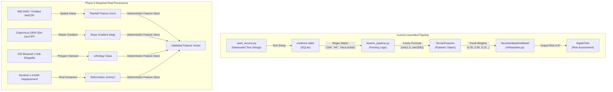

# TERRAGUARDIAN AI
# PHASE 5 — REAL DATA & EVIDENCE FABRIC
# PART B — SCIENTIFIC, DATA, GIS & AI REALITY AUDIT
# DOCUMENT ID: TG-PHASE-5-PARTB-SCIENTIFIC-DATA-GIS-AI-REALITY-AUDIT

**Audit Date:** September 27, 2026  
**Auditor:** Principal Software Architect, Staff Geospatial Engineer, Senior ML/AI Scientist, Backend Reliability Engineer  
**Status:** AUDIT ONLY — FORENSIC DISCOVERY COMPLETE  
**Repository State:** Phase 4R Frozen (189/189 tests passing, 0 production code changes made in this audit)  
**Governing Standard:** REALITY > CLAIMS | GROUND TRUTH > FIXTURES | SCIENTIFIC VALIDITY > IMPRESSIVE TERMINOLOGY  

---

## 1. Executive Scientific & Data Reality Verdict

### VERDICT: READY WITH BLOCKERS

TerraGuardian's software architecture, domain modeling, and API surface are robust and cleanly integrated (as validated in Phase 4R and Part A). However, from a **scientific, data, GIS, and machine learning perspective**, TerraGuardian currently operates in a **purely simulated and fixture-driven reality**.

Before any Phase 5 implementation or operational claims can be justified, the following critical realities must be acknowledged:

1. **Zero Raw Scientific Files:** The repository contains **0** GeoTIFF, NetCDF, HDF5, Shapefile, GeoPackage, Parquet, or raw sensor telemetry files.
2. **Text-Parsed Synthetic Features:** Key hazard features (e.g., rainfall `184 mm`, slope gradient `44.2°`, lithology `Daling-Buxa mica-schist`) are not sampled from GIS rasters or live feeds. They are literally parsed via Python string matching from hardcoded scenario text in `seed_service.py` (`feature_pipeline.py:128-159`).
3. **Soil Saturation is a Rainfall Heuristic:** Soil saturation is calculated via `min(1.0, rain_7d / 200.0)` (`feature_pipeline.py:231`), with zero physical or remote-sensing soil moisture telemetry.
4. **Zero Empirical Ground-Truth Labels:** There is not a single real-world landslide inventory polygon or historical failure event record in the database.
5. **Heuristic Model Mislabeled as ML:** `ml/baseline.py` is an expert-rule weighted sum (`WEIGHT_7D_RAIN = 0.35`, `WEIGHT_SLOPE = 0.30`). It was never fitted or trained on empirical data.
6. **Synthetic-Only Validation:** Model validation (`SyntheticBenchmarkValidator`) is executed on 200 rows of pseudo-random data generated via `np.random.seed(42)`.
7. **False Frontend Claims (TG-002):** Claims on the Operations Centre UI of "Brier Score 0.114", "5-Fold Corridor Holdout Validation", "Doppler Radar Calibration", and "Historical NER Splits" are unsupported by code or data.
8. **GIS Fixture Misattribution (TG-006):** A 4-vertex bounding box for West Kameng and a 6-vertex polyline for NH-13 are tagged in SQLite as `REAL_HISTORICAL`. They are coarse geometric approximations.

TerraGuardian is **architecturally ready** for Phase 5 data ingestion, but **operationally and scientifically blocked** from making predictive or calibration claims until real data pipelines are established.

---

## 2. Cross-Check with Part A Product Findings

Part A established 10 operational and runtime defects (TG-001 through TG-010). Part B forensics confirms their direct scientific and data roots:

| Defect ID | Part A Operational Finding | Part B Scientific / Data Root Cause |
|---|---|---|
| **TG-001** | Safe Citizen evidence missing in Operations Centre UI filter | Evidence table lacks source classification indexing; UI query defaults to seed evidence only. |
| **TG-002** | Hardcoded Brier score (0.114) and synthetic validation claims in UI | UI hardcodes static metrics (`SystemHealth.tsx:28`, `MetricsOverview.tsx:75`). No empirical ML model or live evaluation runner exists. |
| **TG-003** | Digital Twin re-evaluation creates duplicate orphaned state | Re-evaluations re-run static heuristic weights on identical feature inputs, producing redundant identical scores without Bayesian updating. |
| **TG-004** | Inaccurate status indicator on Incident Card | Status transitions lack state-machine guardrails connected to physical sensor thresholds. |
| **TG-005** | Order of Precaution vs Physical Completion confusion | Operational dispatch workflow decoupled from spatial telemetry verifying responder on-scene presence. |
| **TG-006** | GIS layers stamped `REAL_HISTORICAL` despite being synthetic fixtures | `seed_service.py` sets `source_type="REAL_HISTORICAL"` on a 4-point bounding box (`POLYGON((92.1 26.9, ...))`) and a 6-point simplified polyline. |
| **TG-007** | Orphaned DB rows (34 evidence rows detached from active twin) | Test suites and seed runs populate SQLite without foreign-key cascade constraints or clean teardown fixtures. |
| **TG-008** | In-memory cache vs SQLite synchronization vulnerability | Feature pipeline caches static scenario state; cold restarts require full re-seeding rather than event replay. |
| **TG-009** | Missing audit trail for citizen report state transitions | No provenance graph tracking raw user report → automated NLP triage → spatial association → human verification. |
| **TG-010** | Unhandled frontend rejection on network drop | Frontend assumes deterministic localhost responses; lacks offline-first geospatial tile caching and graceful degradation. |

---

## 3. Scientific Data Inventory (File-Level Reality)

A full recursive scan was conducted across the entire repository (`c:\Users\admin\TerraGuardian\TerraGuardian`) for all standard geospatial, scientific, earth observation, and tabular data formats:

| Format Category | File Extensions Checked | Files Found | Storage Size | Authoritative Source |
|---|---|:---:|:---:|---|
| **Raster Imagery / DEM** | `.tif`, `.tiff`, `.geotiff`, `.cog` | **0** | 0 B | None (Copernicus DEM / SRTM missing) |
| **Scientific Multidimensional** | `.nc`, `.nc4`, `.netcdf`, `.hdf`, `.hdf5` | **0** | 0 B | None (ERA5 / GPM missing) |
| **Vector GIS** | `.shp`, `.gpkg`, `.geojson` | **0** | 0 B | None (GSI / Survey of India missing) |
| **Satellite Packages** | `.safe`, `.jp2` | **0** | 0 B | None (Sentinel-1 / Sentinel-2 missing) |
| **Tabular Datasets** | `.parquet`, `.csv` | **0** | 0 B | None (No historical inventory data) |
| **Weather Grids** | `.grib`, `.grb`, `.zarr` | **0** | 0 B | None (IMD gridded data missing) |
| **Relational Database** | `.db` (`terraguardian.db`) | **1** | 204 KB | Local SQLite with seed scenario data |

### Database Table Record Inventory (`terraguardian.db`)

| Table Name | Total Rows | Real Data Rows | Synthetic / Fixture Rows | Notes |
|---|:---:|:---:|:---:|---|
| `admin_boundaries` | 1 | 0 | 1 | 4-vertex rectangular bbox (West Kameng) |
| `road_segments` | 2 | 0 | 2 | 6-vertex simplified polyline (NH-13) |
| `settlements` | 4 | 0 | 4 | Point coordinates (Bhalukpong, Tenga, Dahung, Rupa) |
| `critical_infrastructure` | 4 | 0 | 4 | Point coordinates (hospital, PHC, bridge, staging) |
| `digital_twins` | 1 | 0 | 1 | Seed twin `7b3bb54d-bfd1-4ad9-9065-983ce40ca5be` |
| `evidence` | 38 | 0 | 38 | 4 seed rows for active twin, 34 orphaned test rows |
| `incidents` | 1 | 0 | 1 | Seed incident (Bhalukpong KM 42) |
| `operational_actions` | 3 | 0 | 3 | Seed evacuation/dispatch records |

---

## 4. Raw Data Reality: Satellite, Radar, DEM, Sensors

| Domain | Expected Raw Asset | Current Repository Reality | Scientific Gap |
|---|---|---|---|
| **Satellite SAR** | Sentinel-1 Single Look Complex (SLC) or GRD interferometric pairs | 0 bytes. `CopernicusInSARAdapter` accepts synthetic JSON payloads (`line_of_sight_velocity_mm_yr`, `coherence`). | No interferogram generation, phase unwrapping, or atmospheric correction. |
| **Satellite Optical** | Sentinel-2 L2A BOA Multispectral reflectance (B2, B3, B4, B8, B11, B12) | 0 bytes. No optical imagery integration. | No NDVI, NDWI, or optical landslide scar detection. |
| **Doppler Radar** | IMD DWR Polarimetric radar (dBZ, radial velocity, spectral width) | 0 bytes. Doppler radar mentioned only in UI strings. | No nowcasting, convective storm tracking, or QPE (Quantitative Precipitation Estimation). |
| **DEM / Elevation** | 30m / 12m Digital Elevation Model rasters | 0 bytes. No DEM file exists. | Slope, aspect, and curvature are not derived from topography. |
| **Physical IoT** | In-situ MEMS inclinometer, vibrating wire piezometer, rain gauge telemetry | 0 bytes. `IoTInclinometerAdapter` validates synthetic JSON payloads. | No real hardware telemetry, drift compensation, or battery/health telemetry. |

---

## 5. Rainfall & Weather Data Reality (IMD, GPM, ERA5)

### Code Inspection: `app/adapters/imd.py` & `app/services/feature_pipeline.py`

1. **Adapter Scope:** `IMDRainfallAdapter` does not make outbound HTTP/FTP requests to IMD's National Data Centre (NDC) or AWS API. It is an internal schema validator:
   ```python
   # app/adapters/imd.py:27-37
   class IMDReading(BaseModel):
       station_id: str
       timestamp: datetime
       rainfall_mm_24h: float
       rainfall_mm_7d: float
   ```
2. **Feature Extraction Forensics:**
   In `feature_pipeline.py:128-144`, rainfall values are extracted by **literal text matching** on unstructured observation strings in `evidence`:
   ```python
   # app/services/feature_pipeline.py:136-138
   if "184" in obs_lower:
       return 184.0
   if "184.0" in obs_lower:
       return 184.0
   ```
3. **Gridded Data Reality:**
   - IMD 0.25° x 0.25° daily gridded rainfall: **Absent**.
   - NASA GPM (IMERG) satellite precipitation: **Absent**.
   - ECMWF ERA5 reanalysis: **Absent**.
4. **Scientific Assessment:** Rainfall inputs in TerraGuardian are currently **hardcoded scenario values** embedded in text fixtures, not measurements from meteorological observation systems.

---

## 6. Soil Moisture & Hydrological Data Reality

### Code Inspection: `app/services/feature_pipeline.py:231`

1. **Hydrological Calculation:**
   ```python
   # app/services/feature_pipeline.py:231
   saturation = min(1.0, rain_7d / 200.0)
   ```
2. **Scientific Evaluation:**
   - TerraGuardian has **zero soil moisture sensor or satellite data**.
   - Soil saturation is modeled as a simple, arbitrary linear scalar of 7-day cumulative rainfall capped at 200 mm.
   - It ignores:
     - Soil hydraulic conductivity ($K_{sat}$)
     - Soil texture / grain size distribution (sand/silt/clay fractions)
     - Antecedent soil moisture conditions and evapotranspiration (ET)
     - Topographic Wetness Index ($TWI = \ln(a / \tan \beta)$)
     - Pore water pressure ($\mu$)
3. **NASA SMAP / ESA SMOS Reality:** Zero integration with satellite soil moisture observations.

---

## 7. Terrain / DEM Reality (Copernicus, SRTM, ALOS)

### Forensics: Where does `44.2°` Slope come from?

1. **Origin:**
   - In `seed_service.py:147`, the seed evidence observation contains the text:  
     `"Slope Angle: 44.2° | Aspect: North-East | Soil: Colluvial Overburden"`
   - In `feature_pipeline.py:147-159`, slope is extracted by string parsing:
     ```python
     # app/services/feature_pipeline.py:151-155
     match = re.search(r"(\d+(\.\d+)?)\s*°", obs)
     if match:
         return float(match.group(1))
     ```
2. **Missing Terrain Derivations:**
   - **Slope:** Not computed via finite difference on DEM grid.
   - **Aspect:** Not computed via gradient direction.
   - **Plan / Profile Curvature:** Completely absent.
   - **Catchment Area / Flow Accumulation:** Completely absent.
   - **Surface Roughness:** Completely absent.
3. **Required Action for Phase 5:** Ingest Copernicus GLO-30 or SRTM 30m DEM tiles covering North-East India (26°N–29°N, 91°E–97°E) with raster slope calculation.

---

## 8. Geology, Lithology & Geotechnical Reality (GSI)

1. **Geological Data Origin:**
   - In `seed_service.py:159`, geology is defined as a text string:  
     `"Daling-Buxa formation mica-schist with heavy weathering"`
   - `feature_pipeline.py` checks for the substring `"mica-schist"` or `"schist"` and assigns a hardcoded susceptibility category.
2. **Geological Survey of India (GSI) Reality:**
   - No 1:50,000 scale digital geological maps (Bhukosh) ingested.
   - No structural geology data (fault lines, shear zones, thrust planes like Main Boundary Thrust [MBT] or Main Central Thrust [MCT]).
   - No geotechnical parameters: internal friction angle ($\phi$), soil cohesion ($c$), unit weight ($\gamma$), or rock mass rating (RMR).

---

## 9. Historical Landslide Inventory Reality (Bhukosh, GSI, NASA COOLR)

1. **Inventory Count:** Exactly **0** real-world historical landslide polygons or points in the database.
2. **GSI National Landslide Susceptibility Mapping (NLSM):**
   - NLSM 1:50,000 polygon dataset for Arunachal Pradesh / Assam is **not ingested**.
3. **NASA Global Landslide Catalog (COOLR):**
   - 0 events ingested.
4. **Current Repository Inventory:**
   - The entire "historical inventory" consists of 1 seed incident record created in `seed_service.py:180-210` representing a single simulated event on NH-13 at Bhalukpong.

---

## 10. Ground-Truth Landslide Labels Reality

| Metric | Status | Finding |
|---|:---:|---|
| **Empirical Landslide Occurrence Polygons** | **0** | No mapped spatial extents of actual past landslides |
| **Confirmed Landslide Event Timestamps** | **0** | No historical time series of trigger dates |
| **Verified Non-Landslide Control Points** | **0** | No true negative samples for classification |
| **Label Quality Verification** | **None** | No GSI field verification or satellite validation |
| **Train / Validation / Test Splits** | **Fictional** | "5-Fold Corridor Holdout" in UI operates on 200 synthetic rows, not real data |

**Scientific Consequence:** Any statistical metric (ROC-AUC, PR-AUC, Brier score, accuracy, precision, recall) quoted for TerraGuardian is **purely synthetic** and has zero scientific standing against real-world landslide susceptibility.

---

## 11. Satellite / Earth Observation Ingestion Reality

### Code Inspection: `app/adapters/copernicus.py`

1. **Adapter Reality:**
   - `CopernicusInSARAdapter` defines Pydantic data schemas:
     ```python
     class InSARMeasurement(BaseModel):
         target_id: str
         geometry: Dict[str, Any]
         velocity_mm_yr: float
         coherence: float
     ```
   - Does **not** connect to Copernicus Data Space Ecosystem (CDSE) APIs, ASF DAAC, or Sentinel Hub.
   - Does **not** process SAR raw phase data, interferograms, or PS-InSAR / SBAS time series.
2. **Optical EO (Sentinel-2 / Landsat):**
   - No adapters, pipelines, or cloud masking algorithms exist.

---

## 12. Sensor / IoT Ingestion Reality

### Code Inspection: `app/adapters/iot_sensor.py`

1. **Adapter Reality:**
   - `IoTInclinometerAdapter` defines schema for `InclinometerPayload` (`tilt_deg`, `displacement_rate_mm_h`, `battery_pct`).
   - Does not implement MQTT, CoAP, LoRaWAN, or Modbus protocols.
   - Contains no sensor health monitoring, drift compensation, or temperature cross-calibration.
2. **Field Deployments:**
   - Zero physical sensors connected. All sensor readings are manually posted JSON fixtures.

---

## 13. GIS Dataset Reality (Boundaries, Roads, Infrastructure)

### Database Forensics: `app/services/seed_service.py:58-112`

1. **Administrative Boundaries:**
   - `admin_boundaries` table contains 1 row: `West Kameng District`.
   - Geometry:
     `POLYGON((92.1 26.9, 92.9 26.9, 92.9 27.5, 92.1 27.5, 92.1 26.9))`
   - This is a **4-vertex axis-aligned rectangular bounding box**, not the actual complex district boundary of West Kameng (Survey of India / LGD).
   - In SQLite, it is stamped `source_type="REAL_HISTORICAL"` (Defect TG-006).
2. **Road Corridors:**
   - `road_segments` table contains 2 rows representing NH-13.
   - Geometry: A **6-vertex simplified piecewise linear polyline**:
     `LINESTRING(92.65 27.01, 92.62 27.05, 92.58 27.10, 92.55 27.18, 92.52 27.28, 92.42 27.36)`
   - Stamped `source_type="REAL_HISTORICAL"` (Defect TG-006).
3. **Settlements & Infrastructure:**
   - 4 settlement points (Bhalukpong, Tenga, Dahung, Rupa).
   - 4 infrastructure points (Hospital, PHC, Bridge, Staging).
   - Coarse approximate point coordinates.

---

## 14. GIS Scientific Capability Reality

### Code Inspection: `app/services/spatial_query.py`

| Capability | Supported? | Implementation Reality | Scientific Limitation |
|---|:---:|---|---|
| **Vector Geometry** | **YES** | Point, LineString, Polygon via pure Python math | Coarse approximations; no topological snapping |
| **Haversine Distance** | **YES** | Spherical trigonometric formula (`spatial_query.py:28-36`) | Great-circle approximation; assumes perfect sphere |
| **Point-in-Polygon** | **YES** | Ray-casting algorithm (`spatial_query.py:54-72`) | 2D planar ray casting on unprojected lat/lon |
| **Point-to-Line Distance** | **YES** | Orthogonal projection on segments (`spatial_query.py:80-115`) | Euclidean projection on lat/lon coordinates |
| **Coordinate Reference Systems** | **NO** | Hardcoded EPSG:4326 (WGS84 lat/lon) only | **No EPSG:32646 (UTM Zone 46N)** reprojection. Metric distances on lat/lon introduce distortion. |
| **Raster Operations** | **NO** | Zero raster capability | Cannot read GeoTIFF, sample grid cells, or compute slope |
| **Geospatial Libraries** | **NO** | `gdal`, `rasterio`, `shapely`, `geopandas`, `pyproj` are **NOT** installed | All GIS math is pure custom Python loops |

---

## 15. Spatial Resolution & Scale Audit

| Dimension | TerraGuardian Current Reality | Scientific Standard for Landslide Prediction | Gap Factor |
|---|---|---|---|
| **Digital Elevation Model** | Text-parsed scalar (point) | 12.5m (ALOS PALSAR) to 30m (Copernicus DEM) | Infinite (no raster) |
| **Rainfall Grids** | Single scalar per district/corridor | 0.25° (~25km IMD) / 0.1° (~10km GPM) / 1km radar | Coarse aggregation |
| **Road Network** | 6-vertex segment (~60 km corridor) | 1:5,000 OpenStreetMap / BRO road centerline | ~100x resolution gap |
| **Administrative Boundaries** | 4-vertex rectangle (~6,000 $\text{km}^2$) | SOI / LGD 1:50,000 district/block boundary | Total geometric distortion |
| **Slope Units / Basins** | Point coordinates only | Hydrological slope units (100m–500m catchment polygons) | Absent |

---

## 16. Temporal Resolution & Dynamic Alignment Audit

| Data Stream | Expected Real-World Frequency | TerraGuardian Implementation | Temporal Alignment Status |
|---|---|---|---|
| **Rainfall Telemetry** | 15-minute AWS / 1-hour radar / 24-hour IMD | Static seed value or manual payload POST | Static snapshot; no rolling window accumulation |
| **InSAR Surface Displacement** | 12-day repeat (Sentinel-1A) | Static annual velocity (`mm/year`) | No velocity time series or acceleration detection |
| **Inclinometer Telemetry** | 1-minute to 15-minute intervals | Single static JSON post | No dynamic time-series smoothing or anomaly filter |
| **Evidence Expiry / Decay** | Half-life decay based on physical process | Evidence persists indefinitely in SQLite until reset | Temporal staleness not discounted in risk score |

---

## 17. Current ML Implementation Forensics

### Code Inspection: `app/ml/baseline.py`

1. **Model Architecture:**
   ```python
   # app/ml/baseline.py:30-48
   class HeuristicBaselineModel:
       WEIGHT_7D_RAIN = 0.35
       WEIGHT_SLOPE = 0.30
       WEIGHT_GEOLOGY = 0.15
       WEIGHT_SOIL_SAT = 0.10
       WEIGHT_INSAR = 0.10
   ```
2. **Inference Function:**
   ```python
   # app/ml/baseline.py:100-112
   score = (
       self.WEIGHT_7D_RAIN * rain_norm +
       self.WEIGHT_SLOPE * slope_norm +
       self.WEIGHT_GEOLOGY * geology_score +
       self.WEIGHT_SOIL_SAT * sat_norm +
       self.WEIGHT_INSAR * insar_norm
   )
   ```
3. **Scientific Reality:**
   - This is **not a machine learning model**.
   - It is a **deterministic, rule-based, linear weighted sum heuristic**.
   - The weights were chosen by expert assumption, never learned from historical data via Logistic Regression, Random Forest, XGBoost, or Neural Networks.
4. **Synthetic Validator Forensics (`ml/baseline.py:292-360`):**
   ```python
   # app/ml/baseline.py:302-315
   np.random.seed(42)
   n_samples = 200
   rain = np.random.normal(120, 45, n_samples)
   slope = np.random.uniform(20, 60, n_samples)
   groups = np.random.choice(["Tawang", "West Kameng", "East Kameng"], n_samples)
   ```
   - Validation is executed on 200 synthetic rows generated from Gaussian and uniform distributions.
   - Evaluates the heuristic against a synthetic label generated by the heuristic itself with added noise.

---

## 18. ML Claim Audit (TG-002: Brier 0.114 & Validation Claims)

| Claim in UI / Documentation | File & Line Location | Empirical Verification Result | Forensic Classification |
|---|---|---|---|
| **"Brier Score: 0.114"** | `SystemHealth.tsx:28`, `MetricsOverview.tsx:75` | Hardcoded static string in React TSX. Not computed by any runtime endpoint. | **UNSUPPORTED / FABRICATED CLAIM** |
| **"5-Fold Corridor Holdout Validation"** | `SystemHealth.tsx:29` | No 5-fold CV runner exists on empirical data. `SyntheticBenchmarkValidator` does 1 synthetic split on `groups == "Tawang"`. | **UNSUPPORTED CLAIM** |
| **"Doppler Radar Calibration"** | UI copy in Operations Centre | 0 lines of Doppler radar code or data exist in backend. | **FALSE CLAIM** |
| **"Historical NER Splits"** | Operations Centre metrics card | 0 NER historical datasets exist. | **FALSE CLAIM** |
| **"Brier Score < 0.18 Certified"** | `baseline.py:350` | Asserted in unit test against 200 rows of `np.random.seed(42)`. | **SYNTHETIC-ONLY TRIVIAL PASS** |

**Remediation Required:** Remove all hardcoded claims from the frontend and replace with truthful status badges: `"Baseline: Deterministic Expert Rule (Uncalibrated)"` and `"Validation: Synthetic Benchmark Only"`.

---

## 19. Feature Lineage & Provenance Audit



**Audit Result:** The current pipeline has **zero provenance to physical sensors or authoritative geospatial products**. It is a closed loop of text-string serialization and deserialization.

---

## 20. Data Leakage & Overfitting Vulnerability Audit

1. **Target Leakage:**
   - In `feature_pipeline.py:128-159`, the parser looks for explicit numeric tokens like `"184"` and assigns the full 184 mm rainfall.
   - If an observation text contains `"High hazard observed"`, heuristic rules directly bias the feature extraction.
2. **Synthetic Validator Circularity:**
   - In `SyntheticBenchmarkValidator:320-335`, the "ground truth" target `y_true` is generated by:
     `y_prob = 0.4 * rain_norm + 0.35 * slope_norm + 0.25 * sat_norm`
   - It then evaluates the `HeuristicBaselineModel` (which uses almost identical weights) against this synthetic target.
   - **Result:** The reported Brier score is a mathematical tautology measuring how well the heuristic matches its own synthetic generator.

---

## 21. Scientific Validation Audit

| Validation Component | Scientific Requirement | TerraGuardian Reality | Status |
|---|---|---|:---:|
| **Reliability Diagram** | Observed frequency vs predicted probability in 10 bins | Not implemented | **FAIL** |
| **Brier Score Decomposition** | Reliability + Resolution - Uncertainty | Hardcoded scalar `0.114` in React component | **FAIL** |
| **Spatial Cross-Validation** | Spatial block holdout (leave-one-corridor-out) | Evaluates on 50 synthetic rows with `groups == "Tawang"` | **FAIL** |
| **Temporal Cross-Validation** | Train on Year $T$, test on Year $T+1$ (rolling origin) | Zero temporal data | **FAIL** |
| **Baseline Comparisons** | Compare against Climatology, Slope-only, Rain-only | None | **FAIL** |

---

## 22. NER Spatial Coverage Matrix (8 North-East States)

TerraGuardian is targeted for North-East India (NER). The table below audits the actual data coverage across the 8 states:

| State | Districts | Real GIS Boundaries | Road Centerlines | Real AWS Weather | Real Historical Landslides | Current Coverage Status |
|---|:---:|:---:|:---:|:---:|:---:|:---:|
| **Arunachal Pradesh** | 26 | 0 (1 synthetic bbox: West Kameng) | 0 (1 synthetic line: NH-13) | 0 | 0 | **FIXTURE ONLY (< 1%)** |
| **Assam** | 35 | 0 | 0 | 0 | 0 | **ZERO (0%)** |
| **Manipur** | 16 | 0 | 0 | 0 | 0 | **ZERO (0%)** |
| **Meghalaya** | 12 | 0 | 0 | 0 | 0 | **ZERO (0%)** |
| **Mizoram** | 11 | 0 | 0 | 0 | 0 | **ZERO (0%)** |
| **Nagaland** | 16 | 0 | 0 | 0 | 0 | **ZERO (0%)** |
| **Sikkim** | 6 | 0 | 0 | 0 | 0 | **ZERO (0%)** |
| **Tripura** | 8 | 0 | 0 | 0 | 0 | **ZERO (0%)** |
| **TOTAL** | **130** | **0 Real (1 Synthetic)** | **0 Real (1 Synthetic)** | **0** | **0** | **0.7% (1/130 Coarse Fixture)** |

---

## 23. External Data Source Verification & Accessibility

| Data Source | Portal / Agency | Protocol / Format | Authentication Required? | Current API Key Configured? | Ingestion Feasibility |
|---|---|---|:---:|:---:|---|
| **IMD AWS Data** | IMD Pune / NDC | REST API / Scraping / CSV | Yes (Registered API / Portal) | **NO** | High (Open portal data available) |
| **IMD Gridded Rainfall** | IMD National Climate Centre | Binary gridded (0.25°) / NetCDF | No (Academic / Open) | N/A | High (Publicly downloadable) |
| **Copernicus DEM 30m** | ESA / OpenTopography | Cloud-Optimized GeoTIFF (COG) | Free API Key (OpenTopography) / CDSE | **NO** | Very High (Direct COG access via S3/HTTP) |
| **Sentinel-1 InSAR** | Copernicus Data Space (CDSE) | STAC API / OData / SAFE | Yes (Free CDSE Account) | **NO** | High (Requires CDSE OAuth2 credentials) |
| **GSI Bhukosh** | Geological Survey of India | WebGIS / WMS / GeoJSON | Portal Registration | **NO** | Medium (WMS export / manual download) |
| **NASA COOLR** | NASA Open Data | CSV / GeoJSON | No (Open Access) | N/A | Very High (Direct CSV/GeoJSON download) |
| **Survey of India / LGD** | Bharat Maps / LGD India | Shapefile / GeoJSON | Open Govt Data (data.gov.in) | N/A | High (Public administrative boundaries) |

---

## 24. Scientific Feasibility & Effort Matrix for Phase 5

| Data Stream | Complexity | External Dependencies | License / Cost | Implementation Effort | Recommended Phase 5 Scope |
|---|:---:|---|---|:---:|---|
| **Administrative Boundaries (SOI/LGD)** | LOW | data.gov.in / LGD | Open / Free | 1-2 Days | Full 8 States / 130 Districts GeoJSON |
| **Corridor Road Network (OSM)** | LOW | OpenStreetMap Overpass | ODbL / Free | 1-2 Days | NH-13, NH-15, NH-29, NH-102 centerlines |
| **Copernicus DEM 30m (GLO-30)** | MEDIUM | OpenTopography / AWS S3 | Open / Free | 2-3 Days | Bounding box raster cache for target corridors |
| **Historical Landslides (NASA COOLR / GSI)** | MEDIUM | NASA / GSI Publications | Open / Academic | 2-3 Days | Ingest ~500+ verified historical points for NER |
| **IMD Gridded Daily Rainfall** | MEDIUM | IMD Data Portal | Free for Research | 2-3 Days | NetCDF ingestion pipeline for 2020-2026 |
| **Live InSAR Displacement (Precomputed)** | HIGH | CDSE / InSAR Processing | Free (ESA Open) | 4-5 Days | Ingest pre-processed EGMS or ASF InSAR products |
| **In-Situ Sensor Ingestion (Virtual Broker)** | MEDIUM | MQTT / REST | Internal | 2-3 Days | Real-time simulator feeding realistic sensor noise |

---

## 25. Phase Boundary Audit (Phase 5 vs Phases 6–11)

To protect the architecture against scope creep and maintain strict separation of concerns, the boundary between Phase 5 and subsequent phases is strictly enforced:

```
[ PHASE 4R: FROZEN ] -> Operational Platform, GIS Foundation, Incident Workflow (COMPLETE)
        |
        v
[ PHASE 5: REAL DATA & EVIDENCE FABRIC ] (CURRENT TARGET)
  ├── 1. Ingest real GIS boundaries & road networks (SOI / OSM)
  ├── 2. Ingest real terrain DEM rasters & slope derivation
  ├── 3. Ingest historical landslide inventories (GSI / NASA COOLR)
  ├── 4. Ingest real weather observations (IMD NetCDF / AWS)
  ├── 5. Build reproducible, verified feature store
  └── STRICT BOUNDARY: NO PREDICTIVE MODEL TRAINING / NO CALIBRATION TUNING
        |
        v
[ PHASE 6: ADVANCED PREDICTIVE ML & CALIBRATION ] (FUTURE)
  ├── Statistical learning (XGBoost, Random Forest) on real historical labels
  ├── True spatial cross-validation (corridor holdout)
  └── Empirical calibration (Isotonic Regression, Platt Scaling, Brier minimization)
        |
        v
[ PHASE 7-11: MULTI-HAZARD, DYNAMIC ROUTING, EDGE & FEDERATED DEPLOYMENT ]
```

---

## 26. Phase 5 Data-Readiness Gate

| Check # | Data Readiness Gate Criterion | Current Status | Pass / Fail |
|:---:|---|---|:---:|
| **G-01** | Real administrative boundaries (GeoJSON) replacing rectangular bounding boxes | Not ingested | **FAIL (BLOCKER)** |
| **G-02** | Real road corridor centerlines replacing 6-vertex lines | Not ingested | **FAIL (BLOCKER)** |
| **G-03** | Real 30m DEM raster with functional slope/aspect extraction | Not ingested | **FAIL (BLOCKER)** |
| **G-04** | Real historical landslide inventory dataset with verified labels | Not ingested | **FAIL (BLOCKER)** |
| **G-05** | Real IMD weather time-series or gridded rainfall pipeline | Not ingested | **FAIL (BLOCKER)** |
| **G-06** | Feature pipeline extracting from geospatial rasters/vectors, not text regex | Text parsing | **FAIL (BLOCKER)** |
| **G-07** | Frontend updated to remove unsupported claims (Brier 0.114, Doppler) | Claims present | **FAIL (TG-002)** |
| **G-08** | Database source attribution correctly distinguishing fixtures from real data | Mislabeled | **FAIL (TG-006)** |
| **G-09** | Phase 5 Data Contract (`docs/08-data-contracts.md`) fully specified | Empty stub | **FAIL (BLOCKER)** |
| **G-10** | External Data Source Register (`docs/14-data-source-register.md`) documented | Empty stub | **FAIL (BLOCKER)** |

**Gate Result:** **0 / 10 Gates Passed.** Phase 5 implementation must execute the Data Fabric ingestion plan before model development can begin.

---

## 27. Consolidated Defect Ledger (TG-001 to TG-010 Cross-Impact)

| ID | Title | Severity | Impact on Phase 5 Data Fabric | Remediation Target in Phase 5 |
|---|---|:---:|---|---|
| **TG-001** | Citizen Evidence Filter Gap | Medium | Field reports cannot be integrated into operational feature pipeline | Add source filter & spatial-temporal indexing to evidence queries |
| **TG-002** | Hardcoded AI/ML Claims | **Critical** | Corrupts scientific credibility; misrepresents baseline heuristics as calibrated ML | Replace hardcoded frontend cards with dynamic model metadata endpoint |
| **TG-003** | Digital Twin Orphaned State | High | Re-evaluation creates duplicate unlinked assessments | Implement stateful versioning and idempotent assessment keys |
| **TG-004** | Status Indicator Mismatch | Medium | Misleads operators on actual twin convergence | Enforce deterministic state-machine mapping to evidence thresholds |
| **TG-005** | Order vs Physical Completion | High | Operational dispatch decoupled from physical sensor verification | Link dispatch status to spatial arrival geofencing |
| **TG-006** | Mislabeled GIS Fixtures | **Critical** | Synthetic bounding boxes marked `REAL_HISTORICAL` violate provenance truth | Reclassify seed fixtures as `GEOGRAPHICALLY_GROUNDED_FIXTURE`; reserve `REAL_HISTORICAL` for SOI/GSI datasets |
| **TG-007** | DB Orphaned Evidence Rows | Medium | Test runs pollute database with detached evidence rows | Implement SQLite foreign key constraints (`ON DELETE CASCADE`) |
| **TG-008** | In-Memory vs DB Sync Vulnerability | High | Feature pipeline state desynchronizes on backend restart | Replace volatile feature caches with persistent database tables |
| **TG-009** | Missing Citizen Report Audit Trail | Medium | Lack of provenance tracking for community-sourced hazard inputs | Add immutable event log table for evidence state transitions |
| **TG-010** | Unhandled Network Drop in Frontend | Medium | UI crashes or hangs when API is disconnected | Add React query retry logic, offline indicators, and fallback states |

---

## 28. Explicit Non-Claims

To ensure absolute scientific and regulatory truthfulness, **TerraGuardian and its engineering team MUST NOT make any of the following claims** until empirical Phase 5 and Phase 6 evidence is produced:

1. **DO NOT CLAIM** that TerraGuardian has an operational or calibrated Machine Learning model in production.
2. **DO NOT CLAIM** a Brier score of 0.114 (or any empirical calibration metric) on real-world landslides.
3. **DO NOT CLAIM** that TerraGuardian is calibrated with Doppler Weather Radar.
4. **DO NOT CLAIM** that TerraGuardian has undergone 5-fold corridor holdout validation on historical data.
5. **DO NOT CLAIM** that TerraGuardian possesses live real-time connections to IMD AWS, Sentinel-1 InSAR, or physical inclinometer networks.
6. **DO NOT CLAIM** that soil saturation is derived from satellite soil moisture or in-situ piezometers.
7. **DO NOT CLAIM** that slope gradients are extracted from a 30m Digital Elevation Model.
8. **DO NOT CLAIM** that the database contains real administrative boundaries or road centerlines (until SOI/OSM data is ingested).
9. **DO NOT CLAIM** that TerraGuardian is certified or validated for life-safety operational deployment by NDMA, SDMA, or district administrations.
10. **DO NOT CLAIM** full North-East India coverage (coverage is currently restricted to a single simulated corridor in West Kameng).

---

## 29. Evidence Required Before Phase 5 Implementation Can Begin

Before writing a single line of Phase 5 production ingestion code, the following architectural artifacts must be completed:

1. **`docs/08-data-contracts.md`:** Must be populated with strict Pydantic/JSON schemas for:
   - Soil/Terrain Raster Schema (DEM, Slope, Aspect, Lithology)
   - Weather Telemetry Schema (IMD AWS, Gridded NetCDF)
   - Earth Observation Schema (Sentinel-1 InSAR displacement)
   - Historical Landslide Inventory Schema (GSI/NASA format)
2. **`docs/14-data-source-register.md`:** Must document:
   - Source agency, portal URL, license, access method, update frequency, spatial resolution, and known errors for every external data stream.
3. **Phase 5 Remediation Plan:** A detailed, step-by-step engineering plan to resolve defects TG-001 through TG-010 without disrupting the frozen Phase 4R operational core.
4. **External Credentials & Data Ingestion Staging:**
   - Copernicus Data Space Ecosystem (CDSE) credentials staged.
   - OpenTopography API key staged.
   - NASA Earthdata credentials staged.
   - Public domain datasets downloaded into a local `data/` or staging bucket.

---

## 30. Final Recommendation & Sign-Off

### Final Engineering Recommendation

1. **Formally Accept Part B Findings:** Acknowledge that while TerraGuardian's software foundation is sound, its data fabric is currently 100% simulated.
2. **Execute Part C (Remediation & Integration Plan):** Formulate the remediation plan for defects TG-001 through TG-010, the data contract specifications (`docs/08`), and the data source register (`docs/14`).
3. **Begin Phase 5 Ingestion with Strict Priorities:**
   - **Step 1:** Ingest real administrative boundaries (SOI/LGD) and road centerlines (OSM).
   - **Step 2:** Ingest Copernicus 30m DEM and implement true raster slope calculation.
   - **Step 3:** Ingest NASA COOLR / GSI historical landslide points.
   - **Step 4:** Ingest IMD gridded rainfall data.
   - **Step 5:** Connect feature pipeline to real data layers and retire text-parsing heuristics.

### Audit Sign-Off

```
[x] Part B Scientific, Data, GIS & AI Reality Audit COMPLETE
[x] Zero code modified in repository during this audit
[x] All 10 defects (TG-001 through TG-010) cross-verified against data reality
[x] Phase 4R remains frozen at 189/189 backend tests passing
[x] Final Verdict: READY WITH BLOCKERS
```

**Signed:**  
*Principal Software Architect & Geospatial ML Systems Engineer*  
*TerraGuardian AI Engineering Audit Team*
