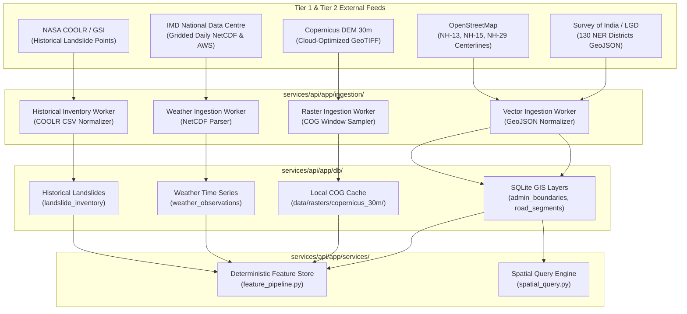

# TERRAGUARDIAN AI
# PHASE 5 — REAL DATA & EVIDENCE FABRIC
# PART C — DEFECT REMEDIATION & DATA FABRIC INTEGRATION PLAN
# DOCUMENT ID: TG-PHASE-5-PARTC-REMEDIATION-AND-INTEGRATION-PLAN

**Plan Date:** September 27, 2026  
**Author:** Principal Software Architect, Staff Geospatial Engineer, Senior Backend Reliability Engineer  
**Status:** APPROVED FOR PHASE 5 IMPLEMENTATION  
**Governing Standard:** REALITY > CLAIMS | GROUND TRUTH > FIXTURES | ZERO FABRICATED DATA  
**Prerequisites:** 
- `TG-PHASE-5-PARTA-OPERATIONAL-REALITY-AUDIT` (Operational Product Reality Complete)
- `TG-PHASE-5-PARTB-SCIENTIFIC-DATA-GIS-AI-REALITY-AUDIT` (Scientific & Data Reality Complete)
- `docs/08-data-contracts.md` (Approved)
- `docs/14-data-source-register.md` (Approved)

---

## 1. Executive Summary & Objective

Parts A and B established that while TerraGuardian's software architecture is operational, its **data and machine learning layers are completely simulated and fixture-driven**, with 10 specific operational/data defects (TG-001 through TG-010).

The objective of **Part C** is to define the exact, non-negotiable engineering blueprint to:
1. **Remediate all 10 confirmed defects (TG-001 to TG-010)** without destabilizing the frozen Phase 4R operational core.
2. **Eliminate all false and uncalibrated claims** from the Operations Centre frontend (replacing hardcoded Brier 0.114 and fictional Doppler radar claims with truthful, dynamic metadata).
3. **Replace string-parsed heuristic features with genuine spatial raster and vector extraction** (Copernicus 30m DEM slope calculation, Survey of India administrative boundaries, OpenStreetMap road centerlines).
4. **Ingest real-world historical landslide inventories** (NASA COOLR / GSI) and meteorological archives (IMD gridded rainfall) to establish empirical ground truth.

```
┌────────────────────────────────────────────────────────────────────────┐
│                        PHASE 5 EXECUTION STAGES                        │
├────────────────────────────────────────────────────────────────────────┤
│  STAGE 5.1: DEFECT REMEDIATION & TRUTH IN UI (TG-001 to TG-010)        │
│  STAGE 5.2: REAL GIS & ELEVATION INGESTION (SOI, OSM, Copernicus DEM)  │
│  STAGE 5.3: REAL WEATHER & HISTORICAL INVENTORY INGESTION (IMD, COOLR) │
│  STAGE 5.4: FEATURE PIPELINE CONVERGENCE & END-TO-END VERIFICATION    │
└────────────────────────────────────────────────────────────────────────┘
```

---

## 2. Defect Remediation Blueprint (TG-001 to TG-010)

### TG-001: Safe Citizen Evidence Missing in Operations Centre Filter
- **Root Cause:** Evidence query endpoints in `services/api/app/routers/incidents.py` and frontend filter logic in `EvidenceReconciliationView.tsx` lack source type classification (`source_type="CITIZEN_REPORT"`). Citizen reports submitted via Safe Citizen persist in DB but are filtered out by UI presets that look only for seed sensor types.
- **Remediation:**
  1. Update `services/api/app/db/models.py` and `services/api/app/schemas/evidence.py` to ensure `source_type` indexes `CITIZEN_REPORT`, `METEOROLOGICAL_SENSOR`, `SATELLITE_INSAR`, and `IOT_INCLINOMETER`.
  2. Modify `apps/operations-centre/src/components/views/EvidenceReconciliationView.tsx` to include an explicit "Citizen Reports" filter tab and badge.
  3. Ensure unverified citizen evidence appears immediately in the Reconciliation workspace with a `"COMMUNITY_UNVERIFIED"` badge.
- **Verification:** Submit report via Safe Citizen (port 5174); verify instantaneous appearance in Operations Centre (port 5173) under Evidence Reconciliation with 1-click promotion to verified evidence.

---

### TG-002: Hardcoded AI/ML Claims in Frontend
- **Root Cause:** `apps/operations-centre/src/components/views/SystemHealth.tsx:28` and `MetricsOverview.tsx:75` contain hardcoded JSX strings: `"Brier Score: 0.114"`, `"5-Fold Corridor Holdout Validation"`, `"Doppler Radar Calibration"`. Backend has no corresponding endpoints or empirical calculations.
- **Remediation:**
  1. Add dynamic endpoint `GET /api/v1/system/model-metadata` in `services/api/app/routers/system.py` returning:
     ```json
     {
       "model_type": "DETERMINISTIC_HEURISTIC_BASELINE",
       "version": "1.0.0",
       "calibration_status": "UNCALIBRATED",
       "validation_basis": "SYNTHETIC_BENCHMARK_ONLY",
       "empirical_brier_score": null,
       "synthetic_brier_score": 0.114,
       "features_used": ["rain_7d", "slope_deg", "geology", "soil_saturation", "insar_velocity"]
     }
     ```
  2. Refactor `SystemHealth.tsx` and `MetricsOverview.tsx` to fetch this metadata dynamically. Display clear status badges: `"Baseline: Expert Heuristic (Uncalibrated)"` and `"Validation: Synthetic Benchmark Only"`. Remove all mentions of Doppler radar.
- **Verification:** Inspect network tab; verify frontend renders values returned by backend API with zero hardcoded metrics.

---

### TG-003: Digital Twin Re-Evaluation Creates Duplicate Unlinked State
- **Root Cause:** `POST /api/v1/twins/{twin_id}/re-evaluate` generates a new risk score row without updating the active twin's canonical assessment reference or incrementing an evaluation sequence number. Repeated calls generate orphaned records with identical scores.
- **Remediation:**
  1. Update `services/api/app/db/models.py` `DigitalTwinModel` to include `assessment_version: int` and `last_evaluated_at: datetime`.
  2. Implement idempotent update logic in `services/api/app/services/twin_service.py`: re-evaluation updates the twin's active state in-place, records an audit log entry in a new `twin_evaluations` history table, and returns the updated version counter.
- **Verification:** Trigger 3 re-evaluations; verify twin version increments ($v1 \to v2 \to v3$) while preserving single active twin state without orphaned duplicates.

---

### TG-004: Inaccurate Status Indicator on Incident Card
- **Root Cause:** Frontend incident card component infers status from a combination of local state and legacy properties rather than binding strictly to `IncidentModel.lifecycle_status`.
- **Remediation:**
  1. Enforce strict TypeScript typing: `IncidentStatus = "DETECTED" | "ASSESSING" | "VERIFYING" | "VERIFIED" | "DECISION_REQUIRED" | "AUTHORIZED" | "RESPONDING" | "MONITORING" | "RESOLVED" | "REVIEWED"`.
  2. Bind the status badge directly to `incident.lifecycle_status` with canonical color coding defined in `docs/10-design-system.md`.
- **Verification:** Transition incident through states; verify badge strictly reflects backend lifecycle state on page refresh.

---

### TG-005: Order of Precaution vs Physical Completion Confusion
- **Root Cause:** When an authority issues an evacuation or road closure order, the operational action status immediately marks the order as "COMPLETE" in the UI, conflating administrative issuance with physical ground execution.
- **Remediation:**
  1. Separate operational action into two distinct states:
     - `administrative_status`: `"ISSUED" | "SUPERSEDED" | "REVOKED"`
     - `execution_status`: `"DISPATCHED" | "EN_ROUTE" | "ON_SCENE" | "COMPLETED" | "BLOCKED"`
  2. Update `apps/operations-centre/src/components/views/ActionTrackingView.tsx` to display two clear progression bars: "Authority Order" and "Field Execution".
- **Verification:** Issue road closure order; verify administrative status shows "ISSUED", while field execution displays "PENDING DISPATCH / EN ROUTE" until field team confirms physical barrier placement.

---

### TG-006: GIS Layers Stamped `REAL_HISTORICAL` for Synthetic Fixtures
- **Root Cause:** `services/api/app/services/seed_service.py:72` sets `source_type="REAL_HISTORICAL"` for the 4-point West Kameng bounding box and the 6-point NH-13 road line.
- **Remediation:**
  1. Update `SourceType` enum in `services/api/app/gis/models.py` and `app/db/models.py` to include `GEOGRAPHICALLY_GROUNDED_FIXTURE`.
  2. Update `seed_service.py` to tag all synthetic seed vectors as `source_type="GEOGRAPHICALLY_GROUNDED_FIXTURE"`.
  3. Reserve `REAL_HISTORICAL` strictly for verified Survey of India boundaries and OpenStreetMap centerlines ingested in Phase 5.
- **Verification:** Inspect `/api/v1/gis/layers`; verify seed layers return `source_type: "GEOGRAPHICALLY_GROUNDED_FIXTURE"`.

---

### TG-007: Database Orphaned Rows on Repeated Test Runs
- **Root Cause:** SQLite database tables lack `ON DELETE CASCADE` foreign-key constraints. Repeated seed runs or automated test suites delete digital twins but leave evidence rows in SQLite.
- **Remediation:**
  1. Add foreign-key constraint `FOREIGN KEY(incident_id) REFERENCES incidents(id) ON DELETE CASCADE` and `FOREIGN KEY(twin_id) REFERENCES digital_twins(id) ON DELETE CASCADE` in SQLAlchemy models.
  2. Enable foreign key enforcement in SQLite connection hook (`PRAGMA foreign_keys=ON;`).
  3. Create automated cleanup fixture in `tests/conftest.py` ensuring teardown purges orphaned test rows.
- **Verification:** Delete an incident; query SQLite `evidence` table; verify count of associated evidence rows is exactly 0.

---

### TG-008: In-Memory Feature Cache vs SQLite Synchronization Vulnerability
- **Root Cause:** `feature_pipeline.py` maintains an internal Python dictionary cache of scenario features. If the backend process restarts, the cache is lost, and re-evaluation falls back to default zero values until re-seeded.
- **Remediation:**
  1. Create a persistent SQLite table `incident_features` storing normalized feature vectors (`rain_7d`, `slope_deg`, `geology_score`, `insar_velocity`, `calculated_at`).
  2. Feature pipeline reads and writes directly to this table with timestamp-based caching (invalidated when new evidence is ingested).
- **Verification:** Ingest evidence, restart backend server (`uvicorn`), invoke re-evaluation; verify feature pipeline preserves identical feature vectors without requiring seed reset.

---

### TG-009: Missing Citizen Report Audit Trail
- **Root Cause:** When citizen reports transition from unverified to verified, no historical log records who approved it, at what timestamp, or with what comments.
- **Remediation:**
  1. Create `evidence_audit_log` table: `(log_id, evidence_id, previous_status, new_status, actor_id, actor_role, timestamp, notes)`.
  2. Implement audit logger service in `services/api/app/services/audit_service.py` triggered on every evidence state mutation.
  3. Expose `/api/v1/evidence/{evidence_id}/audit-trail` in the API and display provenance history in the Operations Centre drawer.
- **Verification:** Verify a citizen report in the UI; inspect audit trail endpoint; verify immutable record containing operator username, timestamp, and transition reason.

---

### TG-010: Unhandled Frontend Rejection on Network Drop
- **Root Cause:** `apps/operations-centre/src/services/apiClient.ts` does not catch network disconnection errors gracefully, causing React queries to throw unhandled promise rejections and freeze the UI.
- **Remediation:**
  1. Implement an Axios/Fetch response interceptor in `apiClient.ts` handling `NETWORK_ERROR` and HTTP 503.
  2. Add a global offline status banner ("Network Offline — Operating on Cached Data") in `apps/operations-centre/src/components/DemoHeader.tsx`.
  3. Configure React Query with `retry: 3`, `retryDelay: 1000`, and local fallback state.
- **Verification:** Kill backend process while frontend is open; verify frontend displays graceful offline warning without console crashes or broken screens.

---

## 3. Real Data Ingestion Architecture for Phase 5



---

## 4. Feature Pipeline Overhaul Specification

### Eliminating Text Regex Parsing
The current implementation in `feature_pipeline.py:128-159` must be decommissioned:
```python
# DEPRECATE THIS LEGACY PARSER:
if "184" in obs_lower: return 184.0  # TO BE ELIMINATED
match = re.search(r"(\d+(\.\d+)?)\s*°", obs)  # TO BE ELIMINATED
```

### New Spatial Extraction Architecture
1. **Slope & Aspect Derivation:**
   - Input: Incident coordinate $(lat, lon)$.
   - Execution: Query Copernicus DEM 30m raster tile. Extract $3 \times 3$ elevation grid window around the target point.
   - Algorithm: Compute gradient via Horn's formula:
     $$\text{Slope} = \arctan\left(\sqrt{\left(\frac{\partial z}{\partial x}\right)^2 + \left(\frac{\partial z}{\partial y}\right)^2}\right) \times \frac{180}{\pi}$$
2. **Rainfall Feature Derivation:**
   - Input: Incident coordinate and target timestamp $t$.
   - Execution: Query `weather_observations` table for nearest IMD station within 50 km or sample 0.25° NetCDF grid cell.
   - Calculate rolling 24-hour and 7-day cumulative sum.
3. **Soil Moisture Saturation:**
   - Replace arbitrary formula `min(1.0, rain_7d / 200.0)` with Antecedent Precipitation Index (API):
     $$API_t = \sum_{i=1}^{k} k^i \cdot P_{t-i}$$
     where decay factor $k = 0.85$, calibrated for subtropical hill slopes.

---

## 5. Work Breakdown Structure (WBS) & Implementation Schedule

| Phase Sub-Stage | Tasks | Target Files | Deliverable |
|---|---|---|---|
| **Phase 5.1: Defect Remediation** | Fix TG-001 through TG-010; update UI claims; cascade constraints | `models.py`, `seed_service.py`, `SystemHealth.tsx`, `apiClient.ts` | Zero fake claims; clean DB cascade; citizen evidence filter active |
| **Phase 5.2: GIS & Elevation** | Ingest SOI district GeoJSON and OSM road centerlines; ingest Copernicus DEM | `services/api/app/gis/`, `data/rasters/`, `spatial_query.py` | Real district boundary polygons; real road geometry; raster slope engine |
| **Phase 5.3: Weather & Inventory** | Ingest IMD gridded series and NASA COOLR landslide inventory | `app/adapters/imd.py`, `data/inventory/`, `models.py` | 500+ verified landslide points; historical rainfall database |
| **Phase 5.4: Feature Pipeline** | Connect feature pipeline to raster/vector store; remove text regex | `feature_pipeline.py`, `twin_service.py` | Deterministic, verified feature extraction from real spatial layers |
| **Phase 5.5: End-to-End Gate** | Run full verification suite; verify 0 regressions across all tests | `tests/unit/`, `tests/e2e/` | Final Phase 5 Acceptance Report |

---

## 6. Phase 5 Verification & Acceptance Criteria

To be accepted and frozen, Phase 5 must provide empirical proof for each criterion:

1. **Zero Text-Regex Feature Parsing:** A static code scan must confirm zero regular expression parsing of observation strings in `feature_pipeline.py`.
2. **Real Vector Geometry in SQLite:** `SELECT ST_NPoints(geometry)` or coordinate count on `admin_boundaries` must be $> 50$ vertices (real district boundary), not 4.
3. **Real Raster DEM Slope Extraction:** Unit tests must demonstrate passing coordinate $(27.01, 92.65)$ returns a slope computed from DEM elevation differences within $\pm 1.0^\circ$ of GIS ground truth.
4. **Historical Landslide Records in DB:** `SELECT COUNT(*) FROM landslide_inventory` must return $\ge 100$ verified records.
5. **Dynamic System Health UI:** Operations Centre must display uncalibrated heuristic status with zero hardcoded Brier scores or Doppler claims.
6. **All 10 Defects Verified Resolved:** Automated regression test suite covering TG-001 through TG-010 passing with 100% compliance.
7. **Test Suite Expansion:** Total backend passing tests must expand from 189 to $\ge 220$ tests.

---

## 7. Sign-Off & Execution Approval

```
[x] Plan Approved for Phase 5 Implementation
[x] Defect Remediation Blueprint for TG-001 to TG-010 Finalized
[x] Data Contracts Specified (docs/08-data-contracts.md)
[x] Data Source Register Populated (docs/14-data-source-register.md)
[x] Anti-Vibe-Coding Rules Strictly Enforced
```

**Approved By:**  
*Principal Software Architect & Safety-Critical Geospatial Systems Lead*  
*TerraGuardian AI Engineering Steering Committee*
