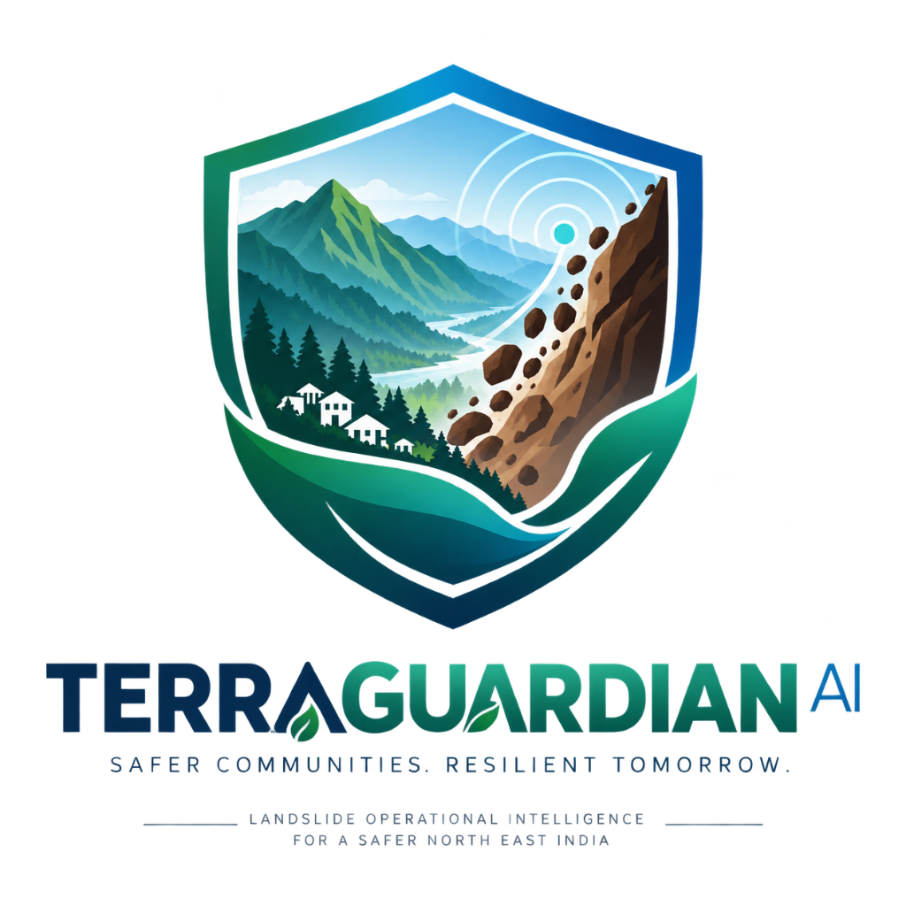

  
# TERRAGUARDIAN AI
### Landslide Operational Intelligence System
### 🔗 **Live Operations Centre**: [terraguardian.vercel.app](https://terraguardian.vercel.app/) &nbsp;|&nbsp; 🎥 **Technical Demonstration**: [Watch on YouTube](https://youtu.be/98XsFZymbQI)

*Smart India Hackathon 2026 · Problem Statement: SIH26001 / PS26001 · Ministry of Development of North Eastern Region (MDoNER) · Disaster Management · Software Track*

---

# TerraGuardian Demonstration Credentials

> [!NOTE]
> **LOCAL / CONTROLLED DEMO ONLY**: These accounts are seeded specifically for evaluating role-based disaster operations, authority gates, and physical confirmation lifecycles locally or in controlled demonstration environments. They must not be used as production credentials.

---

## 1. Supported Command Roles & Credentials

The authoritative credentials below are deterministic and verified against the backend authentication service (`POST /api/v1/auth/login`) using SHA256 PBKDF2 password hashing with server-signed HMAC-SHA256 JWT access tokens.

| Role | Username | Password | Login Surface | Primary Operational Authority |
|---|---|---|---|---|
| **Operator** | `operator` | `Terra#Op2026` | Operations Command | Operational triage, evidence reconciliation, multi-agency action dispatch, outcome recording. *(Cannot authorize statutory orders; cannot confirm physical execution)* |
| **Assessment Officer** | `assessment` | `Terra#Assess2026` | Operations Command | Geotechnical hazard analysis, predictive AI modeling, hypothesis evaluation. *(Cannot authorize statutory orders; cannot execute physical dispatch)* |
| **Field Responder** | `patrol` | `Patrol#2026` | Operations Command | Physical on-site inspection, ground evidence submission, action confirmation. *(The ONLY role permitted to confirm physical execution; cannot authorize statutory orders)* |
| **Authorization Officer** | `magistrate` | `Terra#Admin2026` | Operations Command | Statutory emergency decision authority (DDMA sign-off), legally binding disaster orders (#DDMA-WK-884), final incident closure. *(Cannot self-confirm physical execution)* |
| **Reviewer** | `reviewer` | `Terra#Review2026` | Operations Command | Independent post-event statutory review, timeline inspection, compliance audit. *(Read-only governance; strictly prohibited from mutating live operations)* |
| **Administrator** | `admin` | `Terra#SuperAdmin2026` | Administrative Access | System configuration, adapter telemetry, model registry governance. *(Explicit administrative privileges; does not bypass civil statutory emergency gates)* |

---

## 2. Citizen Access Model

### PUBLIC CITIZEN ACCESS — NO COMMAND-CENTRE LOGIN REQUIRED

* **Public Portal**: TerraGuardian Safe (Citizen Mobile PWA on port `5174` or `/safe`).
* **Reporting Workflow**:
  $$\text{PUBLIC CITIZEN} \longrightarrow \text{OBSERVE HAZARD} \longrightarrow \text{GEO-TAG / GPS} \longrightarrow \text{PHOTO CAPTURE} \longrightarrow \text{SUBMIT REPORT}$$
* **Evidentiary Status**: All citizen submissions are ingested with `source: CITIZEN` and marked as **`UNVERIFIED`** until physically inspected and reconciled by field patrol or operations staff.
* **Separation of Concerns**: Citizens do not log into the Operations Command Centre. The command sign-in surface is strictly reserved for authorized government and emergency response personnel.
* **Programmatic / API Citizen Access**: If citizen API workflows are tested directly against authenticated endpoints:
  - **Username**: `citizen`
  - **Password**: `Citizen#2026`
  - **Role**: `CITIZEN` / `PUBLIC_CITIZEN`

---

## 3. Server-Derived Identity & Security Invariants

1. **Server-Derived Identity**: The client cannot assert `actor_role` or permissions directly. The server cryptographically validates credentials via PBKDF2 (`100,000` iterations) and issues an HMAC-SHA256 bearer token containing the user's canonical role.
2. **Statutory Governance Invariants**:
   - $\text{Recommendation} \neq \text{Authorization}$
   - $\text{Authorization} \neq \text{Execution}$
   - $\text{Execution} \neq \text{Confirmation}$
3. **Session Inactivity Timeout**: 12 hours from issuance.

---

### TERRAGUARDIAN AI
$$\textbf{From Warning to Verified Response}$$

*Built for Smart India Hackathon 2026 · MDoNER · Disaster Management · Software Track*

