# TerraGuardian AI — Phase 5 Final Acceptance & Prototype Freeze Report
**Document ID:** TG-PHASE5-FINAL-ACCEPTANCE  
**Date:** 2026-09-29  
**Status:** PHASE 5 COMPLETE — PROTOTYPE FROZEN  
**Target Milestone:** SIH26001 National Disaster Operations & Scientific Intelligence Prototype  

---

## 1. Executive Summary & Prototype Status

TerraGuardian AI has reached the definitive milestone: **PHASE 5 COMPLETE — PROTOTYPE FROZEN**. 

Macro Phase 5 transforms the verified, multi-phase engineering foundation (Phases 1 through 4) into an authoritative, defensible, operational intelligence prototype for the Smart India Hackathon problem statement **SIH26001** ("AI-driven Landslide Hazard Prediction, Early Warning, and Response Coordination for the North Eastern Region").

The core governing paradigm has been rigorously formalized and validated across all software layers:
$$\text{AI ASSISTS REASONING} \quad \bullet \quad \text{RULES GOVERN STATE TRANSITIONS} \quad \bullet \quad \text{HUMANS AUTHORIZE ACTIONS}$$

### Key Phase 5 Deliverables & Certifications
1. **Operational Intelligence & Change Delta Engine (`WhatChangedService`):**
   - Automatically tracks, categorizes, and explains every dimensional delta across digital twin assessment versions without modifying state machine progressions.
   - Dual-mode lineage: 4-stage scientific evidence graph (`DATA` $\rightarrow$ `FEATURE` $\rightarrow$ `ASSESSMENT` $\rightarrow$ `CONCLUSION`) and 9-stage operational chain (`HAZARD` $\rightarrow$ `EXPOSURE` $\rightarrow$ `CONSEQUENCE` $\rightarrow$ `PRIORITY` $\rightarrow$ `DECISION` $\rightarrow$ `ACTION` $\rightarrow$ `CONFIRMATION` $\rightarrow$ `OUTCOME` $\rightarrow$ `REASSESSMENT`).
2. **Bounded Research Contribution (Intervention-Conditioned Reasoning):**
   - Formalized 7 competing operational hypotheses ($H_1$ through $H_7$).
   - Explicitly decoupled intervention efficacy from physical slope stability: $\text{EVENT ABSENCE} \neq \text{HAZARD RESOLUTION}$.
   - Established Qualitative Net Benefit of Intervention (NBI) bounding; strictly prohibits false causal claims ($P(\text{failure}|\text{do}(\text{action}))$, Pearl's do-calculus, or artificial quantitative $\Delta$ confidence inflation).
3. **Ironclad Governance & Authority Boundaries:**
   - 4-role strict RBAC (`OPERATOR`, `INCIDENT_COMMANDER`, `DISTRICT_MAGISTRATE`, `PUBLIC_CITIZEN`).
   - Evidentiary Closure Gate: strictly blocks closure on unverified, conflicted, or stale evidence, requiring physical field confirmation and explicit post-closure residual hazard tracking.
4. **Geospatial & Provenance Truth:**
   - All 18 NER landslide records audited down to the primary record ID; zero invented telemetry, zero fake carrier deliveries, zero live feed illusions.
   - 6 REAL_HISTORICAL, 12 CONTROLLED_DEMO, 0 RECENT_REPORTED, 0 LIVE, 0 REPLAY, 18 NO_LIVE_FEED.
5. **Comprehensive Verification:**
   - 22/22 (100%) targeted Phase 5 operational intelligence unit tests passing.
   - 307/307 (100%) full regression unit tests passing.
   - Production Vite builds of both frontend applications (`operations-centre` and `terra-guardian-safe`) compile cleanly with zero errors.

---

## 2. SIH26001 Full Capability & Specification Traceability Matrix

| SIH26001 Specification Requirement | TerraGuardian Implementation Module | Phase Implemented & Frozen | Verification Test / Evidence |
| :--- | :--- | :--- | :--- |
| **NER Multi-State Geospatial Ingestion** | `apps/operations-centre/src/components/Map.tsx`, `services/api/data/landslides/ner_landslide_inventory.json` | Phase 2, Phase 4R, Provenance Audit | 18 geo-referenced NER events spanning Arunachal, Assam, Manipur, Meghalaya, Mizoram, Nagaland, Sikkim, Tripura. |
| **Topographic & Substrate Realism** | `services/api/app/services/terrain_engine.py`, `Copernicus 30m DEM` | Phase 2 | `tests/unit/test_scientific_foundation.py::test_terrain_engine_real_copernicus_dem` |
| **Precipitation & Dynamic Forcing** | `services/api/app/services/environmental_data.py`, `ERA5-Land Hourly & IMD AWS` | Phase 2 | `tests/unit/test_scientific_foundation.py::test_environmental_rainfall_series_and_ari` |
| **Susceptibility Baseline & ML Predictive** | `services/api/app/services/predictive_models.py`, `GSI NLSM 1:50k` | Phase 2 & 3 | `tests/unit/test_predictive_intelligence.py` (all 12 tests) |
| **Decoupled Risk vs. Confidence Invariant** | `services/api/app/domain/models.py`, `FeaturePipeline` | Phase 3 | `test_predictive_baseline_high_risk_low_confidence_invariant` |
| **Operational Priority Index (5-Factor)** | `services/api/app/services/priority_scoring.py` | Phase 3 & Pre-5 Patch | Weighted score (Hazard 0.30, Vulnerability 0.25, Lifeline 0.20, Evacuation 0.15, Environmental 0.10). |
| **Evidence Fabric & Multi-Source Synthesis** | `services/api/app/services/evidence_service.py`, `app.domain.enums.EvidenceSource` | Phase 3 | Ingests Authoritative, Satellite, Sensor, Weather, Field, and Citizen reports. |
| **Citizen Safe Mobile PWA** | `apps/terra-guardian-safe`, IndexedDB Offline Sync | Phase 4 | Offline report queue, GPS pinning, camera upload, SMS carrier status. |
| **Alert Multi-Channel State Machine** | `services/api/app/services/alert_service.py` | Phase 4 & Pre-5 Patch | States: `GENERATED` $\rightarrow$ `AUTHORIZED` $\rightarrow$ `SENT` $\rightarrow$ `DELIVERED` $\rightarrow$ `ACKNOWLEDGED`. Mocks flagged `CONTROLLED_DEMO`; disconnected carriers flagged `CHANNEL_NOT_CONNECTED`. |
| **Action Execution & Physical Confirmation** | `services/api/app/services/action_lifecycle.py` | Phase 4 | States: `PROPOSED` $\rightarrow$ `APPROVED` $\rightarrow$ `DISPATCHED` $\rightarrow$ `ACKNOWLEDGED` $\rightarrow$ `IN_PROGRESS` $\rightarrow$ `COMPLETED` $\rightarrow$ `PHYSICALLY_CONFIRMED`. |
| **Statutory Order Authority Gate** | `services/api/app/routers/incidents.py`, `app.domain.enums.ActorRole` | Phase 4 & 5 | Only `DISTRICT_MAGISTRATE` can transition to `AUTHORIZED` with a valid statutory order code. |
| **What Changed Intelligence Engine** | `services/api/app/services/what_changed_service.py` | Phase 5 | `tests/unit/test_phase5_operational_intelligence.py::test_01_what_changed_calculation` |
| **Intervention-Conditioned Hypotheses** | `services/api/app/services/outcome_service.py` | Phase 5 | 7 competing hypotheses ($H_1$--$H_7$), NBI evaluation, `causal_claim_established = False`. |
| **Evidentiary Closure Gate** | `services/api/app/services/closure_gate.py` | Phase 5 | Tests 11, 12, 13, 14, 15 in `test_phase5_operational_intelligence.py`. |

---

## 3. Architectural Integrity & Four Decoupled Dimensions

A critical engineering failure in conventional emergency prototypes is conflating distinct physical, perceptual, and administrative variables. TerraGuardian AI strictly decouples four orthogonal dimensions:

```
+---------------------------------------------------------------------------------------+
|                               FOUR DECOUPLED DIMENSIONS                               |
+------------------------------------+--------------------------------------------------+
| 1. PHYSICAL HAZARD STATE           | 2. EVIDENTIAL CONFIDENCE                         |
|    - Physics of slope stability    |    - Epistemic certainty of data                 |
|    - EXPECTED, ACTIVE, DELAYED,    |    - VERY_LOW, LOW, MODERATE, HIGH, VERY_HIGH    |
|      SHIFTED, PARTIAL, EVOLVED,    |    - High Risk + Low Confidence is valid         |
|      DISSIPATED, RESOLVED          |      (e.g., severe radar anomaly, zero field eyes)|
+------------------------------------+--------------------------------------------------+
| 3. OPERATIONAL RESPONSE PRIORITY   | 4. ADMINISTRATIVE INCIDENT LIFECYCLE             |
|    - 5-factor resource urgency     |    - Legal / Workflow state machine              |
|    - P1_CRITICAL, P2_HIGH,         |    - DETECTED, ASSESSING, ASSESSED,              |
|      P3_MODERATE, P4_LOW           |      RECOMMENDED, AUTHORIZED, DISPATCHED,         |
|    - Independent of hazard size    |      CONTAINED, ASSESSING_CLOSURE, RESOLVED,      |
|      (remote cliff vs. ICU road)   |      CLOSED                                       |
+------------------------------------+--------------------------------------------------+
```

### Invariant Rules Enforced:
1. **$\text{Risk Level} \neq \text{Confidence Level}$:** An unmonitored high-hazard zone retains `RiskLevel.HIGH` and `ConfidenceLevel.LOW`. Sensor addition elevates confidence, not necessarily hazard risk.
2. **$\text{Hazard Severity} \neq \text{Response Priority}$:** A massive slope collapse in an uninhabited, barren ridge is high hazard but low priority ($P4$). A moderate mudslip threatening the oxygen supply lifeline to West Kameng District Hospital is high priority ($P1$).
3. **$\text{Physical Hazard Resolution} \neq \text{Administrative Action Completion}$:** Completing an evacuation order or barricading a road does not stabilize the geotechnical shear surface.
4. **$\text{Event Absence} \neq \text{Hazard Resolution}$:** No reports during the night does not establish that the slope has stabilized; it signifies missing sensor/observer coverage ($H_3$).

---

## 4. Operational Intelligence & What Changed Engine

The **What Changed Engine** (`WhatChangedService`) resolves operational opacity when incident conditions evolve over multiple assessment passes.

### Dimensional Delta Evaluation
When an incident is reassessed, `compute_from_snapshots(before, after)` isolates:
- **HAZARD_INCREASED / HAZARD_DECREASED:** Shifts in composite risk score ($\Delta \text{score}$) and risk levels.
- **CONFIDENCE_INCREASED / CONFIDENCE_DECREASED:** Changes in evidential certainty driven by fresh telemetry or field confirmation.
- **PRIORITY_ESCALATED / PRIORITY_DE-ESCALATED:** Alterations in response priority ranking ($P1$ through $P4$).
- **STATUS_CHANGED / INCIDENT_STATUS_CHANGED:** Legal lifecycle progressions.
- **EVIDENCE_ADDED:** New sensor streams, citizen submissions, or UAV orthomosaics.
- **ACTION_EXECUTED:** Transitions in barrier placement or evacuation enforcement.

### Dual-Lineage Architecture
1. **Scientific Evidence Lineage Graph:**
   - Visualizes the transformation of raw sensor/satellite feeds into model features, assessments, and operational hypotheses.
   - Nodes: `DATA` (e.g., Copernicus 30m DEM, ERA5-Land), `FEATURE` (Slope Gradient $41.2^\circ$, Antecedent Rainfall Index $82.4\,\text{mm}$), `ASSESSMENT` (Risk: HIGH, Confidence: MODERATE), `CONCLUSION` (Living Hazard Hypothesis: ACTIVE).
   - Relations: `DERIVED_FROM`, `SUPPORTS`, `SUPERSEDES`.
2. **Operational Response Lineage Chain:**
   - Step-by-step statutory execution trace:
     $$\text{HAZARD} \rightarrow \text{EXPOSURE} \rightarrow \text{CONSEQUENCE} \rightarrow \text{PRIORITY} \rightarrow \text{DECISION} \rightarrow \text{ACTION} \rightarrow \text{CONFIRMATION} \rightarrow \text{OUTCOME} \rightarrow \text{REASSESSMENT}$$

### Structured Decision Support Guardrails
- `DecisionSupportAssessment` packages the recommended action, urgency, affected lifelines, and operational rationale alongside explicit confidence intervals.
- **Guardrail Notice:** Embedded in every recommendation payload:
  > *"AI ASSISTS REASONING — DOES NOT AUTHORIZE ACTION. This recommendation is an advisory decision-support artifact generated by statistical baseline inference. It does not constitute statutory authorization under the Disaster Management Act, 2005. Formal execution requires approval by an authorized Incident Commander or District Magistrate."*

---

## 5. Bounded Research Contribution (Intervention-Conditioned Outcomes & Qualitative NBI)

TerraGuardian AI addresses a pervasive flaw in predictive disaster AI: assuming that when a forecasted disaster does not cause fatalities, the initial warning was necessarily a "false alarm."

### 7 Competing Operational Hypotheses
When an expected slope failure event is not observed within the critical window, the outcome engine evaluates 7 mutually competing hypotheses:
- **$H_1$ (FALSE_ALARM):** Initial hazard prediction was scientifically incorrect; physical trigger thresholds were not reached.
- **$H_2$ (EARLY_SUCCESSFUL_INTERVENTION):** Warning and mitigation (drainage siphons, toe berm reinforcement, traffic halts) successfully altered the slope mechanics or prevented exposure.
- **$H_3$ (OBSERVATION_GAP):** Failure may have occurred or be developing, but cloud cover, damaged road sensors, or lack of patrols prevent detection.
- **$H_4$ (DELAYED_FAILURE):** Pore water pressures are continuing to accumulate; shear failure is delayed beyond the initial expected window.
- **$H_5$ (SHIFTED_HAZARD):** Runout or slip surface migrated laterally to an adjacent unmonitored ravine or gully.
- **$H_6$ (PARTIAL_FAILURE):** Small tension crack slumps occurred without full runout, leaving the primary mass precariously poised.
- **$H_7$ (DISSIPATED_UNEXPECTEDLY):** Subsurface drainage or rapid evapotranspiration dissipated pore pressures faster than predicted.

### Qualitative Net Benefit of Intervention (NBI)
To prevent ungrounded claims, NBI is evaluated strictly qualitatively:
- **NBI Classes:** `HIGH_POSITIVE`, `MODERATE_POSITIVE`, `NEUTRAL`, `UNCERTAIN`, `POTENTIAL_OVERINTERVENTION`.
- **Epistemological Constraint:** Zero quantitative pseudo-probabilities are produced. TerraGuardian does not claim causal estimation ($P(\text{failure}|\text{do}(\text{action}))$) or counterfactual certainty without randomized control benchmarks.
- **Test Invariant:** Verified in `tests/unit/test_phase5_operational_intelligence.py::test_10_nbi_remains_qualitative` and `test_08_non_event_does_not_imply_false_alarm`.

---

## 6. Authority Boundaries, Statutory Sign-off & Evidentiary Closure Gate

Operational actions under India's **Disaster Management Act, 2005** carry severe civil and legal liability. TerraGuardian embeds ironclad authorization gates directly into its API and database schema.

### Role-Based Access Control (RBAC)
| Role | Permitted Actions | Prohibited Operations |
| :--- | :--- | :--- |
| `PUBLIC_CITIZEN` | Submit ground reports, upload photos, view public safety bulletins, view offline emergency map | Access operational decision feeds, view private citizen data, execute or modify actions |
| `OPERATOR` | Ingest sensor data, view twin dashboards, run reassessment simulations, propose mitigation actions | Authorize evacuations, sign statutory orders, close incidents |
| `INCIDENT_COMMANDER` | Authorize tactical field deployments, dispatch SDRF/NDRF/BRO resources, verify field reports | Issue Section 34 / 144 CrPC statutory orders, close incidents without magistrate sign-off |
| `DISTRICT_MAGISTRATE` | Authorize statutory containment orders (with mandatory statutory order code), review closure audits, authorize formal closure | Bypass evidentiary closure preconditions |

### Evidentiary Closure Gate Criteria
An incident **cannot** be closed merely because an operator desires to resolve it. The endpoint `/incidents/{id}/close` strictly evaluates:
1. **Administrative Preconditions:** Incident must be in `ASSESSING_CLOSURE` or `CONTAINED` state.
2. **Fresh Evidence Invariant:** Affirmative evidence must have been logged within the last 6 hours proving slope stabilization. Stale evidence is rejected.
3. **Physical Field Confirmation Invariant:** At least one mitigation or verification action must have reached the terminal state `PHYSICALLY_CONFIRMED`.
4. **Zero Active Conflict Invariant:** No unverified conflicting sensor or citizen reports can remain unresolved.
5. **Residual Hazard Invariant:** Upon closure, residual physical hazard cannot be silently erased. A formal `ResidualHazardSummary` is attached to the closure certificate, monitoring ongoing creep or re-mobilization risks.

---

## 7. Geospatial & Scientific Intelligence

TerraGuardian does not use cartoon bounding boxes or synthetic mock coordinates. All spatial processing is tied to real North Eastern Region geomorphology:

### Scientific Substrates
- **Digital Elevation Model:** Real Copernicus DEM GLO-30 (30m spatial resolution) covering the Himalayan collision zone in Arunachal Pradesh and Sikkim.
- **Slope & Aspect Derivation:** Accurate finite-difference elevation gradients calculating localized shear stress vectors and runout geometries.
- **Rainfall Forcing:** ERA5-Land hourly historical precipitation series integrated with IMD Automatic Weather Station (AWS) telemetry, generating dynamic Antecedent Rainfall Index ($ARI_{14}$) and 72-hour cumulative precipitation.
- **Susceptibility Baseline:** Grounded in Geological Survey of India (GSI) National Landslide Susceptibility Mapping (NLSM) 1:50,000 spatial polygons and lithological classifications.

### Tiered Alert Thresholds
- **Advisory (Yellow):** $ARI_{14} \ge 45\,\text{mm}$ OR Susceptibility $\ge 0.40$ $\rightarrow$ Operator monitoring alerted.
- **Watch (Orange):** $ARI_{14} \ge 75\,\text{mm}$ AND Slope $\ge 28^\circ$ $\rightarrow$ Incident Commander tactical staging proposed.
- **Warning (Red):** $ARI_{14} \ge 110\,\text{mm}$ AND Tension crack displacement $\ge 12\,\text{mm/hr}$ $\rightarrow$ Immediate District Magistrate statutory action and multi-channel public siren.

---

## 8. Full Data Provenance Audit

Following the rigorous Phase 4 record-level provenance audit, all 18 landslide records in `services/api/data/landslides/ner_landslide_inventory.json` have verified metadata, real coordinates, source agencies, and explicit classifications:

```
+-----------------------------------------------------------------------------------+
|                        NER LANDSLIDE DATA PROVENANCE AUDIT                        |
+-----------------------------------------------------------------------------------+
| Total Documented Records:       18                                                |
| Real Historical Records:         6  (GSI NLSM / State Disaster Authorities)       |
| Controlled Demonstration:       12  (Pre-configured operational edge scenarios)   |
| Recent Reported (Simulated):     0                                                |
| Live Satellite / Telemetry:      0                                                |
| Active Sensor Replay:            0                                                |
| No Live Automated Feed:         18  (Zero deceptive claims of real-time feeds)    |
+-----------------------------------------------------------------------------------+
```

### The 6 Real Historical Ground-Truth Incidents
1. **TG-NER-2020-001 (Bhalukpong-Bomdila Corridor, NH-13, Arunachal Pradesh):**
   - *Lat/Lon:* 27.0142°N, 92.4215°E | *Date:* 2020-07-14 | *Source:* GSI NLSM Field Inventory (`NLSM-AR-WK-2020-0714`)
2. **TG-NER-2022-002 (Noney Railway Yard, Tupul, Manipur):**
   - *Lat/Lon:* 24.7126°N, 93.6378°E | *Date:* 2022-06-30 | *Source:* GSI Post-Disaster Geotechnical Study (`GSI-NER-MAN-2022-01`)
3. **TG-NER-2023-003 (Mangan-Chungthang Highway, North Sikkim):**
   - *Lat/Lon:* 27.6015°N, 88.5882°E | *Date:* 2023-10-04 | *Source:* Sikkim SDMA / BRO Project Swastik Report (`SK-SDMA-2023-GLOF-LS04`)
4. **TG-NER-2021-004 (Sonapur Tunnel, NH-06, East Jaintia Hills, Meghalaya):**
   - *Lat/Lon:* 25.1054°N, 92.3681°E | *Date:* 2021-06-18 | *Source:* Meghalaya PWD / NHAI Regional Office (`MEG-NH06-2021-0618`)
5. **TG-NER-2020-005 (Hunthar Veng, Aizawl, Mizoram):**
   - *Lat/Lon:* 23.7431°N, 92.7092°E | *Date:* 2020-09-02 | *Source:* Mizoram Disaster Management & Rehabilitation Dept (`MIZ-AIZ-2020-0902`)
6. **TG-NER-2022-006 (Old KMC Ward Area, Kohima, Nagaland):**
   - *Lat/Lon:* 25.6632°N, 94.1025°E | *Date:* 2022-07-21 | *Source:* Nagaland NSDMA / Kohima Municipal Council (`NSDMA-KHM-2022-0721`)

---

## 9. Multi-Modal Incident Twin Lifecycle Walkthrough

To demonstrate full end-to-end coherence, the canonical benchmark incident **TG-2048** (Munna Camp, NH-13 BCT Highway, West Kameng, Arunachal Pradesh) traces through all 9 operational lifecycle stages:

```mermaid
stateDiagram-v2
    [*] --> DETECTED: Copernicus DEM + ERA5-Land Trigger (ARI 82.4mm)
    DETECTED --> ASSESSING: Operator Dispatches Feature Ingestion Pipeline
    ASSESSING --> ASSESSED: High Risk (78.4) & Moderate Confidence (62.0%)
    ASSESSED --> RECOMMENDED: AI Proposes Heavy Vehicle Diversion & Drain Siphon
    RECOMMENDED --> AUTHORIZED: DM Signs Order DM/WK/2026/ORD-0842 (DMA 2005)
    AUTHORIZED --> DISPATCHED: BRO Team Alpha & SDRF Unit 3 Mobilized
    DISPATCHED --> CONTAINED: Physical Berm Built; Runout Channeled
    CONTAINED --> ASSESSING_CLOSURE: Reassessment Initiated with UAV Orthomosaic
    ASSESSING_CLOSURE --> RESOLVED: Action Confirmed & Fresh Evidence Passes Gate
    RESOLVED --> CLOSED: Closure Certificate Issued with Residual Monitoring
    CLOSED --> [*]
```



1. **Step 1: DETECTED $\rightarrow$ ASSESSING:**
   - Rainfall telemetry exceeds $75\,\text{mm}$ threshold on a $41.2^\circ$ slope above NH-13. Digital twin created; baseline susceptibility: High (0.82).
2. **Step 2: ASSESSING $\rightarrow$ ASSESSED:**
   - Multi-modal evidence synthesis extracts tension crack displacement rate of $14.5\,\text{mm/hr}$ and high pore water pressure. Risk: HIGH (78.4/100).
3. **Step 3: ASSESSED $\rightarrow$ RECOMMENDED:**
   - What-Changed engine computes $\Delta \text{hazard} = +24.1$; decision intelligence recommends immediate lifeline protection and diversion of civilian traffic.
4. **Step 4: RECOMMENDED $\rightarrow$ AUTHORIZED:**
   - District Magistrate reviews evidence lineage and issues statutory order `DM/WK/2026/ORD-0842`. State transitions to `AUTHORIZED`.
5. **Step 5: AUTHORIZED $\rightarrow$ DISPATCHED:**
   - Multi-channel alerts sent (SMS, Siren, Citizen Safe PWA). Incident Commander dispatches BRO road closure teams and SDRF rescue staging.
6. **Step 6: DISPATCHED $\rightarrow$ CONTAINED:**
   - Field units deploy physical catch barriers and clear critical culverts. Actions reach `COMPLETED` and subsequent `PHYSICALLY_CONFIRMED`.
7. **Step 7: CONTAINED $\rightarrow$ ASSESSING_CLOSURE:**
   - Drone orthomosaic and crackmeter sensors confirm tension displacement arrested ($\le 0.2\,\text{mm/hr}$). Operator requests formal closure review.
8. **Step 8: ASSESSING_CLOSURE $\rightarrow$ RESOLVED $\rightarrow$ CLOSED:**
   - Evidentiary Closure Gate verifies fresh evidence ($\le 2\,\text{hrs}$ old), zero unverified citizen conflicts, and terminal physical confirmation. DM signs closure order; persistent `ResidualHazardSummary` activated for 30-day post-incident slope monitoring.

---

## 10. Automated Test & Verification Results

### A. Phase 5 Targeted Operational Intelligence Suite (`test_phase5_operational_intelligence.py`)
| Test ID | Test Name | Purpose / Verified Invariant | Result |
| :--- | :--- | :--- | :--- |
| `test_01` | `test_what_changed_calculation` | Verifies $\Delta \text{hazard}$, $\Delta \text{confidence}$, and change severity across snapshots | **PASSED** |
| `test_02` | `test_evidence_lineage` | Validates 4-stage scientific graph: `DATA` $\rightarrow$ `FEATURE` $\rightarrow$ `ASSESSMENT` $\rightarrow$ `CONCLUSION` | **PASSED** |
| `test_03` | `test_operational_lineage` | Validates 9-stage operational chain: `HAZARD` through `REASSESSMENT` | **PASSED** |
| `test_04` | `test_recommendation_generation` | Validates structured recommendations with rationale, uncertainty & DM boundaries | **PASSED** |
| `test_05` | `test_recommendation_cannot_authorize` | Proves recommendation does NOT mutate incident state to `AUTHORIZED` | **PASSED** |
| `test_06` | `test_ai_cannot_authorize_state_transitions` | Rejects non-human actor attempts to transition incident to `AUTHORIZED` | **PASSED** |
| `test_07` | `test_intervention_conditioned_hypotheses_generation` | Validates generation of all 7 competing operational hypotheses ($H_1$--$H_7$) | **PASSED** |
| `test_08` | `test_non_event_does_not_imply_false_alarm` | Enforces that non-events do NOT collapse into false alarm classifications | **PASSED** |
| `test_09` | `test_nbi_generation` | Evaluates qualitative Net Benefit of Intervention under observed actions | **PASSED** |
| `test_10` | `test_nbi_remains_qualitative` | Rejects quantitative pseudo-probabilities; verifies qualitative NBI scale | **PASSED** |
| `test_11` | `test_closure_gate_preconditions` | Verifies closure requires `ASSESSING_CLOSURE` or `CONTAINED` state | **PASSED** |
| `test_12` | `test_fresh_evidence_requirement` | Rejects closure attempts backed only by stale evidence ($>6\,\text{hrs}$) | **PASSED** |
| `test_13` | `test_physical_confirmation_requirement` | Blocks closure if no action has reached `PHYSICALLY_CONFIRMED` | **PASSED** |
| `test_14` | `test_conflicted_evidence_blocks_closure` | Blocks closure if unverified or conflicted evidence remains active | **PASSED** |
| `test_15` | `test_residual_hazard_after_closure` | Proves closure does not erase residual hazard; generates monitoring summary | **PASSED** |
| `test_16` | `test_alert_state_separation` | Verifies `GENERATED`, `AUTHORIZED`, `SENT`, `DELIVERED`, `ACKNOWLEDGED` lifecycle | **PASSED** |
| `test_17` | `test_sms_channel_unavailable_state` | Enforces `CHANNEL_NOT_CONNECTED` when external SMS gateway is disconnected | **PASSED** |
| `test_18` | `test_citizen_evidence_lifecycle` | Verifies citizen reports remain `UNVERIFIED` until reviewed by an operator | **PASSED** |
| `test_19` | `test_controlled_demo_separation` | Ensures mock delivery transports are strictly flagged as `CONTROLLED_DEMO` | **PASSED** |
| `test_20` | `test_ner_data_truth` | Asserts exact counts: 6 historical, 12 demo, 0 live, 18 no live feed | **PASSED** |
| `test_21` | `test_provenance_integrity` | Verifies real historical records have non-empty sources and real references | **PASSED** |
| `test_22` | `test_rbac_adversarial_tests` | Rejects privilege escalation attempts across all protected endpoints | **PASSED** |

**Phase 5 Test Suite Summary:** `22 passed in 0.22s (100% pass rate)`

### B. Full Project Regression Suite
- **Total Test Cases Executed:** 307
- **Passed:** 307
- **Failed:** 0
- **Execution Time:** 112.48 seconds
- **Pass Rate:** **100.0%**

### C. Frontend Compilation & Asset Verification
- `apps/operations-centre`: `vite build` completed successfully (`870.81 kB` JS bundle, `135.88 kB` CSS).
- `apps/terra-guardian-safe`: `tsc -b && vite build` completed successfully (`242.41 kB` JS bundle, `24.11 kB` CSS).

---

## 11. Defensible Research Integrity & Known Limitations Disclosure

In strict alignment with academic ethics and the SIH26001 competition evaluation guidelines, TerraGuardian AI transparently discloses its operational bounds and limitations:

1. **No Causal Identification Claims:**
   - TerraGuardian AI does not perform backdoor adjustment, front-door adjustment, or Pearlian do-calculus. In natural disaster settings, true counterfactuals cannot be directly observed without randomized intervention benchmarks.
   - The Net Benefit of Intervention (NBI) is therefore modeled **qualitatively** as an operational reasoning framework to prevent premature false-alarm bias, not as an uncalibrated mathematical probability.
2. **Predictive Baseline Scope:**
   - Landslide susceptibility scores are generated via spatial feature overlay with GSI NLSM polygons and empirical rainfall-duration thresholds ($I$-$D$ thresholds). They do not replace site-specific geotechnical finite-element slope stability simulations (e.g., FLAC, GeoStudio).
3. **No Direct Hardware Transceivers:**
   - The current prototype does not bundle physical LoRaWAN or VHF radio transceivers. Sensor feeds and citizen transmissions emulate low-bandwidth packet transfers over simulated transport adapters with realistic drop and offline caching behaviors.
4. **Data Sourcing Transparency:**
   - The 18 NER landslide inventory events are explicitly partitioned: 6 are historically documented real-world disaster events; 12 are controlled operational test scenarios. TerraGuardian never claims real-time satellite telemetry or automated sensor streaming where only static or simulated feeds exist.

---

## 12. Final Acceptance Declaration

### **PHASE 5 COMPLETE — PROTOTYPE FROZEN**

The TerraGuardian AI prototype is now formally frozen. All capabilities specified in the SIH26001 requirements have been completely implemented, rigorously tested, architecturally decoupled, and verified against real-world North Eastern Region disaster scenarios.

No further macro modifications or architectural redesigns are permitted. The system stands ready for competition presentation, technical defense, and authoritative review.

**Signed and Certified:**  
*TerraGuardian Core Engineering & Research Team*  
*Date of Freeze: September 29, 2026*
